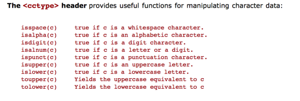

# 0 Intro


+ expression yields `std::cout` as its value with side effect of writing `hello world` to `stdout`
+ _namespace_
  + is a collection of related names
    + standard library use `std` to include all its names  
+ `<iostream>` defines name for
  + `cout`
    + standard output steam
    + `std::cout` has type `std::ostream`
  + `endl`
    + writing value of `std::endl` ends current line of input
    + a _manipulator_
+ operator
  + `<<` is _left associative_
    + `<<` will use as much os the expression as it can, if there is more than one `<<`
      + 
    + `<<` writes char of right operand to the stream of left operand  
    +  `stream << std::endl`
      + `<<` ends current line (do what manipulator specifies) and returns the stream
  + `::` is a _qualified operator / scope operator_
    + `namespace::name`
      + `std::cout` means the name `cout` that is in the namespace of `std`
+ Type
  + defines data structure and operations on it
  + 2 cases
    + core
      + i.e. `int`
    + outside of core
      + i.e. `std::ostream`

---

# 1 String


+ _variable_
  + an object with a name, where an object is part of memory with type, where type implies interface, i.e. the kind of operation possible on the object of such type
  + i.e. variable `name` is of type `std::string` with corresponding header `<string>`
+ _definition_
  + `std::string name;`
+ _operator_
  + `>>`
    + `std::cin >> name;`: reads from `stdin` and stores in `name`
    + discard leading spaces, reads characters until reach space or EOF
+ _buffer_
  + data structure used to store output chars, which is accumulated until `flush`-ed with a single `write`
  + when `flush` happens
    + _buffer_ is full
    + if asked to read from `stdin`
    + explicit statement
  + in the example,
    + _buffer_ is flushed when attempting to read from `stdin` after writing to `stdout`
    + writing value of `std::endl` ends line of output and then flushes
+ _operator overloading_
  + note `3 + 4` and `"a" + "b"` have different meaning
  + `>>`
    + for `int x, y`, `x >> y` means shift right `x` by `y` bit
    + for `istream x`, `x >> y` reasds from `x` to `y`
+ _member function_
  + object has a component function which we can call
    + `greeting.size()` returns number of char in `greetings`
+ _constructing variable_
  + `std::string spaces(n, ' ');`
  + `spaces` now holds `n` number of `' '`.


`std::string`
+ `std::string s`: define `s` to be of type `std::string` that is empty
+ `std::string z(n, c)`: define `z` to be of type `std::string` containing `n` copies of `c`
+ `os << s`: write `s` to output stream `os`
+ `is >> s`: read from input stream `is` to `s`
+ `s.size()`: return size of `s`


---

# 2 loop & counting

+ `const std::string::size_type`: class `std::string` has type for holding the number of characters in string.
  + `size_type` is unsigned
+ _short circuit evaluation_
  + `||`: say if left operand is true then right operand is not evaluated
+ _using-declaration_
  + `using std::cout`: means we use `cout` to represent `std::cout` and we do not define anything else `cout`


+ `using namespace::name`: define `name` as abbrev
+ `type-name name`: define `name` with type `type-name`
+ types
  + `short`: int holds at least 16 bits
  + `long`: int holds at least 32 bits
  + `size_t` unsigned int that can  hold any object's size
  + `string::size_tyep`: unsigned int that can hold size of any string


---

# 3 Working with batches of data

## Compute student grades


+ `std::ios::streamsize`: size used by IO library
+ `std::iomanip`:
  + `setprecision`: a manipulator
    + manipulates stream to change precision of any subsequent output to `cout`
    + good practice to reset to default precision
    + Store `cout.precision()` and restore default precision with `setprecision()`
+ `std::stream::endl`: manipulator for ending line
+ the following is equivalent  
  + `cin >> midterm >> final`
  + `cin >> midterm; cin >> final;`
+ difference between built-in type and class type _default-initialization_
  + _class_: determined by class initializer to use
    + i.e. `string` is implicitly initialized to be empty
  + _built-in type_: undefined if not initialized
    + i.e. `int` contains random garbage
+ `while (cin >> x)`
  + testing that `cin` is true while reading a value into `x` as a side effect
  + `if(cin >> x)` is equivalent to `cin >> x; if(cin){}`
  + note here `istream` defines the outcome of condition evaluation depending on if the last attempt to read worked.
    + ways in which read from stream is unsuccessful
      + reached EOF
      + encountered input of incompatible type
      + detect a hardware failure on input device


## Use median instead of average


__Vector__
+ a container that holds a sequence of values of same type, vector grows dynamically
  + `vector` type defined using _template classes_
+ member function
  + `vector<T> v`: creates an empty vector that hold elements of type `T`
  + `vector.push_back(e)`: Grows the vector by one element initialized to `e`
  + `vector<T>::size_type`: unsigned type guaranteed sufficient to hold the largest possible `vector`
  + `vector.size()`: returns number of element in `vector`
  + `vector.begin()`: return a value that denotes first element in `vector`
  + `vector.end()`: return a value that denotes last element in `vector`


Some Useful Function
+ `algorithm::sort(b, e)`: rearranges value from `b` to `e` so they are in nondecreasing order.
+ `algorithm::max(e1, e2)`: return larger of expression `e1` and `e2`, of same type
+ `s.precision(n)`: sets precision of stream `s` to `n` for future output
+ `iomanip::setprecision(n)`: returns a value that when written on an output stream `s` has effect of calling `s.precision(n)`
+ `ios::streamsize`: type of value expected by `setprecision` and returned by `precision`


---

# Organizing programs and data


## Organizing computation


function
+ pass by value
  + function parameters are initialized to copies of arguments' value
+ _overloading_
  + function with same name but different signature


_throw exception_
+ steps
  + execution stops
  + program control passed to another part of program, along with _exception object_, which holds info that caller can use to act on the exception
+ `stdexcept::domain_error()`: report that function argument is outside of the set of values that the function can accept  


_reference variable_
+ definition
  + An alias, or an alternate name to an existing variable (avoids overhead of copy)
  + less powerful but safer than pointer
  + declaration: `<Type> & <Name>`
  + i.e. `int& foo ();` function returns a reference to `int`
  + i.e. `void bar (int& rP);` function with reference as args
+ difference from pointers
  + there cannot be a reference to a reference; Any occurrences of a reference refer directly to the object it refers.
  + once reference is created, it cannot be changed to reference another object, unlike pointers
  + Cannot be null
  + cannot be uninitialized, must be initialized as soon as they are created.
  + Do not require to use `&x` during initialization
    + `int x; int& ref = x`: not need to do `int& ref = &x`
  +  Do not require de-referencing! Just treat them as normal variables
    + `ref = 56`
+ reference and pointer conversion
  + the address-of operator `(&)` will yield a pointer referring to the same object when applied to a reference,
  + a reference which is initialized from the dereference (`*`) of a pointer value will refer to the same object as that pointer
+ usage
  + _pass by reference_
    + when supplied to function argument, we can change data of the referenced object without copy overheads.
    + i.e. `void square(int x, int& result);` we can call `square(3, y);` to place the `result` in `y`
  + _benefits over pointer_  
    + Always sure that its initialized; do not have to check if its pointing NULL
    + Complier automatically allocates memory
    + same usage as regular variable
+ caution
  + `int *x = 0; int& y = *x`: explicitly assign reference to dereferenced NULL pointer, reference would be invalid
  + `int &getLocalVariable(){ int x; return x;}`: when a reference lives past the time that the block of memory it references to is valid


+ `vector.clear()` clears previous content in `vector<>`
+ `istream.clear()` clears `istream`'s error state


+ `median` requires `vector<double>`: vector copied entirely because want to make sure function does not change the original `vector`
+ `grade` requires `const vector<double>&`: a read-only reference, Efficient!
+ `read_hw` requires `vector<double>&`: writable reference, intend to change value!
  + note


+ note only `lvalue` is allowed to be passed into a _non-const reference parameter_
  + non-temporary object, i.e. variable, reference, NOT expression
+ If allowed, this is equivalent to store input in an object that we could not access. `emptyvec()` is destroyed as soon as function returns.


__Compute student for a batch of data__


+ no ambiguity to function `read`; distinguished by signature


_final_

+ `max(a, b)`: returns greater of the two, which must be of same type `string::size_type`
+ `string(maxlen + 1 - students[i].name.size(), ' ')`: constructs a nameless `string`
+ `error.what()`: prints the error message specified in `domain_error`


+ header file
  + contain function _declaration_ `double median(vector<double>);`
  + should avoid using `using`-declaration because header should be as flexible as possible
    + however usage of `using` in source file is kept local and could be utilized


__Details__

+ _refrence variable_
  + `T&`: reference to type `T`, used to pass parameter that function may change, arguments have to be `lvalue`
  + `const T&`: reference to type `T` that may not be used to change value to which the reference is bound. Used to avoid cost of copying a parameter to a function
+ _exception_
  + `logic_error`, `domain_error`, `invalid_argument`, `out_of_range`, `runtime_error`, `range_error`
  + `e.what()`: return error message


---

# Sequential Container and strings


+ problem
  + avoid keep multiple copies of data any longer than necessary.
    + `student` has two copies
+ solution


+ remove the failing grade from `students` and append to `fail`
  + `vector.erase(iterator position)`: removes element at `position` from `vector`
  +  Inefficient because subsequent element has to be relocated; `O(n)`
  + note if precompute `size = students.size()` and use it for condition in while loop the program fails; `vector.erase()` will change size of `students`
  + `vector` is an efficient _random access_ container implemented using array
+ alternative solution
  + motivation: access of member of `students` happens in sequential order. Hence do not require indexes which allows for random access

_sequential container_

__Iterators__
+ Definition: a value that
  + identifies a container and an element in the container
  + examine value stored in that element
  + provides operation for moving between elements in container
  + restricts available operations in ways that correspond to what container can handle efficiently
  + An abstraction for array like access
    + `students.erase(students.begin() + i)`: would still work for container that does not support random-access indexing through iterators
    + hence making iterating over container generic...
+ Types
  + `container-type::const_iterator`: for changing values in container
    + `vector<Student_info>::const_iterator iter = students.begin()`
    + note `vector.begin()` returns `iterator`, which is automatically casted to `const_iterator`
  + `container-type::iterator`: for read access only
+ Operation
  + `++iter`: advancing iterator to next element in container
    + operator overloading for `iterator` type
  + `*iter`: dereference operator returns an `lvalue` that is element to which iterator refers
    + `(*iter).name` is equivalent to `iter->name`
  + `iter + i`: advancing iterator `i` times
    + operator overloading for `iterator` type

_index vs iterator_


_with while loop_

+ `fail.push_back(*iter)`
  + `*iter` is dereferenced and pushed onto `fail` vector
+ `iter = students.erase(iter)`
  + `erase()` _invalidate_ the iterator, since subsequent element is relocated; iterator referring to them become meaningless
  + `erase` returns an `iterator` that is positioned on element that follows one we just erased


__List__
+ sequence containers that allow constant time insert and erase operations anywhere within the sequence, and iteration in both directions.
  + implemented using _doubly linked list_
    + Fast `O(1)` insert, extract, move element within container for which an iterator has been obtained
    + support bi-directional iterator  
  + drawback:
    + lacks direct access; Access takes `O(n)`
    + consumes extra memory for linking info


+ `list<Student_info> fail;`
  + changing container type does not break `iterator` abstraction

_vector vs list_
+ _vector_
  + `erase()`: iterators pointing to element erased or subsequent element are invalidated
  + `push_back()`: invalidates all iterator (since dynamic array may be rellocated at some point)
+ _list_
  + `erase()` and `push_back()` does not invalidate iterators to other elements. Only iterators refering to current element erased are invalidated, since it no longer exists
  + _sort_: Cannot use `std::sort(begin, end, compare)` for sorting because no random-access properties.
    + 
    + use `list.sort(compare)` instead


+ performance difference
  + due to the many delete operation; `list` is `O(1)` (changing links) `vector` is `O(n)` (shift all subsequent elements in array)


__String__
+ Objects that represent sequences of characters.
  + `s[0]` to `s[s.size() - 1]`


+ `string substr(size_t pos = 0, size_t len = npos);`
  + Returns a newly constructed string object with its value initialized to a _copy_ of a substring of this object.
  + The substring is the portion of the object that starts at character position pos and spans len characters (or until the end of the string, whichever comes first).


+ testing `split(s)`
+ `istream& getline (istream& is, string& str);`
  + Extracts characters from `is` and stores them into `str`
  + `is`: `istream` from which to read
  + `str`: reference to string into which to store what is read


__Framing a picture__

` void insert(iterator position, InputIterator first, InputIterator last);`
+ The vector is extended by inserting new elements before the element at the specified position, effectively increasing the container size by the number of elements inserted.
+ Inserting elements in positions other than the `vector.end()` causes the container to relocate all the elements that were after position to their new positions. This is generally an inefficient operation

__details__
+ `container<T>::iterator`
+ `container<T>::const_iterator`
+ `const<T>::size_type`: appropriate type to hold largest possible instance of the container, usually `size_t`
+ `c.begin()`
+ `c.end()`: iterators referring to first one past the last element in container
+ `c.rbegin()`
+ `c.rend()`: one before the first element in container when accessing container element in reverse order
+ `container<T> c;`
+ `container<T> c(c2)`: define `c` as a copy of `c2`
+ `container<T> c(n)`: define `c` as container with `n` element initialized to default value
+ `container<T> c(n, t)`: define `c` with `n` elements that are copies of `t`
+ `container<T> c(b, e)`: define `c` holds copy of element denoted by iterators in range `[b, e)`
+ `c = c2`: replace `c` with copy of `c2`
+ `c.size()`: number of element in `c`
+ `c.insert(d, b, e)`: copy elemnts in `[b, e)` inserts them to `c` immediately before `d`
+ `c[n]`: for containers with random accessing / `string` type
+ `s.substr(i, j)`: creates new string holds a copy of chars in `s` in range `[i, i+j)`
+ `vector`: fast access lookup
+ `list`: fast insert/delete, slow access
+ `<cctype>`
  + 


---

# 6 Using library algorithms

__Analyzing strings__

_generic algorithm_
+ not a particular kind of container, but takes a cue from arg types,
+ std usually uses iterators among their argument, to manipulate element of underlying data structure  

`OutputIterator copy(InputIterator first, InputIterator last, OutputIterator result);`
+ Copies the elements in the range `[first,last)` into the range beginning at `result`.
+ equivalent to `while (first != last){ *result++ = *first++; }`
  + `first++`: returns copy of original value of `first`, incrementing stored value of `first` as a side effect. so equivalent to `it = first;  ++first;`
  + `*` has same precedence as `++`; so `*out++` has same meaning as `*(out++)`
  + equivalent to `{ *result = *first; ++result; ++first; }`
+ _iterator adaptors_: yield iterators with properties related to args in useful ways
  + `iterator::back_inserter`: takes a container as arg and yields an iterator, when used as a destination, appends values to the container.
  + `copy(bottom.begin(), bottom.end(), back_insert(ret));`: copies all element of `bottom` and appends to end of `ret`
  + `copy(bottom.begin(), bottom.end(), ret.end());`: will cause errors!  since no element at position `ret.end()`


+ `InputIterator find_if(InputIterator first, InputIterator last, UnaryPredicate pred);`
  + returns an iterator to first element in range `[first, last)` for which `pred` returns true. otherwise function returns last.
+ `string(i, j)`: construct string that is a copy of chars in range `[i, j)`


+ `bool equal (InputIterator1 first1, InputIterator1 last1,
              InputIterator2 first2);`
  + compare element in range `[first1, last1)` with those in range beginning at `first2` and return true if all of the elements in both ranges match


---

# 7 Using Associative containers

motivating example: a pool of ints, want to determine whether any element of container has value 42
  + `vector`: if sorted, `O(logn)` binary search
  + `list`: `O(n)`
  + `map`


_associative container_
+ automatically arrange elements into sequence depends on value of elements themselves, rather than the sequence in which they are inserted.
+ efficient _loop up / access_


__Map__
+ associative container that store elements formed by a combination of `key` and `mapped value` following a specific order
  + `key`: for sorting and identification, need not be `int`
  + `value`: store content
  + `typedef pair<const Key, T> value_type;`
+ note
  + slower than _unordered map_; but allow direct iteration on subsets based on order
  + implemented using RB-tree
  + should not do anything that changes order of elements when it is in map


+ a map from `string` to `int`
+ `++counters[s]`: If index `map` with a key that has not yet been seen, automatically creates a new element with that key, i.e. _value initialized_.
  + for `int`: initialized to 0
  + so increment the count every time we have seen `s`
+ _pair_
  + a data structure that holds 2 element; `pair<const K, V>`
    + each element in map is a `pair`
  + `pair.first` is key
  + `pair.second` is associated value


+ cross reference table that keeps track of the line number the word occurs.
+ `> >` instead of `>>`since will just assume `>>` operator instead
+ ` vector<string> find_words(const string&) = split`: defines function param
  + _default argument_: caller can omit arg if they wish; if arg is supplied the function will use it; otherwise the default is substituted as a result


_note on performance_
+ hash table
  + _disadvantage_
    + must supply hash function,
    + performance sensitive to hash function
    + no easy way of retrieving element of hash table in useful order
+ C++ associative container
  + _note_
    + `O(logn)` for access (worst case?0)
    + always kept sorted by key
    + typically slower than best hash table data structure, perform much better than naive data structures.
    + automatic ordering is convenient
    + use self-balancing tree


__Details__
+ _value initialization_: access non-existent value creates an element of type `V`; built-in types initialized to 0
+ `pair(K, V)`: objects holds pairs of value
+ `map(K, V)`: associative array with key `K` and value type `V`
+ `m[k]`: indexing `map` using key `k` of type `K`. If no entry is given, a new value-initialized element is created and inserted into the `map` with this key
  + so `[ ]` not allowed on `const map`
  + use `m.at(const k)` instead which returns a reference to mapped value of element identified by `k`
+ `m.insert(const value_type& val)`: insert new element, increase size by number of elements inserted. If already exist, element not inserted,
+ `m.find(k)`: returns an iterator referring to element with key `k` or `m.end()` if no such element


---


# 8 Writing generic function


+ _comment_
  + we can call `median(v)` where v is of type `vector<int>`, `vector<double>`, but not `vector<string>` since `string` does not have division `/` operator defined

__generic function__
  + definition
    + functions with parameter types that we do not know until we call the functions.
    + one of key feature of cpp
    + Operation dictates the required type
  + _template functions_
    + write a single definition for a family of functions (or types) that behave similarly.
    + assuming objects of different type share common behavior
    + type is determined at compile time.
  + _template header_
    + `template<class T>`
    + function will take a _type parameter_  `T`
      + define names that can be used within scope of function params
      + denote _type_ instead of _variable_  
      + At compile time, `T` is bound to a type that it determines at that point. In effect, the implementation instantiates the code as if we had written a specific version of function
        + i.e. `vector<int> vi; median(vi);`, here all `T` is bound to `int`
  + _typename_
    + `typedef typename vector<T>::size_type vec_sz;`
    + Scenario
      + When a type (i.e. `vector<T>`) that depends on template parameter and want to use a member of the type (i.e. `size_type`)
      + Use `typename` to let implementation know how to treat the name as a type  
  + _template instantiation_
    + When calling `median(v)` where `v` is of type `vector<int>`. implementation will create/compile an instance of function that replaces every use of `T` by `int`


__Data-structure independence__
  + `find(c.begin(), c.end(), val)`
    + works finds a value in any contiguous part of any container
    + alternatives
      + `c.find(val)`:
        + `find` has to be a member function of every container type `c`
        + wont work on built in arrays
        + will look at the entire `c` instead perhaps a subset
  + _algorithm and iterators_
    + different kinds of iterators offer different kind of operations, and algorithm may require different iterators.
    + _5 iterator categories_
      + _input iterator_
        + sequential read-only access
        + supports `++`, `==`, `!=`, `*`, `iter->member`
      + _output iterator_
        + write elements sequentially
        + write only once.
      + _forward iterator_
        + sequential read-write access
        + read/write but only sequentially forward, never backward
        + supports `*`, `++`, `==`, `!=`, `iter->member`
      + _bidirectional iterator_
        + reversible access.
        + supports forward iterator's valid operator in addition to `--`
          + all std container meet forward-iterator requirements
      + _random access iterator_
        + supports iterator arithmetics in addition to what is supported by bidirectional iterator
          + pointer and integer operation: `p + n`,
          + pointer pointer arithmetic: `p - q`
          + dereferencing with pointer: `p[n]` (`*(p+n)`)
          + pointer pointer comparison: `p < q`
        + only `sort` requires this iterator
  + _iterator range_
    + `b`: first element of range, `e`: one past last element of range
      + why not let `e` be last element of range?
        1. if range has no element, then `e` would be set differently
        2. iterator comparison uses `!=` or `==` only, no need to note if one is less than another
          + if `b == e`:  range empty
          + if `b != e`: `b` refers to a valid element
          + we can use `while(begin != end){ ++begin; }`
        3. easy to specify out of range.
          + just return second iterator of the range `e` to indicate failure
    + `end`: reference to last element
  + _input and output iterator_
    + why distinguish input/output iterator with forward iterator.
      + Not all iterators are associated with containers
        1. `back_inserter(c)` is output iterator
        2. `istream_iterator`: iterator for `istream` meets requirement for input iterator
          + `copy(istream_iterator<int>(cin), istream_iterator<int>(), back_inserter(v));`
            + read values from `stdin` until hit EOF or input is not valid as an `int`
            + `istream_iterator<int>(cin)`: bound to `cin`, expect to read in type `int`
            + `istream_iterator<int>()`: default/empty not bound to any file, appear to equal to default value if reached EOF or error state.
        3. `ostream_iterator`: iterator for `ostream` that write sequentially to an output stream , i.e. `cout`
          + `copy(v.begin(), v.end(), ostream_iterator<int>(cout, " "))`
            + write elements of `v` each separated from each other by a space.
            + `" "` space is written after each element.
  + _using iterator_
    + `split`: splits space-delimited string into a `vector<string>`
      + improvement:
        + take in an output iterator and write the word in the string
        + does not limit on what container is required.
        + any iterator other than input iterator works.


+ `find` requires input iterator only `class In`


+ `copy` requires output iterator since writing to a container `class Out`


+ `replace` requires forward iterator `class For`, since
  + requires reading current element and compare to `x`
  + requires writing to current element if `x` is found.


+ `reverse` requires reverse traversal
  + march `end` backward and `beg` forward, exchanging elements that they reference as we go


+ `binary search`


+ `split` using iterator

_summary_
+ _template function_
  + `template<class type-parameter [, class type-parameter]...> ret-type function-name (parameter-list)`
    + each `type-parameter` should be used in `parameter-list`
    + otherwise the caller must qualify the `function-name` with the actual types that cannot be inferred.
      + i.e. `template<class T> T zero() {return 0;}` caller: `double x = zero<double>();`
  + _typename_
    + qualify declarations that use types that are defined by template type parameters
    + i.e. `typename T::size_type name` declares `name` to have `size_type`, which is a member of `T`
+ _iterator_
  + algorithm achieves data-structure independence by using iterators
  + 


---


# 9 Defining New Types

__Class type__
+ 
  + `Student_info` does not restrict access to data elements.
  + Bad; want to access member with function instead


```c
struct Student_info{
  std::string name;
  double midterm, final;
  std::vector<double> homework;

  std::istream& read(std::istream&);
  double grade() const;
}

istream& Student_info::read(istream& in){
  in >> name >> midterm >> final;
  read_hw(in, homework);
  return in;
}

double Student_info::grade() const{
  return ::grade(midterm, final, homework);
}
```
+ _member function_
  + a function that is a member of a class object.
+ note
  + function definition is prefixed with `Student_info::read`
    + Specify same scope operator; indicating function is of `Student_info` type
  + Do not need to pass in `Student_info` object as argument, or to define it at all
  + allowed access to data elements of object directly (i.e `homework` instead of `s.homework`)
  + prefix with `::grade()` insists on using a version of name that is not a member of anything; Without this, compiler would think we are referring to `Student_info::grade`
+ _const member function_
  + use of `const` after parameter list; function cannot change any member of class
    + i.e. the `class` instance `Student_info` cannot be mutated
      + before: `double grade(const Student_info&) { .. }`
      + after: `double Student_info::grade() const{ .. }`
+ _non member function_


__Protection__
+ data hiding by allowing authors of types to say which members of those types are _public_ and hence accessible to all users of the type, and which parts are _private_ and inaccessible to users of the type
+ _class_
  + same as `struct`, except for default protection between `{` and first _protection label_: members are initially private for class and public for struct within the range
  + 
+ _protection labels_
  + _public_
    + fully available
  + _private_
    + members inaccessible to users of `Student_info` type
    + reference is illegal; compiler will complain
  + _protected_ 
    + same as _private_ except that member variable is accessible in child classes
+ _accessor function_
  + `std::string name() const { return n; }`
    + only read access allowed
  + should be provided only when the hidden data is part of the abstract interface
  + use `s.name()` to invoke accessor function

```c
class Student_info {
public:
  Student_info();
  Student_info(std::istream&);

  std::string name() const { return n;}
  bool valid() const {return !homework.empty();}

  std::istream& read(std::istream&);

  double grade() const;
private:
  std::string n;
  double midterm, final;
  std::vector<double> homework;
};

Student_info::Student_info(): midterm(0), final(0) {}
Student_info::Student_info(istream& is) { read(is); }

bool compare(const Student_info&, const Student_info&);

bool compare(const Student_info& x, const Student_info& y){
  return x.name() < y.name();
}
```

__Constructors__
+ special member functions that define how objects are initialized.
  + Creating object of class type call appropriate construct automatically as side effect
+ Compiler will synthesize a construct if none were provided
  + initialize data member to value depends on how object is being created
    + _built-in type_: value-initialized to NIL
    + _container_: value-initialized to 0
  + Good practice to initialize every data member
+ _default constructor_
  + constructor with no arguments
  + ensure that object data member are properly initialized
  + _constructor initializer list_
    + tells compiler to initialize given members with value between corresponding parentheses,
    + between `:` and `{`: `Student_info():: midterm(0), final(0) {}`
      + set `midterm` and `final` to 0
      + notice we explicitly initialize built-in values; class types already value-initialized properly, i.e. with `string()` and `vector()` construct
+ _object creation_
  + allocates memory to hold object
  + initializes object, by constructor's initializer list
    + note every data member is initialized, regardless if its in constructor initializer list or not.
    + especially important for built-in types
  + execute construct body
+ _constructor with args_


__Using Student_info Class__


---

# 10 Memory and low-level data structures

_pointers and arrays_
  + pointer is a random-access iterator for accessing elements of array.
+ _pointer_ `p --> x`
  + definitions
    + value representing address of and object `&x`
    + _address operator_: `&`
    + _dereference operator_: `*`
    + _null pointer_: converting 0 to pointer
    + _pointer type_: `int *p` `p` has type `int *`
  + _function pointer_ `fp --> func`
    + `int (*fp)(int)`
    + `fp = &func` and `fp = func` is equivalent.
    + `int i = (*fp)(10)` is equivalent to `int i = fp(i);`
  + _using typedef_
    + `typdef double (*analysis_fp)(const vector<Student_info>&);`
    + `analysis_fp get_analysis_ptr();`
    + using function pointer
      + 
  + _pointer arithmetics_
    + usage in converting beteween array and container
      + `vector<double> v; copy(coords, coords + NDim, back_inserter(v))`;
      + `vector<double> v(coords, coords + NDim)`
+ _array_
  + sequence of objects of same type, where number of elements must be known at compile time, hence arrays cannot grow or shrink dynamically
  + _declaration_
    + `const size_t  NDim = 3; double coords[NDim];`
    + note `coords` is pointer to first element in array
  + _initialization_
    + `const int month_lengs[] = { 31, 28, 31, 30, 31, 30, 31, 31, 30, 31, 30, 31};`
  + _string literal_  
    + an array of `const char` with null terminated `\0` (necessary to locate end when given only initial address of string literal)
    + `const char hello[] = { 'H', 'e', 'l', 'l', 'o', '\0'}`
  + _args to main_
    + `argc`: number of pointers in array, always >= 1
    + `argv`: pointer to initial element of an array of pointers
+ _reading/writing files_
  + stderr
    + `cerr`: always writes to output immediately, output will be visible as soon as possible
    + `clog`: for logging purposes, same buffer property as `cout`
  + multiple input/output files. `<fstream>`
    + `ifstream` or `ofstream`, which are just `istream` and `ostream` respectively.
    + 
      + copy a file named `in` to a file named `out`
    + `ifstream infile(file.c_str());`
      + If name of file is of type `string`, then use `s.c_str()` to convert to char array pointer to create `ifstream` or `ofstream`

_memory management_
+ types  
  + _automatic_
    + associated with local variables, automatically deallocated and end of block containing the definition
    + deallocation of a automatic variable invalidates its pointer.
      + i.e. `int* invalid_pointer(){ int x; return &x; }`
  + _static_
    + allocate once and only once, and do not deallocate as long as the program runs.
    + Now return value is not invalidated
      + `int *pointer_to_static(){ static int x; return &x; }`
      + drawback: every call will return a pointer to the same object! What if we want a different object returned every time function returns
  + _dynamic_
    + `p = new T(args)`: allocates object of type `T`, default-initialized, and yields a pointer.
      + object stays around until
        1. program ends
        2. execute `delete p`
      + i.e. `int *p = new int(42);`
        + allocates type `int` object, initialized t 42, and cause `p` to point to the object.
    + `delete p;`: deallocates object pointed to by `p`
+ _dynamic array allocation/deallocation_
  + `p = new T[n]`: allocates array of `n` (`n = 0` allowed) objects of type `T` and returns a pointer of type `T*`, with each element default-initialized
    + built-in type: uninitialized
    + class type: each element initialized by running its default constructor.
  + `delete[] p`: deallocates entire array (rather than the first element)
  + 
    + creates a dynamically allocated char array copy
  + _style_ 
    + use `new` instead of `malloc` as 
      + `malloc` 
        + not type safe 
        + can be justified for `POD`, but risk having no compiler error should `POD` change to `non-POD`, which must be allocated using `new`
        + return `NULL` on failure; later operation is `undefined`
      + `new`
        + throws `std:bad_alloc`, which can be allowed to propagate to a level where caller is able to sensibly process
    + _passive data structure_ `PDS` 
      + = `POD` (plain old data): raw data
      + a passive collection of field values wihtout OOP features
      + a class without 
        + constructors, 
        + destructors,
        + virtual members functions
        + custom/overriden operators 
      + only built in type allowed, yielding C like behavior

_summary_
+ `cerr`: standard error stream, output not buffered
+ `clog`: for logging, buffered
+ `ifstream::ifstream(cp)`: input stream bound to file named by `char* cp`, supports operations on `istream`
+ `ifstream::ofstream(cp)`
+ `new T`: allocates and default-initializes a new object of type `T`
+ `new T(args)`: use `args` to initialize the object
+ `delete p`: deallocates
+ `new T[n]`: allocates array of `n` new objects
+ `delete[] p`: destroys objects in array to which `p` points to


---

# 11 Abstract data types
+ _Vec class_
  + _template class_
    + `T` will be replaced with `int` by compiler if we initialize with `Vec<int> v;`
  + _data member_
    + `Vec` holds address of first element, and address of one past last element in `Vec`, the size of `Vec` can be computed from the other two.
  + _constructor_   
    + `Vec<Student_info> vs;`: creates empty `vs`
    + `Vec<double> vs(100);`: creates `vs` with a given size, require memory allocation
      + `explicit Vec(size_type n, const T& val = T()) { create(n, val); }`
      + second arg is a default arg, hence this constructor defines 2 signatures
      + `explicit`: used in constructor with 1 arg; compiler will use the constructor only in contexts in which user expressly invokes the constructor and not otherwise
        + `Vec<int> vi(100)` is ok but `Vec<int> vi = 100` is not
  + _type definition_ with `typedef`
    + `value_type`: data type stored, i.e. `T`,
    + `iterator`: pointer to data, since array just `T*`
    + `size_type`: usually `size_t`
  + _index and size_
    + `size()`: a member function that returns `Vec::size_type` which is number of elements in `Vec`
    + `operator[]`:
      + overloaded operator defined as name, arg, return type
      + if _operator_
        + is a member function, then function has as many args as the operator has operands (unary -> 1; binary -> 2); left operand is
        + not a member function, then left operand is implicitly bound to object on which operator is invoked, hence takes 1 less arg than operator indicates
      + `[]` must be member function
        + `vs[i]` call member named `operator[]` of vs passing `i` as arg
  + _iterators_
    + overloading `begin()` and `end()` depending on whether `T` is `const `or not
  + _copy control_
    + object copy occurs when
      1. pass object by value to function, (i.e. `vector<int> vi; double d; d = median(vi);`)
      2. or return object by value from a function, (i.e. `vector<string> words = split(line)`)
      3. object initialization (i.e. `vector<Student_info> vs; vector<Student_info> v2 = vs`)
    + _copy constructor_
      + controls both explicit and implicit copy
      + takes in 1 arg that has same type as class itself.
      + the arg is `const` since not changing anything
    + _behavior_
      + when copy, need to allocate new space and copy contents from source to newly allocated destination
      + 
  + _assignment_
    + always obliterates existing value (left side) and replace it with new value (right hand side)
      + deallocate preexisting object
      + allocates space for new object like copy
    + self-assignment
      + check is important; if not checked, then we will first deallocate the object, and since its deallocated, cant be used for copy later on.
    + Note
      + _template function outside of class header_:
        + template function `template <class T>`
        + have to explicitly name the type parameter in return type (`Vec<T>& Vec<T>::operator()`)
          + since we can omit (syntactic sugar) `<T>` inside class definition
      + _`this`_
        + denotes a pointer to object on which the member function is operating, inside a member function. (i.e. `this` is of type `Vec*`, pointer to `Vec`)
        + refer to the object itself
    + _assignment is not initialization_  
      + _initialization_
        + `=` for giving initial value to variable, the _copy constructor_ is invoke, which creates a new object and giving it a value at the same time.
        + occurs when
          + variable declaration  
            + (`string y`): default constructor
          + function param on entry to a function
          + return value of a function on return
          + constructor initializers
            + (`string url = "~;/?:@...";`): create `string` from string literal
            + (`string spaces(url.size(), '');`): create `string` from constructor
      + _assignmnet_
        + `=` for assignment, calling `operator=` instead, which always destroys previous value
        + occurs when
        + in expression (`y = url;`)
      + _example_
        + `vector<string> split(const string&);`: function declaration
        + `vector<string> v;`: initialization
        + `v = split(line);`:
          + on entry, initialization of `split` param
          + on exit, initialization of return value
          + then assignment to `v`
  + _destructor_
    + controls what happens when objects of the type are destroyed, _destructor_ has same name as constructor but with a prefixed `~`
      + functions as cleanup, releasing resources (memory)
    + object destroyed when
      + local variable goes out of scope
      + dynamically allocated object with `delete`
  + _default operation_
    + compiler synthesizes default copy/assignment/destroy
      + operate recursively on each data element according to appropriate rule for the type of that element
      + class type member: call its copy constructor, assignment operator, and destructor
      + built-in type member: copy and assign based on its value. do nothing for destroy (i.e. pointer not freed)
    + default constructor recursively initializes each data member
      + default-initialization / value-initialization for data members
  + _rule of three_
    + memory as resource
      + default destructor will destroy pointer, but does not free the space to which it points to, resulting in memory leak
      + default copy constructor does not allocate new space, hence 2 copies point to the same address. This becomes a problem if one copy is destroyed and we want to access the other copy
    + hence _destructor, copy constructor, and assignment operator_ comes hand in hand
      + constructor: `T::T()` to allocate resources
      + destructor: `T::~T()` to free up resources
      + copy constructor: `T::T(const T&)`
      + assignment operator: `T::operator=(const T&)`
  + _dynamic vecs_
    + implemented using dynamic table
      + 
  + _flexible memory management_
    + options
      + `new` and `delete`:
        + restrictive since `new` both allocates and initializes memory
        + `new` also requires default constructor for `T`, must be class type
        + `new` can be expensive since `T::T()` called and then initialized again with user specified values


---

# Library summary


`<iostream>`
+ `cout`
+ `ceerr`
+ `ostream::clog`: bound to `stdout` and `stderr`
+ `istream::cin`: bound to `stdin`


_reading/writing_
+ `is >> t`: read from `is` to `t` after skipping whitespaces
  + leaving `is` in failure state until a call is made to `is.clear()`
+ `os << t`: sends `t` to `os`
+ `is.get(c)`: reads next char, even if it is whitespace from `is` to `c`
+ `is.unget()`: clears stream `is` by one char.

`<iterator>`
+ `istream_iterator<T> in(is)`;
  + defines `in` as input iterator reading value of type `T` from `is`


`<iomanip>`
+ defines manipulator other than `endl`
+ `os << endl`: ends current output line and flushes stream associated with `os`
+ `os << flush`: flush stream with `os`
+ `os << setprecision(n)`
+ `os << setw(n)`


_Container_
+ `container<T>::size_type`: size of largest container
+ `container<T>::value_type`: type of container element
+ `container<T> c;`: defines `c` as empty `container` with `c.size() == 0`
+ `container<T> c2(c)`: defines `c2` as container with `c2.size() == c.size()` and each element of `c2` is copy of element of `c`
+ `c.empty()`
+ `c.clear()`: empties container; same as `c.erase(c.begin(), c.end())`


_sequential container_
+ `string`, `vector`, `list`
+ `container<T> c(n ,t)`: defines `c` to have `n` element, each is a copy of `t`
+ `container<T> c(b, e)`: defines `c` and initializes it with a copy of elements in sequence denoted by input iterators `b` and `e`
+ `c.insert(it, t)`, `c.insert(it, n, t)`, `c.insert(it, b, e)`
  + inserts elements into `c` immediately before it. Return iterator referring to newly inserted element, void, void, respectively
  + If `c` is `vector` or `string`, operation invalidates all iterators refer to or after insertion point, may cause relocation; operation maybe slow if `it` is far from end.
+ `c.erase(it)`, `c.erase(b, e)`
  + removes element denoted by `it` or elements in range `[b, e)` from `c`, invalidates all iterator referring to erased element. Returns iterator to position immediately after the erasure
  + If `c` is `vector` or `string`, all iterator after the erasure also invalidated.
+ `c.assign(b, e)`: replaces `c`'s elements with elements in sequence denoted by input iterators `b` and `e`
+ `c.front()`: return reference to first element of `c`, undefined if `c` empty
+ `c.back()`: return reference to last element of `c`, undefined if `c` empty
+ `c.push_back(t)`: appends a copy of `t` to `c`, increase size by 1, returns `void`
+ `c.pop_back()`: removes last element from `c`, returns void, undefined if `c` empty
+ `iterator::inserter(c, it)`: returns an output iterator that inserts value into `c` starting immediately before position denoted by `it`
+ `c[n]`: indexing, valid for `vector` and `list` only
+ `c.push_front(t)`: insert a copy of `t` to beginning of `c`, increase size of `c` by one. not valid for `string` or `vector`; good with `list` since doubly linked list
+ `c.pop_front()`: removes first element from `c`. Returns `void`. Undefined if `c` is empty. Valid for `list`
+ `iterator::front_inserter(c)`: returns output iterator that can insert new values at front of `c` by calling `c.push_front()`


_associative containers_
+ fast access based on key
+ `container<T>::key_type`: type of `K`; note for `map(K, V)` has `value_type` or `pair<const K, V>`, not `K`
+ `container<T> c(cmp)`: defines `c` as empty container using predicate `cmp` to order elements
+ `container c(b, e, cmp);`: initialize a copy of values in sequence by input iterators
+ `c.insert(b, e)`: insert elements into `c` from the sequence denoted by input iterators `b` and `e`.
+ `c.erase(it)`: removes element denoted by iterator `it` from `c`, Returns `void`
+ `c.erase(b, e)`: removes element in range `[b, e)` from `c`. Return `void`
+ `c.erase(k)`: removes all element with key `k` from `c`. Returns number removed
+ `c.find(k)`: returns iterator referring to element with key equal to `k`, returns `c.end()` if no such element exists.


_iterators_
+ abstraction of pointers;
+ _type_
  + _output_: advance through container one element at a time,. write each element visited once and only once (i.e. `copy`)
  + _input_: advance through container one element at a time, read each element as often as needed before advancing to next element
  + _forward_: advance through container one at a time, to revisit elements to which previously remembered iterators refer and to read or write each element as often as needed
  + _bidirectional_: move through container one at a time, either forward or backward (`list` and `map` provide bidirectional iterators, `algorithm:reverse` requires this iterator)
  + _random access_: possible to move through container using all operations supported by pointers. i.e. `vector`, `string`, built-in arrays supports random access iterators (`algorithm::sort` requires this operator)


_vector_
+ dynamically allocated, type-independent arrays. support random access iterators.
+ `v.reserve(n)`: reallocates `v` so that it grows to accommodate at least `n` elements without further reallocation
+ `v.resize(n)`: reallocates `v` to hold `n` elements. Invalidates all iterators referring to elements of `v`. Preserves first `n` element. If new size is less than old, excess elements are destroyed. Otherwise, new elements are value-initialized
