# set

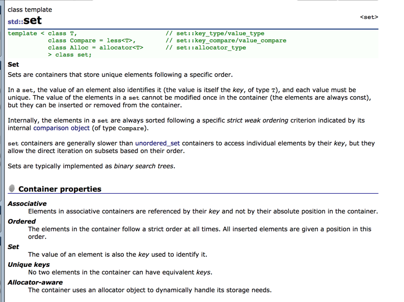
+ `set::key_type` and `set::value_type`
+ `set::insert(v)` inserts `v` to set
  + `set::insert(iterator pos, v)`
  + `set::insert(b, e)`: insert elements referred to by `[b, e)`
+ `set::erase(iterator pos)`: removes elements from set; amortized `O(1)`
  + `set::erase(value_type v)`: `O(logn)`
  + `set::erase(b, e)`
+ `set::find(v)`: search for element equal to `v` and returns iterator if found, otherwise set iterator to `set::end`
  + `O(logn)`

# Map

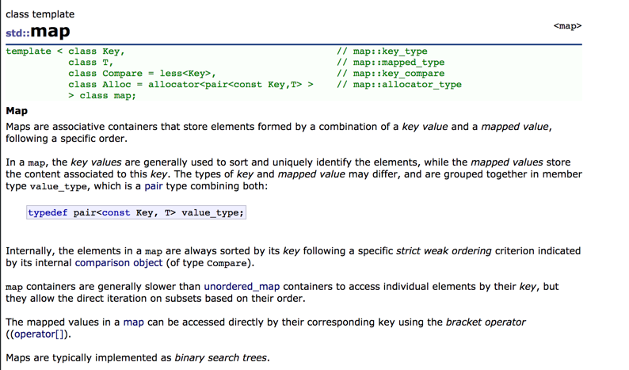
+ `map(K, T)` has `map::value_type = pair<const K, T>`
+ `map.at(k)`: return mapped value same as `map[k]` otherwise out of range; `O(logn)`
+ `map::insert(value_type v)`: Note `map::value_type = pair<const K, T> ` function inserts `v` and returns the `pair` with `pair.first` be iterator to element inserted/found, and `pair.second` be `bool`: true of inserted properly
  + `std::map<char,int> mymap;` and `mymap.insert ( std::pair<char,int>('a',100) );`
+ `mapped_type& map::operator[] (key_type& k)`: returns reference to mapped value if exists otherwise creates new element with given key and return reference
  + equivalent to `(*((this->insert(make_pair(k,mapped_type()))).first)).second`
  + easier than `map::insert()`
  + `std::map<char,std::string> mymap;` and `mymap['a']="an element";`
  + 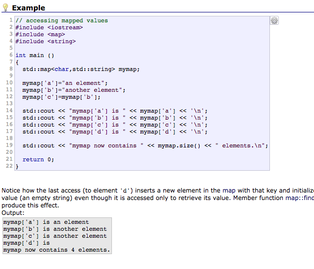
+ `pair<iterator, bool> map::insert(pair<K, T>)`
  + insert if not already exists; otherwise return iterator to existing element
  + `pair<iterator, bool>`
    + `iterator`: pointing to either newly inserted element or element with equivalent key in map
    + `bool`: true if new element inserted, false if equivalent key exists
  + 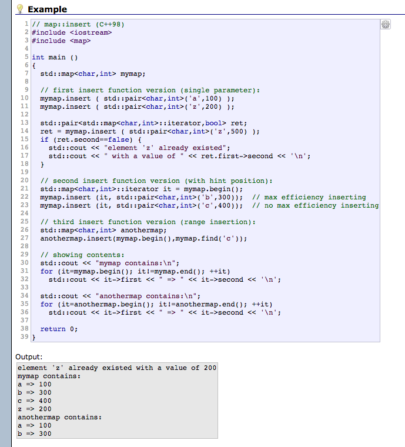
  + `O(logn)`

_Map vs Set_
+ Same
  + ordered
  + use self-balancing trees
  + data must be unique
    + otherwise use multi-set/map
+ difference
  + `map::operator[]` allows access/creation of element while `set` does not have this operator
+ choice
  + map allows usage of set by introduction of `map::key_type` to determine ordering of element that otherwise cannot be determined from `map::value_type`
  + If ordering can be determined entirely by `map::value_type`, then better off using `set` to avoid duplicating the key
  + Otherwise, if key is not contained in data, better off using `map`
  + if `key` is a subset off `map`, then there is the tradeoff between duplicating keys (`map`) vs. cost of constructing data for `find` operation (`set`)

# Unordered set

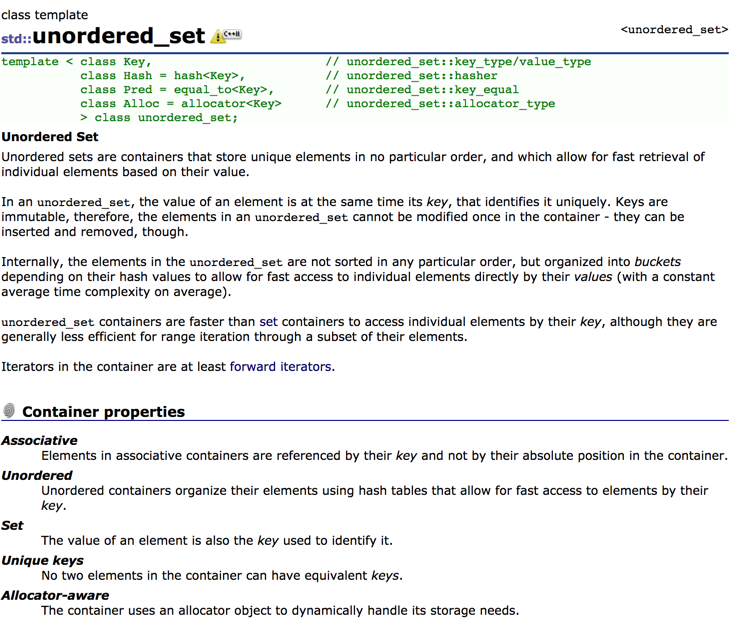
+ characteristics
  + unordered
  + `O(1)` access
  + `unordered_set::key_type == unordered_set::value_type`
  + key cannot be modified hence data cannot be modified once in container
+ _constructor_
  + 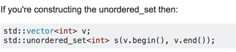
+ `iter find(k)`: search for element with `k` and return iterator if found, otherwise return `unordered_set.end()`
  + `O(1)` average `O(n)` worst case
  + 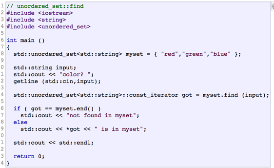
+ `pair<iterator, bool> emplace(args ...)`: insert new element to container in place with given args if no element with key is in container
+ `iter erase(iter pos)` or `size_t erase(key_type k)`: removes from set at location `pos` or with key `k`; returns either
  + iterator immediately after last elements erased,
  + or number of elements erased, which is 1 is success.
  + 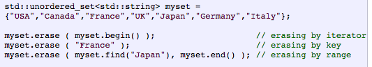
+ `insert()`
  + 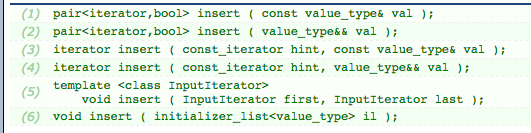
  + 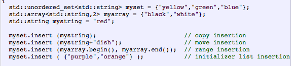

# Unordered Map

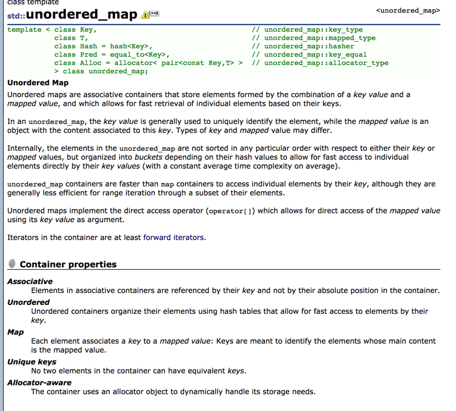
+ `size_t unordered_map::count(k)`: search element with key and return number of elements found. Since key is unique, so function returns 1 if exists 0 otherwise
+ `std::make_pair(T1, T2)`: construct `pair`
+ `insert(v)`: insert new element, only if key not equivalent to any other element already in container, returns a pair object with `iter` pointing to newly inserted element and `bool`: indicating success of insert
  + 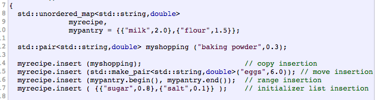
+ `pair<iter, bool> emplace(args..)`: insert new element if key unique. The new element is constructed using `args` as arguments to constructor.
  + `O(1)` average; `O(n)` worst cast
  + 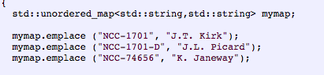
+ `iter emplace_hint(iter pos, args..)`: insert new element if key unique.
  + `pos` points to location suggesting hint on where to start search for insertion point.

# Vector

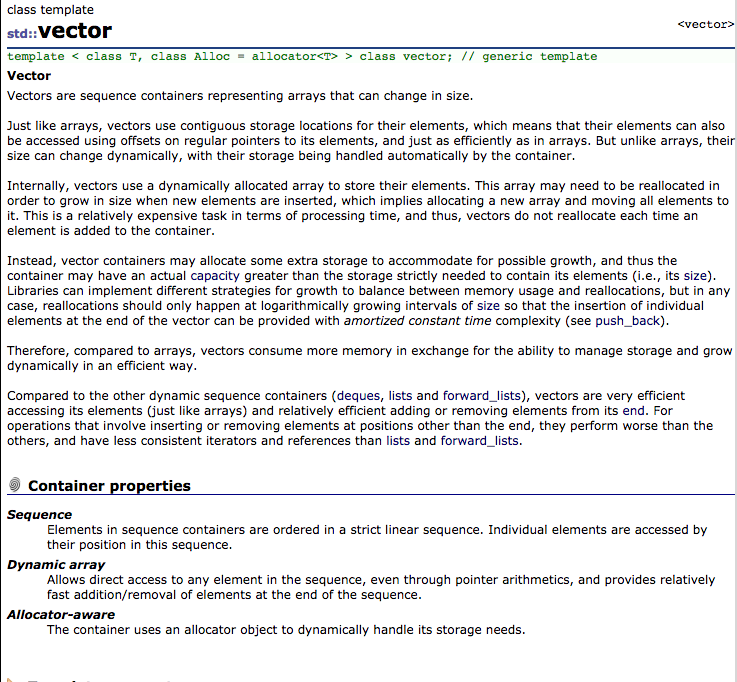
+ characteristics
  + dynamic array that change in size
  + contiguous storage
  + random access iterator, fast access `O(1)`
  + slow insert/delete
+ `operator[n]`: return reference to element at position `n` in vector container
+ `vector::at(n)`: same as `vector[n]`, but with additional `out_of_range` exception
+ `vector::back()`: return reference to last element
+ `vector::push_back(v)`: adds `v` to end of vector.
  + may cause reallocation, hence invalidate iterators / reference
+ `vector::pop_back()`: remove last element in vector, reduce size by one
+ `vector::insert(iter pos, val)`: insert `val` at `pos`
  + cause shift, relocate all element after `pos` to new location, inefficient
+ `vector::erase(iter pos)` or `erase(b, e)`: removes vector a single element or range of elments
+ `vector::emplace(iter pos, args ..)`: insert new element at `pos`, return iterator to newly emplaced element
  + is efficient since has to shift `val`
  + differs from `insert()` as `args` can be used to construct object in place, avoiding unnecessary copy or move operations
     + 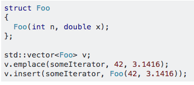

# String

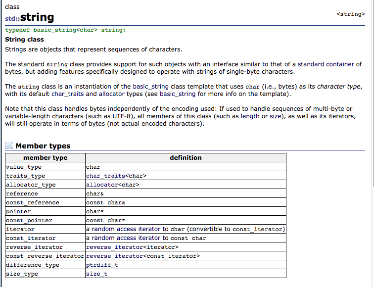
+ sequence of chars
+ `operator[]`: return reference to char at position
  + `O(1)`

# Deque

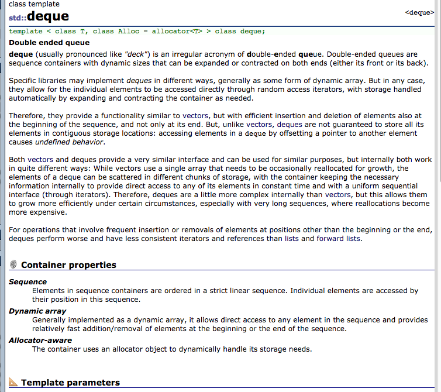
+ double-ended queue
+ properties
  + dynamic sizes expand or contract on both ends
  + implemented using dynamic array,
  + allow direct access
  + functionality similar to `vector`, but with efficient insertion/deletion at both ends
    + insertion / deletion not at ends are inefficient
  + implemented using linked list
+ has `push_back()`, `push_front()`, `pop_back()`, `pop_front()`

# List

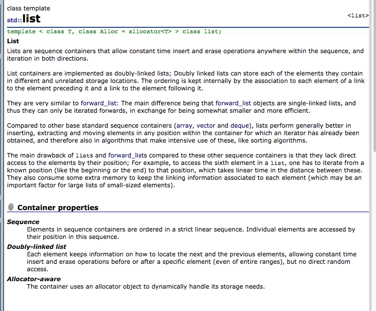
+ sequence container allowing constant time insert / erase anywhere in sequence
+ properties
  + implemented using doubly linked list
  + can be iterated in both direction
  + insertion / delete has higher performance than `array`, `vector`, `deque`. `O(1)`
  + lack direct access by position hence access is `O(n)`

# Stack

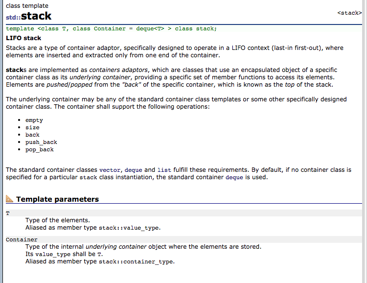
+ a container adaptor, LIFO. `vector`, `deque`, and `list` can fulfill the requirements
+ `empty()`
+ `size()`
+ `back()`
+ `push()`
+ `pop()`

# Queue

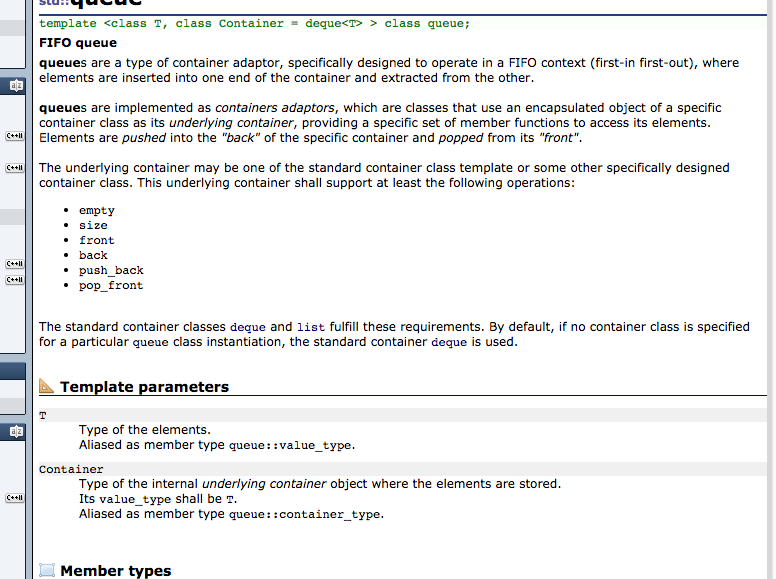
+ properties
  + `deque` and `list` fulfill the requirements
+ `front()`
+ `back()`
+ `push()`
+ `pop()`

# Priority Queue

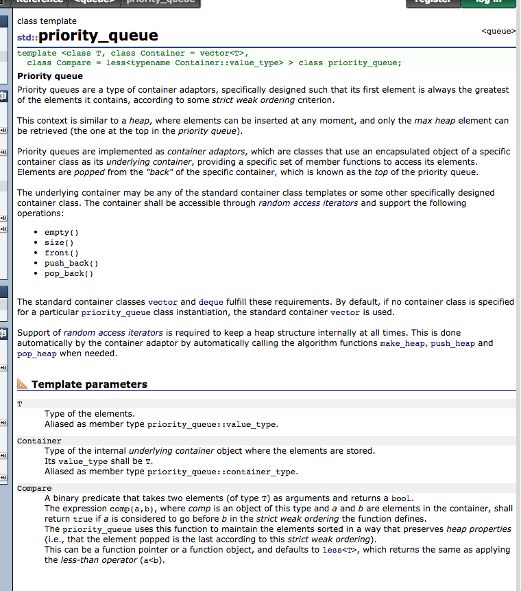
+ properties
  + first element is always the greatest element
  + has ordering
  + max heap
  + `vector ` and `deque` fulfill the requirements
    + function
    + random access iterator
+ `empty()`
+ `size()`
+ `front()`
+ `push()`
  + 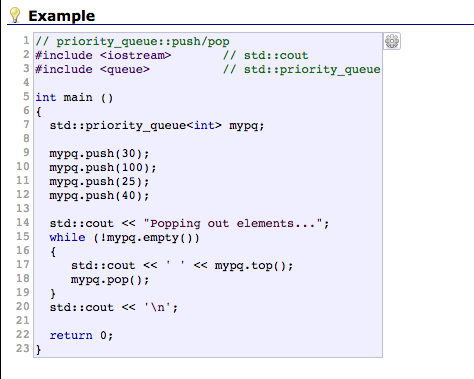
+ `pop()`
