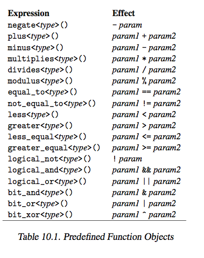

# STL Function Objects and Using Lambdas


### 10.1 The concept of Function Objects


+ _definition_ 
    ```cpp
    class FunctionObjectType {
        public:
            void operator()(){
                // statements
            }
    }
    ```
    + function object is an object with `operaotr()` defined
    + _advantage_ 
        + keeps a state, 
        + each function object has its own type
            + specialize certain template behavior
            + do well in declaration of hash function, sorting, equivalence criterion of containers
        + usually faster than a function pointer
+ _Function object as sorting criteria_ 
    ```cpp
    class Person {
        public:
            string firstname() const;
            string lastname() const;
    };

    class PersonSortCriterion{
        public:
            bool operator()(const Person& p1, const Person& p2) const {
                return p1.lastname() < p2.lastname() || 
                    (p1.lastname() == p2.lastname() && 
                    p1.firstname() < p2.firstname());
            }
    };

    std::set<Person, PersonSortCriterion>;
    ```
    + Note
        + `PersonSortCriterion` is a type, so can be placed in templates, not possible with function pointers
+ _Function object with internal state_ 
    ```cpp
    class IntSequence {
        private:
            int value;
        public:
            IntSequence(int initialValue)
                :value(initialValue) {}
            int operator()(){
                return ++value;
            }
    };

    std::list<int> coll;
    // insert value 1~9
    generate_n(back_inserter(coll), 9, IntSequence(1));
    // replace 2nd to last but one with 42
    generate(next(coll.begin()), prev(coll.end()), IntSequence(42));
    ```
    + _function object are passed by value by default_  
        + _advantage_
            + allowed to pass constant and temporary expression
                + i.e. with `f(IntSequence(1))`
        + _disadvantage_
            + does not benefit from modification of function object state
                + i.e. `generate_n` here gets an internal copy, and cant get back final state 
    + _workarounds_
        + _can keep state externally, and let function object refer to it_
        + _pass function objects by reference_
            + qualify call to algorithm with template types
            ```cpp 
            IntSequence seq(1);
            generate_n<back_insert_iterator<list<int>>, int, IntSequence&>
                (back_inserter(coll), 4, seq);
            // now starts from 5... still the same function object
            // pass by value
            generate_n<back_insert_iterator<list<int>>, int, IntSequence&>
                (back_inserter(coll), 4, seq);
            // same as previous invocation, pass by value
            generate_n<back_insert_iterator<list<int>>, int, IntSequence&>
                (back_inserter(coll), 4, seq);

            // outputs
            // 2 3 4 5
            // 2 3 4 5 6 7 8 9
            // 2 3 4 5 6 7 8 9 6 7 8 9  
            ```
        + _use return value of `for_each`_
+ _Return value of `for_each`_
    + `for_each` is the only algorithm that returns the function object
    ```cpp
    class MeanValue {
        private:
            long num;
            long sum;
        public:
            MeanValue(): num(0), sum(0){}
            void operator(int elem){
                ++num;
                sum += elem;
            }
            double value(){
                return static_cast<double>(sum) / static_cast<double>(num);
            }
    };

    vector<int> coll = {1,2,3,4,5,6,7,8};
    MeanValue mv = for_each(coll.begin(), coll.end(), MeanValue());
    ```
    + _computes mean value with `for_each`_
    + can make function object even better by writing an automatic conversion from `MeanValue` to `float`
+ _Predicates vs Function Objects_
    + _predicates_ are fucntion or function objects that return a `bool`
    ```cpp 
    class Nth {
        private:
            int nth;
            int count;
        public:
            Nth(int n): nth(n), count(0){}
            bool operator()(int){
                return ++count == nth;
            }
    };

    list<int> coll = {1,2,3,4,5,6,7,8,9,10};
    list<int>::iterator pos;
    pos = remove_if(coll.begin(), coll.end(), Nth(3));
    coll.erase(pos, coll.end());

    // should just remove 3rd element, but removed 3 and 6
    // outputs: 1 2 4 5 7 8 9 10
    ```
    + _behavior_
        + function impl copies predicate around, so deletes 2 elements
    + _getaway_ 
        + predicate should be stateless
        + so a copy of a predicate should have same state as original,
        + declare `operator()() const {}`


### 10.2 Predefined function objects and binders

+ `<functional>`
    + provide predifined function objects and bindfers for _functional composition_
+ 
    + `less<>` is default criterion for sorting function
    + `equal_to<>` is defualt equivalence criterion for unordered containers
+ _function adaptor and binder_
    + _function adaptor_
        + a function object that enables the composition of function objects with each other, with certain values or with special functions

skip... because lambdas pretty much overtook binders

### 10.3 Lambdas 

+ Lambdas provides readable, individual behavior for algorithms and container functions 
+ _lambda hugely improves over binders_
    ```cpp
    auto plus10 = [](int i){
        return i + 10;
    }
    auto plus10times2 = [](int i){
        return (i+10)*2;
    }
    auto plus10times2 = std::bind(std::multiplies<int>(),
                                    std::bind(std::plus<int>(),
                                            std::placeholders::_1, 10), 2)
    ```
+ _lambdas vs stateful function object_
    ```cpp 
    vector<int> coll = {1,2,3,4,5,6,7,8};
    long sum = 0;
    for_each(coll.begin(), coll.end(), [&sum](int elem){
        sum += elem;
    })
    double mv = static_cast<double>(sum) / static_cast<double>(coll.size());
    ```
    + _comments_
        + _function object imp_ shown previously is more condensed, and less error prone
    ```cpp
    list<int> coll = {1,2,3,4,5,6,7,8,9,10};
    list<int>::iterator pos;
    int count = 0;

    // removes 3rd element
    pos = remove_if(coll.begin(), coll.end(), 
        [count](int) mutable {
            return ++count == 3;
        });
    coll.erase(pos, coll.end());

    // 3 and 6 removed! bad: 1 2 4 5 7 8 9 10
    ```
    + _note_
        + pass `count` by value since not needed outside of lambda
        + use `mutable` because keep an internal state with `count`, and want write access to `count`
        + again removed both 3 and 6 because lambda duplicated
        + actually, doesnt have this problem. __TESTED!__
+ _lambdas vs member function_  
    + lambdas can call member fucntions freely 
+ _lambdas as hash function, sorting, or equivalence criterion_
    ```cpp
    auto hash = [](const Person& p){};
    auto eq = [](const Person& p1, const Person& p2){};
    unordered_set<Person, decltype(hash), decltype(eq)> pset(10, hash, eq);
    ```
    + use `decltype` to pass type of lambda to template qualification
    + need to pass in lambda in constructor because
        + by default will cal default constructor of `hash` and `eq` 
        + which are not available if written as lambdas
    + _comment_
        + function object in this case is clearer, more readable, convenient


