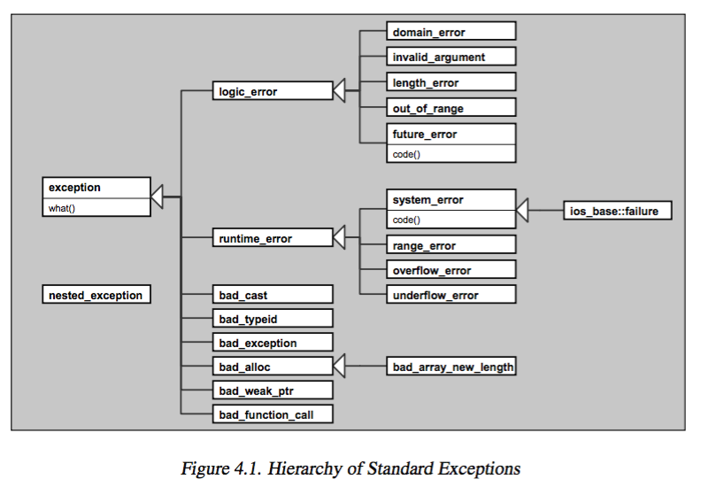
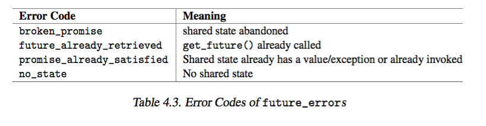
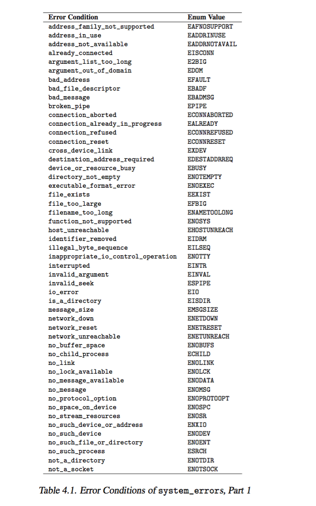

# 4 General Concepts 


+ _namespace `std`_
    + _namespace_ 
        + a certain scope for identifiers 
        + properties 
            + open for extension at any source, 
            + so can define component that are distributed over several physical modules 
            + i.e. `std` 
    + 3 ways of using `namespace` 
        + qualify identifier directly 
            + `std::cout << std::hex << 3.4 << std::endl;`
        + with _`using` declaration_
            + `using std::cout`, `using std::endl`
            + `cout << std::hex << 3.4 << endl;`
        + with _`using` directive_
            + all identifiers of the namespace are available as if declared globally 
            + `using namespace std;`
            + `cout << hex << 3.4 << endl;`
+ _header files_ 
    + compatibility issues
        + older header files not compatible, i.e. not under namespace `std`
    + standardization 
        + prefix `c` instead of old extension `.h`
        + `#include <cstdlib>   // instead of <stdlib.h>` 
    + `#include <stdlib.h>`: in effect, declared in global space behave as if they declare all identifiers in namespace `std`
+ _error handling_ 
    + _standard exception classes_  
        + 
        + categories 
            + language support 
                + part of language, used by language features 
                + `bad_cast`: thrown by `dynamic_cast`
                + `bad_exception`: handled unexpected exception
                    + `unexpected()` used to throw the exception 
            + logic errors 
                + usually can be avoided...
                + usually defined in `<stdexcept>`
                + `invalid_argument`: report invalid arg 
                + `length_error`: exceed max allowable size 
                + `out_of_range`: not in range
                + `domain_error`
                + `future_error`: for async syscalls
                    + in `<future>`
            + runtime errors 
                + usually defined in `<stdexcept>`
                + `range_error`: report range error in internal computation 
                + `overflow_error`: report arithmetic overflow 
                + `underflow_error`
                + `system_error`: caused by OS, can be thrown by `thread` and `async()`
                + `bad_alloc`: fails on `new` operator. 
                    + `<new>`
                + `bad_weak_ptr`: creation of weak pointer out of a shared pointer fails 
                    + `<memory>`
                + `bad_function_call`: `function` wrapper gets invokded but has no target...
                    + `<functional>`
                + `ios_base::failure`: thrown when a stream changes its state due to error/EOF
                    + `<ios>`
    + header files for dealing with exception classes 
        ```cpp 
        #include <exception>    // for classes exception and bad_exception
        #include <stdexcept>    // for most logic and runtime error classes
        #include <system_error>  // for system errors (since C++11)
        #include <new>           // for out-of-memory exceptions
        #include <ios>           // for I/O exceptions
        #include <future>        // for errors with async() and futures (since C++11)
        #include <typeinfo>       // for bad_cast and bad_typeid
        ```
    + member of exception class 
        + `what()` returns null-terminated byte string (C-string)
        ```cpp 
        namespace std {
            class exception {
                public:
                    virtual const char* what() const noexcept;
            }
        }
        ```
        + error codes vs error conditions 
            + _error codes_: light-weight objects that encapsulate erorr code values 
                + i.e. `std::io_errc` provides error codes 
                + i.e. `std::future_errc` provides erorr code by concurrency library
                + 
            + _error conditions_: objects providing portable abstraction of error descriptions
                + i.e. `std::errc` provides error condition for `system_error`
                + it is _scoped enumerators_!
                + 
        + handling `std::error_code` and `std::error_condition`
            + same way to check...
            + difference between code or condition doesnt matter
        ```cpp 
        if(ec == std::errc::invalid_argument){} // checks error condition
        if(ec == std::future_errc::no_state){}  // check error code
        ```
    + `std::system_error` and `std::_future_error` 
        + member nonvirtual `code()` returning object of type `std::error_code`
        + `error_code` class 
            + provides member function to get detail of error 
            + `category()` and `value()` together distinguishes the error 
            + `message()`: usually what `what()` gives 
            + `operator bool()`: if an error code is set (0 -> no error), evalutes to true if exception caught 
            + `default_error_condition()`: return corresponding class `error_condition`
        + `error_category`
            + `name()` name of _category_
                + `"iostream` for `ios_base::failure`
                + `"generic` for `system_error` with a corresponding POSIX `errno` 
                + `"system` for `system_error` without a corresponding POSIX `errno`
                + `"future` for `future_error`
                + global function returns category 
                ```cpp 
                const error_category& generic_category() noexcept;  // in <system_errror> 
                const error_category& system_category() noexcept;       // in <system_error>
                const error_category& iostream_category();      // in <ios>
                const error_category& future_category() noexcept;       // in <future>
                ```
                + usage 
                    + `if(e.code().category() == std::iostream_category())` ...
            + `operator ==` and `operator !=` allows compare error categories
        ```cpp 
        namespace std {
            class system_error: public runtime_error {
                public: 
                    virtual const char* what() const noexcept;
                    const error_code& code() const noexcept;
            };

            class future_error: public logic_error {
                public: 
                    virtual const char* what() const noexcept;
                    const error_code& code() const noexcept;
            }

            class error_code {
                public: 
                    const error_category& category() const noexcept;
                    int value() const noexcept;
                    string message() const;
                    explicit operator bool() const noexcept;
                    error_condition default_error_condition() const noexcept
            }

            class error_condition {
                public: 
                    const error_category& category() const noexcept;
                    int value() const noexcept; 
                    string mesasge() const;
                    explicit operator bool() const noexcept;
            }

            class error_category {
                public: 
                    virtual const char* name() const noexcept = 0;
                    virtual string message(int ev) const = 0;
                    virtual error_condition default_error_condition(int ev) const noexcept;
                    bool operator == (const error_category& rhs) const noexcept;
                    bool operator != (const error_category& rhs) const noexcept;
            }
        }
        ```
    + _throw std exceptions_   
        + `logic_error` and `runtime_error`
            + by throwing error class constructor 
            ```cpp 
            namespace std {
                class logic_error: public exception {
                    public: 
                        explicit logic_error(const string& whatStr);
                        explicit logic_error(const char* whatStr);      //  since C++11
                }
            }
            ```
        + `system_error`
            + create exception object by passing 
                + an error code 
                + a `what()` string 
                + optional category 
            ```cpp 
            namespace std{
                class system_error: public runtime_error {
                    public: 
                        system_error(error_code ec, const string& what_arg);
                        system_error(error_code ec, const char * what_arg);
                        system_error(error_code ec);
                        system_error(int ev, const error_category& ecat, const string& what_arg);
                        system_error(int ev, const error_category& ecat, const char* what_arg);

                }
            }
            ```
        + examples 
            ```cpp 
            throw std::out_of_range("out_of_range (somewhere, somehow)");
            throw std::system_error(std::make_error_code(std::errc::invalid_argument), "arg... is not valid")
            ```
    + _derive from standard exception classes_ 
+ _callable object_     
    + definition 
        + objects that can be used to call some functionality 
            + a function, 
            + pointer to a member function 
            + function object (functor)
            + lambda, which is a function object
        ```cpp 
        void func (int x, int y);
        auto l = [] (int x, int y){ ... };
        class C {
            public: 
                void operator() (int x, int y) const;
                void memfunc(int x, int y) const;
        }

        int main() {
            C c;
            std::shared_ptr<C> sp(new C);

            // bind() uses callable objects to bind args 
            std::bind(func, 1, 2)();          // func(1,2)
            std::bind(l, 1, 2)();             // l(1,2)
            std::bind(C(), 1, 2)();           // C::operator()(1, 2)
            std::bind(&C::memfunc c, 1, 2)(); // c.memfunc(1, 2)
            std::bind(&C::memfunc, sp, 1, 2)();     // sp->memfunc(1, 2)

            // async() uses callable objects to start background tasks:
            std::async(func, 1, 2);           // func(1, 2)
            ...
        }
        ```
    + might use `std::function<>` to declare _callable object_ 
+ _concurrency_ 
    + supported 
        + _stl_ 
            + read-only access is safe 
                + i.e. calling nonconstant member function 
                + `begin()`, `end()`, `find()`, `at()`, `operator[]`, ...
            + read/write to different element of same container is safe
        + I/O is synchronized 
            + string stream, file stream, stream buffers concurrent access results in undefined behavior 
        + member function of default allocator is synchronized 
+ _allocator_ 

