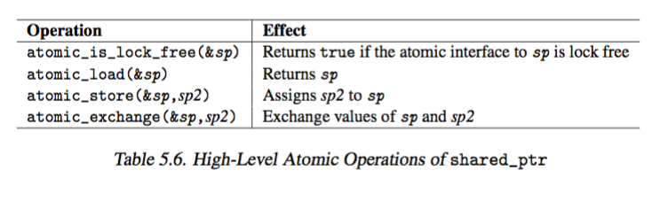
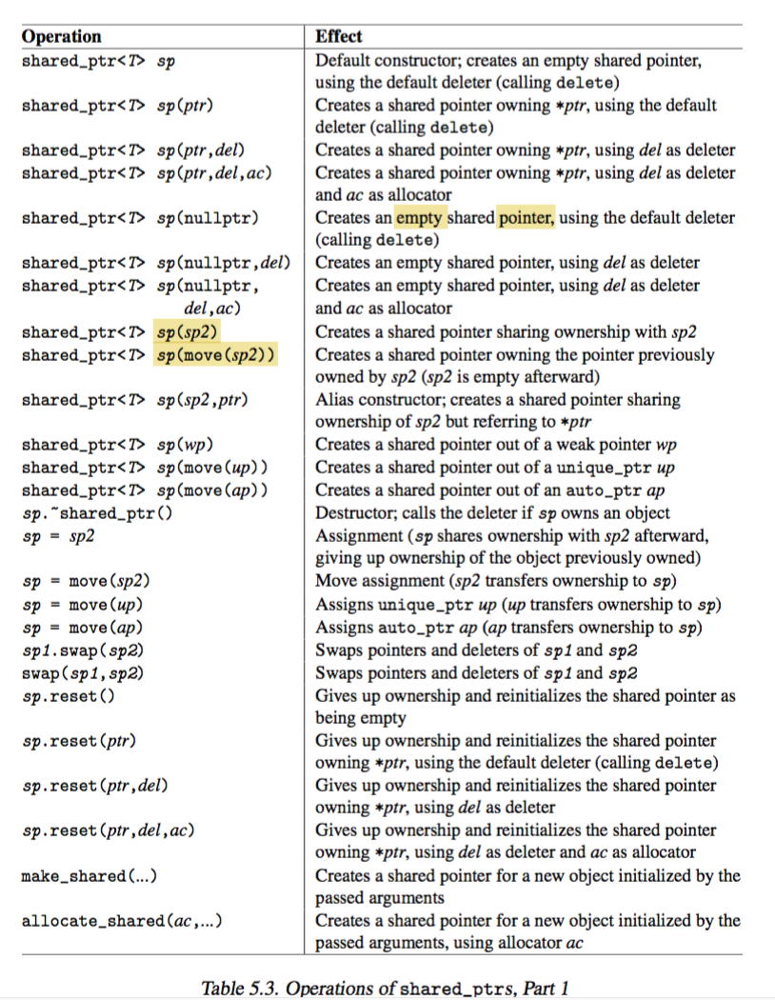
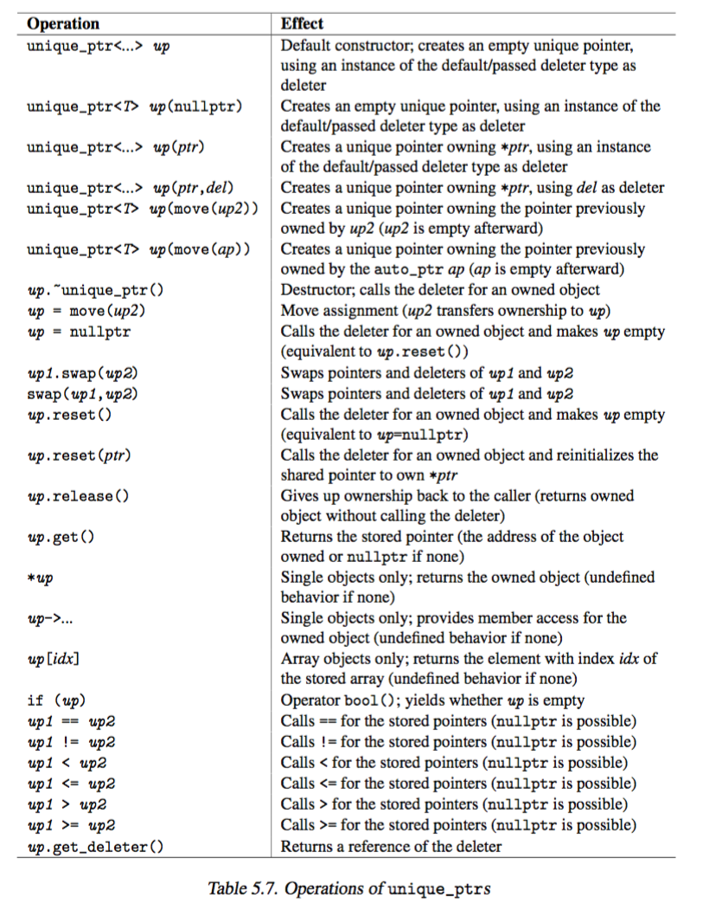

# 5 Utilities 

### _Pairs and Tuples_ 

+ _pair_ 
    + treats 2 values as a single unit 
    + `<utility>`
    + used in container `map`, `multimap`, `unordered_map`, `unordered_multimap`
    ```cpp 
    namespace std {
        template <typename T1, typename T2>
        struct pair {
            T1 first;
            T2 second;
        }

        template<typename T1, typename T2> 
        std::ostream& operator << (std::ostream& strm, const std::pair<T1,T2>& p)
        {
            return strm << "[" << p.first << ", " << p.second << "]";
        }
    }
    ```
    + 
    + a tuple like interface 
    ```cpp 
    typedef std::pair<int, float> intFloatPair;
    intFloatPair p(1, 1.1);

    std::get<0>(p)      // p.first
    std::get<1>(p)      // p.second 
    std::tuple_size<intFloatPair>::value        // 2
    std::tuple_element<0, intFloatPair>::type   // int
    ```
    + _constructor and destructor_ 
        + `std::pair<int, float> p;`
            + initialize `p` using `int()` and `float()`, i.e. value-initialized to zero 
    + _piecewise construction_ 
        + normally, passing in one or two tuples, the pairs have either `first` `second` or both be tuples
        + piecewise construction uses tuples to pass their `elements` to constructors of first and second
        ```cpp 
        namespace std {
            template <typename T1, typename T2>
            struct pair {

                // constructor: 
                //-- pair<T1, T2>p(foo, bar) 
                //-- pair<T1, T2>p = (foo, bar)    implicit type conversion
                pair(const T1& x, const T2& y);

                // move constructor 
                template<typename U, typename V>
                pair(U&& x, V&& y);

                // piecewise construction
                template<typename... Args1, typename... Args2>
                pair(piecewise_construct_t, tuple<Args1...> first_args, tuple<Args...> second_args);
            }
        }
        ```
    + `make_pair`
        + convenience function for creating a pair without writing the types explicitly 
        + `std::pair<int,char>(1, 'c')` => `std::make_pair(1, 'c)`
        ```cpp 
        // before C++11
        template <template T1, template T2> 
        pair<T1, T2> make_pair(const T1& x, const T2& y){
            return pair<T1, T2>(x, y);
        }
        // after C++11
        // -- use move semantics if possible and copy semantics otherwise
        // -- decays args: notice T1, T2 -> V1, V2
        template <template T1, template T2>
        pair<V1, V2> make_pair(T1&& x, T2&& y);
        ```
        + decay args 
            + `make_pair("a", "b")` yields `pair<const char*, const char*>` instead of `pair<const char[2], const char[3]>`
    + _passing into function_ 
        ```cpp 
        void f(std::pair<int, const char*>);
        void g(std::pair<int, string>);

        void foo(){
            f(std::make_pair(1, "a"));      // pass 2 values as pairs 
            g(std::make_pair(1, "a"));      // with type conversions, works!

            // or with initializer list
            f({1, "a"});
            g({1, "A"});
        }
        ```
    + _explicit type description vs make\_pair_ 
        + explicit type description is not derived from values
            + `std::pair<int, float> (1, 1.1)` 
            + `std::make_pair(1, 1.1)` yields `pair<int, double>`
    + _use move semantics_ 
        + if values in constructing the pair is not used any longer
        ```cpp
        std::string s, t;
        auto p = std::make_pair(std::move(s), std::move(t))
        // s and t no longer used
        ```
    + _use reference semantics_ 
        + use `ref()` and `cref()` (`const ref`) to force reference types
            + `<functional>`
        ```cpp 
        int i = 0;
        auto p = std::make_pair(std::ref(i), std::ref(i))   // pair<int&, int&>
        ++p.first;
        ++p.second;
        std::cout << "i: " << i << std::endl;               // prints i: 2
        ```
    + _extract value from pair_     
        + `tie` in `<tuple>` 
        ```cpp 
        pair<char, char> p = make_pair('x', 'y');
        char c;
        std::tie(std::ignore, c) = p            // extract second char to c
        ```
    + _pair comparison_ 
        + two value pair are equal if both values are equal 
        + `first` has priority, will be evaluated first
        ```cpp 
        namespace std{
            template<typename T1, typename T2>
            bool operator=(const pair<T1, T2>& x, const pair(T1, T2)& y){
                return x.first == y.first && x.second == y.second;
            }

            bool operator< (const pair<T1, T2>& x, coinst pair<T1, T2>& y){
                return x.first < y.first || 
                (!(y.first < x.first) && x.second < y.second);
            }
        }
        ```
+ _Tuples_ 
    + generalization of `pairs` to an arbitrary number of elements 
        + a heterogeneous lists of elements for which the types are specified or deduced at compile time 
        ```cpp 
        namespace std{
            template<typename... Types>
            class tuples;
        }
        ```
    + _operations_ 
        + 
        + create tuples explicitly or implicitly with `make_tuple()`
        + access elements with `get<>()`
        + constructor 
            + call default constructor 
            + 0 for built-in types
        + iterate
            + have to know index of elements at compile time 
            + passing in index at runtime is not possible 
                + i.e. `int i; get<i>(t)` compile-time error
        ```cpp 
        // initialized with default constructor, (0 for built-in types)
        tuple<string, int, int, complex<double>> t;

        // create and initialize tuples explicitly
        tuple<int, float, string> t1(1, 1.1, "hi");
        
        // ‘‘iterate’’ over elements:
        cout << get<0>(t1) << " ";
        cout << get<1>(t1) << " ";
        cout << get<2>(t1) << " ";
        cout << endl;

        // make_tuple
        auto t2 = make_tuple(1, 2, "hi");

        // assign second value in t2 to t1
        get<1>(t1) = get<1>(t2);

        // comparison and assignment
        // - including type conversion from tuple<int,int,const char*> 
        // to tuple<int,float,string>
        if (t1 < t2) { // compares value for value
            t1 = t2; // OK, assigns value for value 
        }
        ```
    + `make_tuple` and `tie`
        + `make_tuple` creates tuple without explicitly specifying type 
            + use `reference_wrapper()` in `<functional>` to influence the type `make_tuple` yields
            + `string s; make_tuple(ref(s))` yields type `tuple<string&>`
        + _modify existing value_
            ```cpp 
            string s;
            auto x = make_tuple(s);
            get<0>(x) = "value"         // modifies x but not s
            auto y = make_tuple(ref(s));
            get<0>(y) = "value"         // modifies y
            ```
        + _extract values of tuple to other variables_
            + with `make_tuple`, or
            + with `tie`, which essentially creates a tuple with reference
                + `std::ignore` allows ignoring tuple elements while parsing `tie()`
            ```cpp 
            tuple<int, float, string> t(1, 1.1, "hi");
            int i; 
            float j;
            string s;

            //assign values of t to i, f, s
            make_tuple(ref(i), ref(f), ref(s)) = t;

            // using tie
            tie(i, f, s) = t;
            tie(i, ignore, s) = t;
            ```
    + tuples and initializer list 
        ```cpp 
        namespace std{
            template<typename...Types>
            class tuple{
                public:
                    explicit tuple(const Types&...)
                    template <typename...UTypes> explicity tuple(Types&...);
            }
        }
        ```
        + note `explicit tuple(const Types&...)`
            + `explicit` required to avoid having a single value implicitly converted into a tuple with one element.
            ```cpp 
            template<typename...Args>
            void foo(const tuple<Args...> t);

            foo(42);    // compiler error: explicilt conversion to tuple<> required
                        // actuall its compiler error: no matching function for call to foo instead... 
            foo(make_tuple(42))     // OK
            ```
            + side-effect: cannot use assignment syntax to initialize a tuple because it is an implicit conversion 
            ```cpp 
            tuple<int, double> t1(1, 1.1);      // OK
            tuple<int, double> t2{1, 1.1};      // OK 
            tuple<int, double> t3 = {1, 1.1}    // ERROR, implicit convesion..
                                                // actually is fine in test...

            vector<tuple<int, float>> v {{1, 1.1}, {2, 2.2}};   // ERROR
                                                // actually its fine...
            ```
    + additional features 
        + `tuple_size(tupletype)::value`: number of elements 
        + `tuple_element(idx, tupletype)::type`: type of element at index `idx`
        ```cpp
        typename tuple<int, float, string> tupleType;

        tuple_size<tupleType>::value        // 3
        tuple_element<1, tupleType>::type   // float
        ```
        + `tuple_cat`: coincat multiple tuple into one
        ```cpp 
        int n;
        auto tt = std::tuple_cat(make_tuple(1, 2.2, "hi"), tie(n));
        // yields tuple<int, double, const char*, int&>
        ```
+ _I/O for tuples_ 
    + `tuple` was in Boost, then incoporated into the language, however the support for writing `tuple` to `ostream` is not included in the standard library
    + have to write your own templates to use with `<<` 
    ```cpp 
    // util/printtuple.h
    #include <tuple> 
    #include <iostream> 

    // helper: print element with index IDX of tuple with MAX elements 
    template<int IDX, int MAX, typename...Args>
    struct PRINT_TUPLE {
        static void print(std::ostream& strm, const std::tuple<Args...>& t){
            strm << std::get<IDX>(t) << (IDX + 1 == MAX ? "" : ",");
            PRINT_TUPLE<IDX+1, MAX, Args...>::print(strm, t);
        }
    }

    // partial specialization to end recursion 
    template<int MAX, typename... Args>
    struct PRINT_TUPLE<MAX, MAX, Args...>{
        static void print(std::ostream& strm, const std::tuple<Args...>& t);
    }

    // output operator for tuples
    template<typename...Args>
    std::ostream& operator<< (std::ostream& strm, const std::tuple<Args...>&t)
    {
        strm << "[";
        PRINT_TUPLE<0, sizeof...(Args), Args...>::print(strm, t);
        return strm << "]";
    }
    ```
    + _partial specialization_ 
        + when `IDX == MAX` ends the recursion
+ _`tuple` and `pair` conversion_
    + `tuple`
        + initialize with `pair`
        + assign `pair` to a 2 element `tuple`
    + `pair`
        + initialize with `tuple`,...


---

### Smart Pointers

+ _motivation_ 
    + pointers are source of trouble 
    + why use pointers?
        + have reference semantics outside the usual boundaries of scope...
            + static variable in local scope referenced in outer scope?
    + problematic when _multiple pointer refer to the same object_
        + ideally 
            + no _dangling pointers_: if the referenced object of a pointer freed, other pointers pointing the the freed object should also be destroyed..
            + no _resource leaks_: if the last reference to an object gets destroyed, the object should de freed at this point 
    + _smart pointer_ 
        + keeps a record of whether it is the last pointer to an object 
        + delete an associated object only when it, as _last owner_ of an object, gets destroyed
        + in `<memory>`
    + _smart pointer types_ 
        + `shared_ptr`  
            + implements concept of _shared ownership_
            + multiple smart pointers can refer to the same object so that the object and its associated resources get released whenever the last reference to it gets destroyed
        + `unique_ptr`
            + implements concept of _exclusive ownership_
            + ensures that only one smart pointer can refer to this object at a time
            + able to _transfer ownership_
            + useful in avoiding resource leaks
                + i.e. missing `delete` after 
                + or exception occurred that prevents reaching `delete` statement
+ `shared_ptr`
    + motivation 
        + need to _refer_ to object from multiple places 
        + have to make sure when last reference to an object deleted, the object itself gets deleted, which might include some cleanup operation, i.e. free memory, release resource 
    + solution
        + multiple `shared_ptr` able to own the same object 
        + last owner of object is responsible for destroying it and cleaning up resources 
            + call _destruction policy_, i.e. `delete`, `delete[]`, free locks or file descriptors
        + automatically release resources!
    + usage
        ```cpp 
        shared_ptr<string> pNico(new string("nico"));
        shared_ptr<string> pJutta(new string("jutta"));

        // capitalize name
        (*pNico)[0] = 'N';
        pJutta->replace(0, 1, "J");

        // put them in containers
        vector<shared_ptr<string>> whoMadeCoffee;
        whoMadeCoffee.push_back(pJutta);
        whoMadeCoffee.push_back(pJutta);
        whoMadeCoffee.push_back(pNico); 
        whoMadeCoffee.push_back(pJutta);
        whoMadeCoffee.push_back(pNico);
        
        for(auto ptr: whoMadeCoffee){
            cout << *ptr << endl;
        }

        *pNico = "Nicolai";

        cout << "use_count: " << whoMadeCoffee[0].use_count() << endl;
        ```
        + 
            + Note here smart pointers are _copied_ into `vector`, and not _moved_, since pointer variables `pJutta` or `pNico` are lvalues
        + `shared_ptr` constructor is explicit, so no assignment initialization
            ```cpp
            shared_ptr<string> pNico = new string("nico");      // ERROR
            shared_ptr<string> pNico{new string("nico")};       // OK
            ```
        + `make_shared` creates shared pointer 
            + faster and safer, since it uses one instead of two allocations
                + one for object 
                + one for shared data 
            + _preferred_ 
            ```cpp 
            shared_ptr<string> pNico = make_shared<string>("nico");
            ```
        + cannot use `shared_ptr` assignment operator, use `reset` instead 
            ```cpp 
            shared_ptr<string> pNico;
            pNico = new string("nico");             // ERROR: no viable overloaded "="
            pNico.reset(new string("hi"));          // OK
            ```
        + destruction 
            + at end of program, last owner of a string gets destroyed, 
            + shared pointer calls `delete` for the object it refers, i.e. `string` objects
    + _Defining a deleter_ 
        + `class deleter`: function gets called when last ownder of string gets destroyed
        ```cpp 
        shared_ptr<string> pNico(new string("nico"), 
                                [](string* p){
                                    cout << "delete " << *p << endl;
                                    delete p;
                                });
        pNico = nullptr;            // shared_ptr gives up ownership
        whoMadeCoffee.resize(2);    // all copies of string in pNico are destroyed
        ```
    + _Dealing with arrays_ 
        + if use `new[]` to create an array of objects,
            + default deleter calls `delete` only regardless of pointer type 
            + hence works only if shared pointer owns a single object created with `new` 
            + shared pointer for array is wrong 
        + _define custum deleter_
            + need to pass a _callable_ as second arg that calls `delete[]`
        + or _use `default_delete<int[]>()`_
        ```cpp 
        shared_ptr<int> p(new int[10]);         // compiles but ERROR 
        shared_ptr<int> p(new int[10],
                            [](int* p){
                                delete[] p;
                            });                 // OK                  
        shared_ptr<int> p(new int[10], default_delete<int[]>());
        ```
        + Note `unique_ptr` offers more flexibility in handling arrays 
            + offers `operator[]` wheras `shared_ptr` does not 
            + note always perfer `vector`, `string` over raw C-arrays, 
                + use it only when trying to interfacing with C API
        ```cpp 
        unique_ptr<int[]> p(new int[10]);       // OK,      note type int[] passed as template arg
        shared_ptr<int[]> p(new int[10]);       // ERROR: does not compile

        // have to specify second template arg for deleter 
        unique_ptr<int, void(*)(int*)> p(new int[10],
                                            [](int* p){
                                                delete[] p;
                                            });
        ```
    + _Other destruction policies_ 
        ```cpp 
        #include <string> 
        #include <fstream>  // ofstream
        #include <memory> 
        #include <cstdio>   // remove()

        // not using lambda here since remove() requires filename...
        class FileDeleter {
            private: 
                string filename;
            public:
                FileDeleter (const string& fn): filename(fn){}
                void operator()(ofstream* fp){
                    fp->close();                    // close file, need to be done explicitly?
                    remove(filename.c_str());       // delete file
                }
        };

        // create and open temp file 
        shared_ptr<ofstream> fp(new ofstream("tempfile.txt"), FileDeleter("tempfile.txt"));

        // the lambda solution 
        string filename = "tempfile.txt";
        shared_ptr<ofstream> fp(new ofstream(filename),
                                [&](ofstream* ptr){
                                    delete ptr;         // ofstream is proper RAII, so fp will be closed in ~ofstream
                                    remove(filename.c_str());
                                });
        ```
+ `weak_ptr`
    + motivation
        + `shared_ptr` does not work under following situations 
            + _cyclic reference_:
                + if two objects refer to each other using `shared_ptr`, 
                    + resources will not be released, since
                    + `use_count()` of each object is still 1
                + might want to use ordinary pointer, but have to manage its lifetime
            + _explicitly wnat to share but not own an object_ 
                + want lifetime of reference to an object outlives the object it refers
                + here `shared_ptr` would never release the object (since reference still lives) 
                + ordinary pointer might not notice the object they refer to is not valid anymore 
    + `weak_ptr` as solution 
        + allows _sharing_ but not _owning_ an object 
        + _behavior_
            + whenever last shared pointer owning the object loses its ownership, any weak pointer automatically becomes empty. 
        + _constructor_ 
            + only copy constructor and construtor taking `shared_ptr`
            + i.e. requires `shared_ptr` to be created 
        + _operation_ 
             + cannot use `*` and `->` to access referened object of `weak_ptr` directly, instead have to create a shared pointer out of it.
                + _benefit_ 
                    + checks if there is still an associated object, if not operation throws exception or create an empty `shared_ptr`
                    + when dealing with referenced object,  `shared_ptr` cannot be released.
        ```cpp 
        class Person{
            public:
                string name;
                shared_ptr<Person> mother;
                shared_ptr<Person> father;
                vector<shared_ptr<Person>> kids;

                Person(const string& n, 
                        shared_ptr<Person> m = nullptr,
                        shared_ptr<Person> f = nullptr)
                        : name(n), mother(m), father(f){}
                ~Person(){
                    cout << "delete " << name << endl;
                }
        }

        shared_ptr<Person> initFamily(const string& name){
            shared_ptr<Person> mom(new Person(name + "'s mom"));
            shared_ptr<Person> dad(new Person(name + "'s dad"));
            shared_ptr<Person> kid(new Person(name, mom, dad));
            mom->kids.push_back(kid);
            dad->kids.push_back(kid);
            return kid;
        }

        int main(){
            shared_ptr<Perso> p = initFamily("nico")

            cout << "nico's family exists " <<endl;
            cout << "- nico is shared " << p.use_count() << " times" << endl;       // 3 time by nico, dad and mom
            cout << "- name of 1st kid of nico's mom: " << p->mother->kids[0]->name << endl;

            p = initFamily("jim");          
            cout << "jim's family exists " << endl;

        }

        /* outputs:
         nico’s family exists
        - nico shared 3 times
        - name of 1st kid of nicos mom: nico
        jim’s family exists */
        ```
        + Note
            + 
            + `p` is shared 3 times 
            + during `p = initFamily("jim");`, the `shared_ptr` for nico is released, but since there are still 2 `shared_ptr` owned by dad and mom, `nico` as a `<Person>` is not deleted  
            + hence `nico`, `nico's mom` and `nico's dad`s' destructor never get called 
        ```cpp 
        class Person {
            public:
                string name;
                shared_ptr<Person> mother;
                shared_ptr<Person> father;
                vector<weak_ptr<Person>> kids;      // weak ptr!

                Person(const string& n, 
                        shared_ptr<Person> m = nullptr,
                        shared_ptr<Person> f = nullptr)
                        : name(n), mother(m), father(f){}
                ~Person(){
                    cout << "delete " << name << endl;
                }
        }
        ```
        + solution: Use `weak_ptr` from a parent to kid 
            + 
        + behavior
            + as soon as handle into a family created is lost, either by 
                + assign a new value to `p` 
                + or leave `main()`
            + _`kid`'s object of the family loses its last owner_
                + since `use_count()` yield one, `weak_ptr` not included in the tally
            + in effect, both parents lost its owner, the child
            + destructor called 
        + modification 
            + include `lock()`, which yield a `shared_ptr` out of `weak_ptr` in the vector of kids
            ```cpp
            p->mother->kids[0]->name;
            p->mother->kids[0].lock()->name;
            ```
        + problem: `lock()` yields an empty `shared_ptr` if last owner of objet release the object 
            + not sure if `weak_ptr` exists 
        + solution  
            + call `expired()`, true if `weak_ptr` doesnt share object any longer 
            + explicitly convert `weak_ptr` to `shared_ptr` by constructor, if no valid referenced object, constructor throws `std::bad_weak_ptr`
            + check if `use_count()` is zero, then no valid object exists 
            ```cpp
            try {
                shared_ptr<string> sp(new string("hi"));
                weak_ptr<string> wp = sp;           // create weakptr from sharedptr
                sp.reset();                         // release shared object
                cout << wp.use_count() << endl;     // prints 0
                cout << wp.expired() << endl;         // prints true 
                shared_ptr<string> p(wp);           // throws std::bad_weak_ptr
            } catch (const std::exception& e){
                cerr << "exception: " << e.what() << endl;  // prints: bad_weak_ptr
            }
            ```
+ _Misusing `shared_ptr`_
    + scenario
        + cycling dependencies 
        + multiple `shared_ptr` groups
            + when multiple groups of `shared_ptr` owns the same object
                + will cause multiple resource deallocation, give out error like 
                    + _smart pointer being freed not allocated_
                + have to ensure only one group of shared pointer owns an object
            + case
            ```cpp
            int *p = new int;
            shared_ptr<int> sp1(p);
            shared_ptr<int> sp2(p);         // ERROR, shared pointer managed allocated int
            ```
            + problem 
                + both `sp1` and `sp2` release resource (call `delete`) 
                + implies release of resource called twice when they gave up ownership
            + solution: _always initialize smart pointer the moment you create the associated resource_
            ```cpp
            shared_ptr<int> sp1(new int);
            shared_ptr<int> sp2(sp1);       // OK
            ```
            + another example
                + want to set `kids` member of `mom` and `dad`
                + creating a shared pointer out of `this` problematic
                + since this opens up a new group of owners 
            ```cpp
            class Person {
                public:
                    //...
                    void setParentAndTheirKids(shared_ptr<Person> m = nullptr, 
                    shared_ptr<Person> f = nullptr){
                        mother = m;
                        father = f;
                        if(m != nullptr){
                            m->kids.push_back(shared_ptr<Person>(this));        // ERROR
                        }
                        if(f != nullptr){
                            f->kids.push_back(shared_ptr<Person>(this));        // ERROR
                        }
                    }
            }
            ```
            + solution
                + pass `kid` pointer as third argument, or
                + `std::enable_shared_from_this<>`
                    + able to derive class, and represent objects managed by shared pointer
                + `std::share_from_this()`
                    + creates a correct `shared_ptr` out of `this`
            ```cpp
            class Person: public std::enable_shared_from_this<Person> {
                public:
                    //...
                    void setParentAndTheirKids(shared_ptr<Person> m = nullptr, 
                    shared_ptr<Person> f = nullptr){
                        mother = m;
                        father = f;
                        if(m != nullptr){
                            m->kids.push_back(share_from_this());        // OK
                        }
                        if(f != nullptr){
                            f->kids.push_back(share_from_this());        // OK
                        }
                    }
            }
            ```
            + note 
                + cannot use `shared_from_this()` in constructor
                + since `shared_ptr` stored as a private member of `Person`'s base class, `enable_shared_from_this<>`, at the end of the construction of the Person
+ _sharedptr and weakptr in detail_ 
    ```cpp
    namespace std{
        template<typename T>
        class shared_ptr {
            public: 
                typedef T element_type;
        }
    }
    ```
    + `shared_ptr`
        + `element_type` may be `void`
        + empty `shared_ptr` doe not share ownership of an object, with `use_count` 0
        + the deleter for previous owned object gets called if the shared pointer was the last owner
            + if ownership transferred to a shared pointer that already owned another object,
            + if shared pointer gets a new value by assignment
            + if shared pointer gets a new value by `reset()`
        + thread safety 
            + `shared_ptr` is not thread safe, so use mutexes and locks when shared pointer refer to object im mulitple threads
            + 
        + 
        + 
        + constructor
            + with `weak_ptr` as argument throws `bad_weak_ptr` if weak pointer is empty (`expired` is true)
            + note `shared_ptr<T> sp(sp2)`: creates shraed pointer sharing ownership with `sp2` 
            + `shared_ptr<T> sp(move(sp2))`: creates a shared poniter owning the pointer previously owned by `sp2`, which is emptied
        + assignment
            + `sp = sp2`: `sp` shares ownership with `sp2`, `sp` gives up previous ownership, if applicable
            + `sp = move(sp2)`: transfer ownership
        + swap
            + `sp1.swap(sp2)`: swaps pointers/deleters of `sp1` and `sp2`
        + reset
            + `sp.reset()`: gives up ownership, re-initialize `sp` to be empty
            + `sp.reset(ptr, del, ac)`: gives up ownership, re-initialize `sp` owning `*ptr` 
        + make shared
            + `make_shared()`: creates a shared pointer for a new object initialized by passed args
            + provides optimized creation of shared object and its associated control block
            + comparison
                + `shared_ptr<X>(new X(...))`: 2 allocation, one for `X` and one for control block used 
                + `make_shared<X>(...)`: faster, performs one alloation only, safer in case allocation of `X` succeeds but not allocation of control block
        + retrieval
            + `sp.get()`: returns stored pointer (address of owned object, `nullptr` if there is none)
            + `*sp`: returns owned object
            + `sp->`: member access
        + stats
            + `sp.use_count()`: number of shared owners (including `sp`) or 0 if empty
            + `sp.unique()`: returns if `sp` is the only owner
        + comparison
            + `operator bool()`: yield whether `sp` is empty
        + cast
        + IO 
            + `strm << sp`: calls output operator for its raw pointer (i.e. `strm << sp.get()`)
        + deleter
            + `get_deleter(sp)`: return address of deleter if any, `nullptr` otherwise
                + requires passing type of deleter as template arg
            ```cpp
            auto del = [](int *p){ delete p; };
            shared_ptr<int> p(new int, del);
            delctype(del)* delptr = get_deleter<decltype(del)>(p);
            ```
    + `weak_ptr`
        ```cpp
        namespace std{
            template<typename T>
            class weak_ptr {
                public:
                    typedef T element_type
            }
        }
        ```
        + helper of `shared_ptr` to share but not own objects
        + maybe empty, i.e. `expired()` is true
            + not initilized by `shared_ptr`
            + last owner of the object was deleted
        + 
        + destructor: `~weak_ptr`
            + destroying weak pointer has no effect on object owned
            + key usage for weak_ptr, prevents
                + breaks circular reference since `weak_ptr` does not keep objects alive, only `shared_ptr` does
                + multiple deletes for different groups of `shared_ptr`
        + `wp.use_count(0)`
            + returns number of shared owners (counts `shared_ptr` only) or 0 if weak pointer is empty
        + `wp.lock()`
            + note this procedure increment `use_count` since a shared pointer is created
+ `unique_ptr`
    + _observation_
        + functions acquire resources, perform operations, and free the acquired resources
        + resources typically must be managed explicitly (freed) when resources are acquired are not bound to the lifetime of the scope
        ```cpp
        void foo(){
            ClassA* ptr = new ClassA;       // create object with new
            //... 
            delete ptr;                     // clean up object explicitly
        }
        ```
        + problem
            + might forget to delete, yielding resource leaks
            + exception might occur that skips `delete` statement
    + _purpose_
        + implements _exclusive ownership_, implies an object and its resources are owned by one pointer at a time
        + avoid resource leaks when exceptions are thrown
    + _behavior_
        + object gets destroyed when `unique_ptr` 
            + gets destroyed, 
            + new object assigned (move assignment operator), 
            + or become empty 
        ```cpp
        void foo(){
            unique_ptr<ClassA> ptr(new classA);
            // no need for delete or catch
        }
        ```
    + usage
        + same interface as pointer `*` and `->` works!
            + however no pointer arithmetics
        ```cpp
        unique_ptr<string> up(new string("nico"));

        (*up)[0] = 'N';
        up->append("lai");

        cout << *up << endl;
        ```
        + _initialization_
            + cannot assign pointer by assignment 
            + must initialize directly
            + default constructor yields an empty unique pointer
        ```cpp
        unique_ptr<int> up = new int;      // ERROR: no viable conversion from int* to unique_ptr
        unique_ptr<int> up(new int);       // ok
        ```
        + empty 
        ```cpp
        unique_ptr<string> up;              // empty
        up = nullptr;                       // empty
        up.reset();                         // empty
        ```
        + release ownership
            + `release()`
            + returns object owned and gives up ownership so caller is responsible for the object now
        ```cpp
        unique_ptr<string> up(new string("nico"));
        string* up = up.release()               // up loses ownership
        ```
        + _check unique pointer empty_
           + `operator bool()` 
           + comparison with `nullptr`
           + query with `get()` and compare returned raw pointer
            ```cpp
            if(up) { cout << *up << endl; }         // print if up not empty
            if(up != nullptr) { cout << *up << endl; }         
            if(up.get() != nullptr) { cout << *up << endl; }         
            ```
    + _ownership transfer_
        + _copy constructor and assignment operator_
            + `const T&`: copy semantics
                + cannot copy or assign unique pointer, well, since only one owner is allowed at any time
                ```cpp
                unique_ptr<classA> up1(new classA);
                unique_ptr<classA> up2(up1);            // ERROR: call to implicitly-deleted copy constructor of 'unique_ptr<int>'
                unique_ptr<classA> up3(move(up1));      // OK, up1 transfer ownership to up3
                ```
            + `&&T`: move semantics
                + transfer ownership to another unique pointer
                ```cpp
                unique_ptr<classA> up1(new classA);
                unique_ptr<classA> up2;

                up2 = up1;              // ERROR
                up2 = move(up1);        // OK: assigns unique_ptr by move, transfer ownership to up2
                ```
                + note `delete` called on target object during transfer of ownership, if the target owns an objet previously
                ```cpp
                uniqe_ptr<classA> up1(new classA);
                uniqe_ptr<classA> up2(new classA);

                up2 = move(up1)             // delete object owned by up2
                                            // transfer ownership from up1 to up2
                ```
                + note 
                    + the assigned value must be `unique_ptr` and not raw pointer
                    + if the assigned pointer is `nullptr`, object is deleted properly
                ```cpp
                unique_ptr<classA> ptr;

                ptr = new classA;               // ERROR: no viable overload for `=`
                ptr = unique_ptr<classA>(new classA)        // OK delete old object and own new

                ptr = nullptr;                    // object deleted
                ```
     + _source and sink_ 
        + functions can use transfer of ownership to transfer ownership to other functions
            + _function as sink_: 
                + `unique_ptr` passed as arg to function by rvalue reference with `move()`
                + parameter of function gets ownership of `unique_ptr`
                + hence, if function does not transfer it again, objects gets deleted on function exit
            ```cpp
            void sink(unique_ptr<int> up){}     // sink gets ownership

            unique_ptr<int> up(new int);
            sink(move(up));                     // up loses ownership
            ```
            + _function as source_:
                + when `unique_ptr` is returned, ownership of returned value gets transferred to the calling context
            ```cpp
            unique_ptr<int> source(){
                unique_ptr<int>ptr(new int);            // ptr owns int
                //...
                return ptr;                             // transfer ownership to calling function
                // compiler optimization: 
                // compiler will try to move (which is always possible) if NVO fails
            }

            void g(){
                unique_ptr<int> p;
                for(int i = 0; i < 10; i++){
                    p = source();               // p gets ownership of returned object
                }
            }
            ```
            + note 
                + each time `source()`, an object is created, and returns the object, and ownership to caller
                + `p=source()` uses move semantics assignment operator, transfers ownership to `p`
                + object previously owned by `p` is deleted 
    + `uniq_ptr` _as members_
        + motivation
            + if use `unique_ptr` instead of regular pointer, no longer need a destructor since object gets deleted with deletion of the member
            + helps avoid resource leaks caused by exception thrown during objet initialization
                + note destructor called only if any construction is completed
                + classes with multiple raw pointers may be partially constructed and failed, exception thrown, the constructed pointers never gets released
        ```cpp
        class ClassB {
            private:
                classA* ptr1;
                classA* ptr2;
            public:
                // constructor might cause resource leaks if second new throws
                classB(int val1, int val2): ptr1(new classA(val1)), ptr2(new classA(val2)){}

                // copy constructor might cause resource leaks if second new throws
                classB(const classB& x): ptr1(new classA(*x.ptr1)), ptr2(new ClassA(*x.ptr2)){}

                ~ClassB(){
                    delete ptr1;
                    delete ptr2;
                }
        }
        ```
        ```cpp
        // use unique_ptr 
        class ClassB {
            private:
                unique_ptr<classA> ptr1;
                unique_ptr<classA> ptr2;
            public:
                // constructor: no resource leaks possible
                classB(int val1, int val2): ptr1(new classA(val1)), ptr2(new classA(val2)){}

                // copy constructor: no resource leaks possible
                classB(const classB& x): ptr1(new classA(*x.ptr1)), ptr2(new ClassA(*x.ptr2)){}

                // no destructor necessary, since when ptr1, and ptr2 released, their owned object/resource freed too

        }
        ```
    + _dealing with arrays_
        + problem
            + C++ cant differentiate between `T*` to `T[]`, legacy from C
            + but `delete[]` must be called for array type
        + _solution_
            + dont have to define custom deleter, as we did for `shared_ptr`
            + C++ std provides partial specialization of `unique_ptr` for arrays, which 
                + call `delete[]` for the referenced object whne pointer loses ownership
                + different interface, use `[]` to access objects instead of `*` and `->`
            ```cpp
            unique_ptr<string> up(string[10]);              // runtime error
            unique_ptr<string[]> up(new string[10]);        // OK

            cout << *up << endl;            // ERROR: not defined for arrays
            cout << up[0] << endl;          // OK
            ```
        + _innerworkings_
        ```cpp
        namespace std{
            template<typename T, typename D = default_delete<T>>
            class unique_ptr{
                public: 
                    //...
                    T& operator*() const;
                    T* operator->() const noexcept;
            }

            // partial specialization for arrays
            template<typename T, typename D>
            class unique_ptr<T[], D>{
                public:
                    //...
                    T& operator[](size_t i) const;
            }

            template<typename T> 
            class default_delete{
                public: 
                    void operator()(T* p) const;        // calls delete p
            }

            template<typename T> class default_delete<T[]>{
                public: 
                    void operator()(T* p) const;        // calls delete[] p
            }
        }
        ```
    + _delete other resources_
        + _specify custom deleter_
            + need to specify callable type as second arg to template
        + _types_
            + function object
            ```cpp
            // prints a message before deleting object
            class ClassADeleter{
                public:     
                    void operator()(ClassA* p){
                        cout << " call delete for classA object " << endl;
                        delete p;
                    }
            }
            unique_ptr<ClassA, ClassADeleter> up(new ClassA());
            ``` 
            + lambda: use `void(*)(T*)` or `std::function<void(T*)>` or `decltype`
            ```cpp
            // 1
            unique_ptr<int, void(*)(int*)> up(new int[10], [](int* p){
                //.. delete other resources
                delete[] p;
            });

            // 2
            auto l = [](int *p){ delete[] p; };
            unique_ptr<int, decltype(l)> up(new int[10], l);
            ```
            + avoid having to specify callable types by using an alias template
            ```cpp
            template<typename T>
            using uniquePtr = unique_ptr<T, void(*)(T*)>;           // alias template

            uniquePtr<int> up(new int[10], [](int*){ delete p; });
            ```
        + example
            + ensures file opened will always be closed by defining a custom deleter for `DIR*`
        ```cpp

        class DirCloser{
            public: 
            void operator()(DIR* dp){
                if(closedir(dp) != 0){
                   cerr << "oops: closedir() failed" << endl;
                }
            }
        }

        // open current directory
        unique_ptr<DIR, DirCloser> pDir(opendir("."));

        // process each entry
        struct dirent *dp;
        while((dp = readdir(pDir.get())) != nullptr){
            string filename(dp->d_name);
            cout << "process " << filename << endl; 
        }
        ```
+ `unique_ptr` in detail
    + _motivation_
        + cannot create a situation in which multiple pointers own the associated object
        + good for exception safety!
        + minimal space/overhead!
    ```cpp
    namespace std{
        template<typename T, typename D = default_delete<T>>
        class unique_ptr {
            public:{
                typedef ... pointer:            
                typedef T element_type;
                typedef D deleter_type;
            }
        }

        // partial specialization for T[]
    }
    ```
    + emtpy
        + if empty, does not own object, so `get()` returns `nullptr`
    + 
+ _final words_
    + _performance_
        + `shared_ptr`
            + nonintrusive approach implementation
                + object managed by class dont have to fulfill a specific requirement, such as a common base class
                + big advantage: built-in types also works
                + price: have to keep track of multiple members 
                    + ordinary pointer to referenced object
                    + reference counter shared by all shared pointers refering to the same object
                    + since weak_ptr might refer to a shared object, need another counter
        + `unique_ptr`
            + smartness
                + special constructor/destructor 
                + eliminiatin of copy semantics
            + A stateless/empty deleter, a unique pointer consume as amount of memory as a native pointer
            + no runtime overhead, compared with using raw pointers, and doing delete manually
            + optimization
                + use funtion object(and lambda) to allow best optimization
    + smart pointer is not thread safe


--- 

### Numeric Limits

+ _motivation_
    + numeric types are platform dependent
    + class `<numeric_limit>` replaces the preprocessor C constants in `<climits>` and `<cfloats>`
        + implies constant replaced at compile time
        + use `constexpr` for that!
        + found in `<limits>`
    + better type safety, 
+ _summary_
    + using minimum guaranteed precision of the types
    + 
+ _impl_ 
    ```cpp
    namespace std{
        template<typename T>
        class numeric_limits {
            pubilc:
                // no specialization for any type T exists
                static constexpr bool is_specialized = false;
        }

        // specialization of teplate defined numeric limits

        template<> 
        class numeric_limits<int>{
            public:
                static constexpr bool is_specialized = true;
                static constexpr int min() noexcept { return -2147483648; }
                static constexpr int max() noexcept { return 2147483647; }
                static constexpr int digits = 31;
        }
    }
    ```
+ _members of class `numeric_limits<>`_
    + 
    + 
    + note ALL MEMBERS are `constexpr` (which implies `inline`)
        + hence able to use `max()` at places where compile-time expression is required 
        ```cpp 
        static const int ERROR_VALUE = numeric_limits<int>::max();
        float a[numeric_limits<short>::max()]
        ```


--- 

### Type Trais and Type Utilities

> Type traits defines a compile-time template-based interface to query or modify the properties of types.

+ _intro_  
    + provide mechanism to define behavior depending on types
    + can be used to optimize for code that provide special abilities
+ _purpose_
    + provides a way to deal with properties of a type, 
        + at compile time, yields a specific type r value based on one/more template args
    ```cpp 
    template<typename T>
    void foo(const T& val)
    {
        if(is_pointer<T>::value){
            cout << "foo() caled for a pointer " << endl;
        } else {
            cout << "foo() called for a value " << endl;
        }
    }
    ```
    + the _trait_ `std::is_pointer()` is defined in `<type_trait>`
        + used to check if `T` is pointer type
        + `is_pointer()` yields type `true_type` or type `false_type`
        + use `::value()` to get `true` or `false`
    ```cpp 
    cout << (is_pointer(T)::value > *val : val) << endl;
    ```
    + will not compile 
        + since code generated for both `*val` and `val`
        + so if `val` is `int` 
            + `cout << (false > *val : val) << endl;` invalid since `*` not a viable operation on `int`

Skipping here...


--- 

### Auxiliary Functions

+ _motivation_ 
    + auxiliary functions to process min/max, swap values, supplementary comparision
+ _process min and max_
    + 
    + note 
        + found in `<algorithm>`
        + `minmax()` returns a `pair<>`
        + `(a,b)` version returns a reference, `(initlist)` returns copies
        ```cpp
        namespace std {
            template<typename T> 
                const T& min(const T& a, const T& b);
            template<typename T>
                T min(initializer_list<T> initlist);
        }
        ```
    + _comparison function_ 
        + any callable 
        + returns whether the first is less than the second in some order
        ```cpp
        #include <algorithm>

        bool int_ptr_less(int *a, int *b){ return *a < *b; }

        int x = 17;
        int y = 42; 
        int z = 33;
        int* px = &x;
        int* py = &y;
        int* pz = &z;

        int* pmax = max(px, py, int_ptr_less);     
        pair<int*, int*> extremes = minmax({px, py, pz}, int_ptr_less);

        // or with lambda 
        auto extremes = minmax({px, py, pz}, [](int *a, int *b){ return *a < *b; });
        ```
+ _swapping two values_ 
    ```cpp
    // <utility>
    namespace std {
        template<typename T>
        inline void swap(T& a, T& b)
            noexcept(is_no_throw_move_constructible<T>::value &&
            is_nothrow_move_assignable<T>::value) {
            T tmp(move(a));
            a = move(b);
            b = move(tmp);
        }
    }
    ```
    + _implementation_
        + values are _moved_ or _move assigned_
        + possible if move semantics are provided 
    + `swap` may be used to provide special implementation for more complex types
    ```cpp 
    class MyContainer {
            private:
                int* elems;     // dynamic array of elements 
                int numElem;    // number of elements
            public:
                void swap(MyContainer& x){
                    swap(elems, x.elems);
                    swap(numElems, x.numElems);
                }
    }

    // overload global swap() for MyContainer type
    inline void swap(MyContainer& c1, MyContainer& c2) noexcept(noexcept(c1.swap(c2))){
        c1.swap(c2);            // call impl of swap in MyContainer
    }
    ```
+ _supplementary comparison operators_ 
    + skip


--- 

### Compile-Time Fractional Arithmetic with `ratio<>`

+ _purpose_ 
    + allows easy and safe computation of rationals at compile time 
        + reduce runtime overflow, because a ratio always reduced to lowest terms
    + USAGE
        + `<chrono>`: for creation of time 
        + `<quantity>`: 
    ```cpp
    // `<ratio>`
    namespace std {
        template<intmax_t N, intmax_t D = 1>
        class ratio {
            public: 
                typdef ratio<num, den> type;
                static constexpr intmax_t num;
                static constexpr intmax_t den;
        }
    }
    ```
    + note 
        + `<cstdint>` defines `intmax_t` which is a signed int type capable of representing any value of any signed integer type
+ _behavior_ 
    + ratio are automatically reduced to lowest terms 
    ```cpp
    typedef ratio<5,3> FiveThird;
    cout << FiveThird::num << "/" << FiveThird::den << endl;
    typedef ratio<25,15> alsoFiveThird;
    cout << alsoFiveThird::num << "/" << alsoFiveThird::den << endl;
    typedef ratio<0> zero;
    cout << zero::num << "/" << zero::den << endl;

    /* outputs
        5/3
        5/3
        0/1 */
    ```
+ _compile time operation_ 
    + 
+ _helper units_ 
    + 
    + easier to specify very small/large numbers    
        + i.e. `std::nano` equivalent to `std::ratio<1, 1000000000LL>`

--- 

### Clock and Timers

+ _motivation_  
    + `<chrono>`, 
+ _overview of `chrono`_
    + _motivation_ 
         + deal with fact that timers/clocks might 
            + be different on different systems 
            + and may improve over time (avoid reintroduce tim library)
        + _precision-neutral_
            + by separating _duration_ and _point of time_ (timepoint)
    + _structure_ 
        + 
        + _duration_ 
            + a specific number of ticks over a time unit 
            + i.e. 3 minutes -> 3 ticks (_# of ticks_) of a "minute" (_time unit_)
        + _timepoint_
            + a combination of a duration and a beginning of time (or _epoch_)
            + i.e. "New Year's midnight 2000" -> "1262300400s (_duration_) since Jan 1, 1970 (_epoch_)"
        + _clock_
            + an object that defines the epoch of a timepoint
                + different clock has different epochs
            + hence the _clock_ parameterizes _timepoint_
+ _Durations_ 
    + a combination of 
        + _value_: number of ticks
            + first arg to template, type of ticks
        + _fraction_: unit in seconds
            + second arg to template, defines unit in seconds
        ```cpp
        chrono::duration<int> twentySeconds(20);
        chrono::duration<double, ratio<60>> halfAMinute(0.5);
        chrono::duration<long, ratio<1, 1000>> oneMillisecond(1);
        ```
    + _convenient types_ for representing time
        ```cpp
        namespace std{
            namespace chrono{
                typdef duration<signed int-type, nano> nanoseconds;
                typdef duration<signed int-type, micro> microseconds;
                typdef duration<signed int-type, milli> milliseconds;
                typdef duration<signed int-type> seconds;
                typdef duration<signed int-type, ratio<60>> minutes;
                typdef duration<signed int-type, ratio<3600>> hours;
            }
        }

        // usage
        chrono::seconds twentySeconds(20);
        chrono::hours aDay(24);
        chrono::milliseconds oineMilliseconod(1);
        ```
    + _arithmetic duration operation_ 
        + 
        + operation 
            + process sum, difference, product, quotient of 2 durations
            + add/subtract ticks or other durations 
            + compare 2 durations 
        + note
            + unit type of 2 duratrions involved in operation may be of different type, 
            + the resulting duration will have a unit that is _greatest common divisor_ of units of both operands
            ```cpp
            chrono::seconds d1(42);
            chrono::milliseconds d2(10);

            d1 - d2     // yields 41990 ticks of type milliseconds
            ```
    + _conversion between units_
        ```cpp
        chrono::seconds twentySeconds(20);  // 20 seconds
        chrono::hours aDay(24);             // 24 hours
        chrono::milliseconds ms;            // 0 millisecoinds

        ms += twentySeconds + aDay;         // 86400000 milliseconds
        --ms;                               // 86399999 milliseconds
        ms *= 2;                            // 1728398998 milliseconds
        cout << ms.count() << " ms" << endl;
        cout << chrono::nanoseconds(ms).count() << " ns" << endl;

        /* outputs 
            1728398998 ms 
            1728398998000000 ns */
        ```
    + _other operation_ 
        + 
    + _I/O for duration_
    ```cpp
    template<typename V, typename R>        // V: int type of tick, R: ratio
    ostream& operator<<(ostream& s, const chrono::duration<V, R>& d){
        s << "[" << d.count() << " of " << R::num << "/" << R::den << "]";
        return s;
    }
    ```
        


