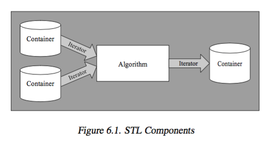
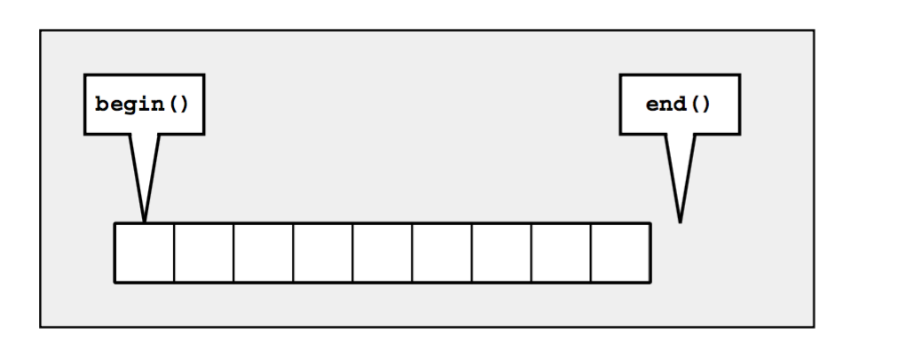
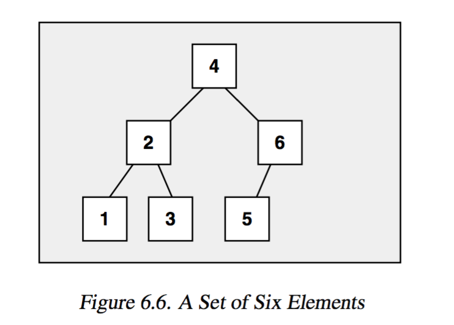
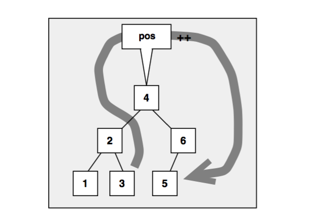
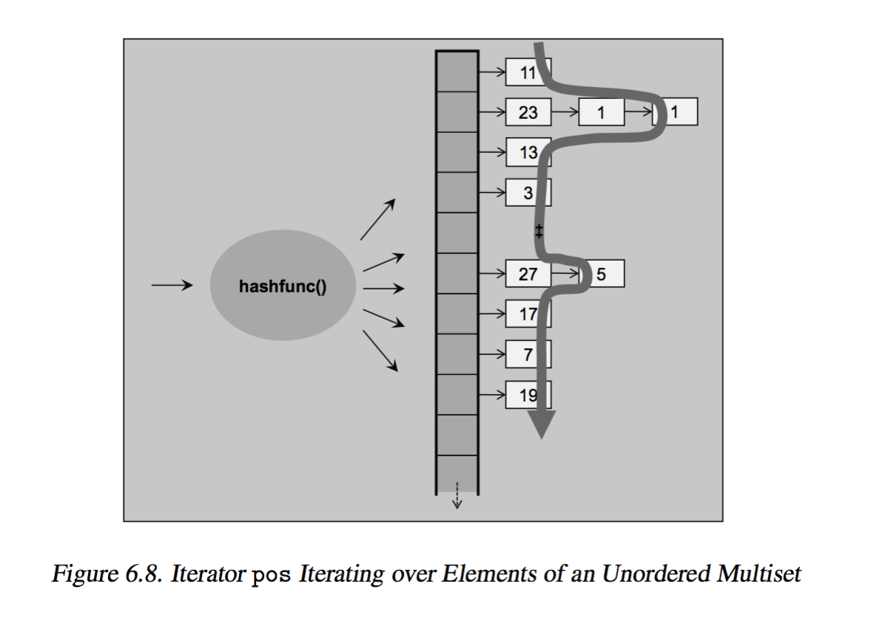
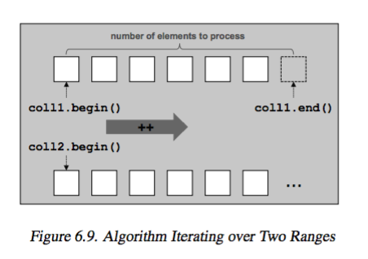

# The Standard Template Library 


### 6.1 STL Components

+ _components_ 
    + _Containers_ 
        + manage collections of objects of a certain kind
    + _Iterators_ 
        + used to step through elements of collections of objects 
        + provides a small but common interface for any arbitrary container types
        + `++` and `*` works as if its a pointer
    + _Algorithms_ 
        + used to process elements of collections 
+ _philosophy_ 
    + 
    + separation of 
        + _data_: managed by container 
        + _operation_: defined by algorithms 
    + and glued together by iterators


### 6.2 Containers

+ _categories_ 
    + _Sequence Containers_ 
        + _ordered collections_ where every element has a certain position
        + position 
            + depends on time/place of insertion 
            + independent of value of the element 
        + `array`, `vector`, `deque`, `list`, `forward_list`
        + impl as arrays or linked list
    + _Associative Containers_ 
        + _sorted collections_ in which position of element depends on its value (or key, if its k-v pair) due to certain ordering criterion
        + position 
            + depends on value 
            + independent of order of insertion 
        + `set`, `multiset`, `map`, `multimap`
        + impl as binary trees
        + _performance_ 
            + fast search (since sorted): `O(log n)`
    + _Unordered (associative) Containers_
        + _unordered collections_ in which position of an element does not matter 
            + only important question if element is in such collection
            + order/position is undefined, and may change over its lifetime
        + `unordered_set`, `unorderd_multiset`, `unorderd_map`, `unorderd_multimap`
        + impl using hash tables
+ _Sequence Containers_ 
    + `vector`
        + _properties_ 
            + impl with dynamic array
            + random access
            + insert/removal
                + fast at _end of array_ (amortized)
                + slow at _middle/beginning of array_  (following elements have to be moved)
        ```cpp
        vector<int> coll;           // vector container 
        for(int i = 1; i<= 6; ++i){
            coll.push_back(i);
        }

        for(int i =0; i < coll.size(); ++i){
            cout << coll[i] << " ";
        }
        cout << endl;
        ```
    + `deque`: 
        + _properties_
            + double ended queue
            + impl with dynamic array, that can grow in both directions
            + random access
            + insert/removal
                + fast at _beginning/end_ of array
                + slow at _middle_ of array
        ```cpp
        deque<float> coll;
        for(int i=1; i <= 6; ++i){
            coll.push_front(i * 1.1);           // insert at front 
        }
        // array elements: [6.6, 5.5, 4.4, 3.3, 2.2, 1.1]
        ```
        + operation 
            + `push_front` works for `deque` and not `vector`
                + otherwise bad runtime ...
    + `array`
        + _properties_ 
            + elements managed in _fixed size_ array 
                + implies have to specify size during initialization
            + random access
        ```cpp
        array<string, 5> coll = {"hello", "world"};
        for(int i = 0; i < coll.size(); ++i){
            cout << i << ": " << coll[i] << endl;
        }
        // array: ["hello", "world", "", "", ""]
        ```
        + _initialization_ 
            + fundamnetal data types _zero initialization_
            + class types are initialized with default constructor of element's type (i.e. `string`)
        + _size as part of type_    
            + `array<int, 5>` and `array<int, 10>` are different types 
    + `list`
        + _properties_ 
            + impl with doubly linked list
            + _no_ random access 
                + hence search is `O(n)`
                + hence no `operator[]` implemented 
            + insert/removal
                + _fast_ even in the middle of a list
        ```cpp
        list<char> coll;
        for(char c='a'; c <= 'z'; ++c){
            coll.push_back(c);
        }
        for(auto& elem: coll){
            // modification of elem modifies the current element in coll
        }
        ```
        ```cpp
        template<typename T> 
        void printElements(const T& coll){
            for(const auto& elem: coll){        
                cout << elem << endl;
            }
        }
        ```
        + `const auto&`
            + avoids copy semantics 
            + avoid accidental modification, checked at compile times
    + `forward_list`
        + _properties_ 
            + impl as singly linked list, 
            + a restricted `list`
                + operations that move backward or cause performance penulty not supported 
                + i.e. `push_back()` and `size()` not provided 
        + _problem_ 
            + cannot search for an element and then delete it or insert another element in front of it
            + Since deletion requires we stand at the preceding element 
        ```cpp
        forward_list<long> coll = {2,3,4,5,6,7};
        // resize 2 times -- poor performance 
        coll.resize(9);
        coll.resize(19, 99);

        // print 
        for(auto elem: coll){ cout << elem << ""};
        cout << endl;
        ```
+ _Associative Containers_ 
    + _summary_ 
        + sort elements automatically according to a certain ordering criterion
        + elements can be 
            + value of any type 
            + key/value pairs 
        + _sorting function_
            + compares value or key 
            + `operator<` by default
        + _impl_
            + binary trees (all of them...)
            + every element has 1 parent and 2 children
            + ancestors to the left have lesser values, ancestors to the right have greater values
        + _performance_ 
            + _search_ is fast `O(log n)` 
                + (compare to `O(n)` in all sequence containers)
            + _modification_ to values directly not allowed, since doing so corrupt the automatic sorting of elements 
    + _categories_ 
        + `set`
            + a collection in which elements are sorted according to their own values 
            + each element occur once, no duplicates allowed 
            + a special kind of `map`
                + where value is identical to the key
        + `multiset`
            + same as `set` except duplicates are allowed 
            + _order of equivalent elements_ (with equal key) 
                + newly inserted elements are inseretd at the end of equivalent elements that multisets/multimap already contain
        + `map`
            + contains elements that are key/value pairs. 
                + each elemnt has a key that is basis for sorting criterion and a value
            + key is unique, no duplicate key allowed 
            + can be used as _associative array_, array that has arbitrary index type 
        + `multimap`
            + same as `map` except that duplicates allowed 
                + i.e. may contain multiple element that have the same key 
            + can be used as _dictionary_
    ```cpp
    #include <set>

    multiset<string> cities {
        "Braunschweig", "Hanover", "Frankfurt", "New York", "Chicago", "Toronto", "Paris", "Frankfurt"
    };

    // insert additional element 
    cities.insert( {"London", "Munich", "Hanover", "Braunschweig"} );

    // print 
    for(const auto&: cities){ cout << elem << " ";}
    cout << endl;

    /* outputs (Note the elements are sorted alphabetically)
    Braunschweig Braunschweig Chicago Frankfurt Frankfurt Hanover Hanover London Munich New York Paris Toronto
    */
    ```
    ```cpp
    multimap<int, string> coll;         // container for int/string values 

    // insert some elements in arbitrary order 
    // - a key with 1 gets inserted twice 
    coll = { {5,"tagged"},
                {2,"a"},
                {1,"this"},
                {4,"of"},
                {6,"strings"},
                {1,"is"},
                {3,"multimap"} };
    // print all elements 
    for(auto elem: coll){
        cout << elem.second << " ";
    }
    ```
    + `multimap<int, string>` declares a multiset with key/value pairs
        + _initialization_: pass in key/value pairs by nested initializer list
            + inner lists define key and value of each element 
            + outer list group all these elements 
        + _process_: have to deal with key/value pairs
            + `value_type` is `pair<const key, value>`
                + `const key` to prevent breaking ordering 
            + use `elem.first` as key 
            + use `elem.second` as value 
+ _Unordered Container_ 
    + _summary_ 
        + impl as hash table 
            + internally, container is an _array of linked list_
            + `key/value` -> hash function -> `bucket number`
        + _performance_ 
            + _search_: expected constant complexity `O(1)`
        + _unorderd vs associative_
            + provide the same interface
            + except perhaps that unorderd container provide special member to influence behaivior/ inspect state
    + _categories_ 
        + `unordered_set`
            + collection of unordered elements, where each element occur once (no duplicates)
        +  `unorderd_multiset`
            + same as `unordered_set`, except duplicates are allowed 
        + `unordered_map`
            + contains element that are key/value pairs, 
            + Each key occur only once, duplicate keys not allowed
        + `unordered_multimap`
            + same as `unordered_map` except that duplicates are allowed
            + may contain multiple elements with the same key
    + _additional template args_
        + _hash function_
        + _equivalence criterion_
            + identify duplicates 
            + defaults to `operator==`
    ```cpp
    unordered_multiset<string> cities {
        "Braunschweig", "Hanover", "Frankfurt", "New York", "Chicago", "Toronto", "Paris", "Frankfurt"
    };

    cities.insert( {"London", "Munich", "Hanover", "Braunschweig"} );

    // multiset: [London Hanover Hanover Frankfurt Frankfurt New York Chicago Munich Braunschweig Braunschweig Toronto Paris]
    ```
    ```cpp
    unordered_map<string, double> coll {
        {"tim", 9.9},
        {"struppi", 11.77}
    }
    // square value 
    for(pair<const string, double>& elem: coll){
        elem.second *= elem.second
    }
    for(const auto& elem: coll){
        cout << elem.first << ": " << elem.second << endl;
    }
    /* outputs (order may change)
        struppi: 138.533
        tim: 98.01 */
    ```
+ _associative arrays_ 
    + _definition_
        + an array whose index is not an integer value
    + impl with `map` or `unorderd_map`
        + both provide `operator[]` overload
    + _comments_ 
        + usually would want to use `unorderd_map` for this purpose since fast amortized search time tha `map`
    ```cpp
    unorderd_map<string, float> coll;
    // insert to collection: with associative array syntax
    coll["VAT1"] = 0.16;
    coll["VAT2"] = 0.07;
    coll["Pi"] = 3.1415;
    coll["an arbitrary number"] = 4983.223; coll["Null"] = 0;

    // change value 
    coll["VAT1"] += 0.03;
    ```
    + `operator[]` 
        + not having an element for an index is _not an error_ 
        + in this case, a new index (key) is taken to create and insert a new map element with that index as key
        + so index is _always valid_
    + `at()`
        + access values of element while passing the key 
        + a key not found results in `out_of_range` exception
        + i.e. `coll.at("NOT_IN_MAP") = 0.16; // out_of_range`
+ _Other Containers_ 
    + `string`
        + similar to `vector` but with `char` as element 
    + ordinary _C-style array_
        + not STL containers 
        + no `size()` or `empty()`
        + but algorithms still work...
+ _Container Adaptors_ 
    + _definition_ 
        + predefined containers that provide a restrited interface to meet special needs 
        + implemented by using foundamental container classes
    + _categories_ 
        + `stack`: LIFO policy 
        + `queue`: FIFO policy 
        + `priority queue`: 
            + elements have different priorities 
            + priority is the sorting criterion

--- 

### 6.3 Iterators


+ _iterators_ 
    + _concept_
        + objects that 
            + specify location of elements in a container 
            + able to iterate over elements 
        + has very similar interafce to pointers
    + _fundamental operation_
        + `operator*`: returns element of current position
        + `operator++`: let iterator step forward to next element 
        + `operator==` and `operator!=`: return if 2 iterator represent the same location 
        + `operator=`: assigns an iterator
    + _half-open range_
        +    
        + `begin()`: returns an iterator that represents beginning of elements in container 
        + `end()`: returns an iterator that represents end of elements in container (the position _behind_ the last element)
        + _advantage_ 
            + a simple end criterion for loops. Simply continue as `end()` not reached 
            + avoid special handling for empty ranges, in which case `begin()` is equal to `end()`
    ```cpp
    list<char> coll;
    for(char c='a'; c <= 'z'; ++c){
        coll.push_back(c);
    }

    //iterate over 
    list<char>::const_iterator pos;
    for(pos = coll.begin(); pos != pos.end(); ++pos){
        cout << *pos << " ";
    }

    list<char>::iterator pos;
    for(pos = coll.begin(); pos != pos.end(); ++pos){
        *pos = toupper(*pos);
    }
    cout << endl;
    ```
    + _2 iterator types_ 
        + `container::iterator`: iterate over elements in read/write mode 
        + `container::const_iterator`: iterate over elements in read-only mode
    + _`++pos` versus `pos++`_
        + prefers `++pos` since 
        + `pos++` internally involves a temporary object since it must return old position of iterator
    + _const `cbegin()` and `cend()`_
        + _motivation_ 
            + use of `auto` instead of declaring iterator types 
            + but `auto` iterators losses its constness
            + `auto pos = coll.begin()` yields non-const iterator 
        + _solution_ 
            + use `cbegin()` and `cend()` to denote const iterator
    ```cpp
    for(T elem: coll){ ... }
    // equivalent to 
    for(auto pos=coll.begin(), end=coll.end(); pos!=end; ++pos){
        T elem = *pos;
    }
    ```
    + _ranged-based `for` loop vs iterators_
        + by default range based for loop gives 
            + non-`const` iteration over 
            + _every_ element in the container
+ _Other Examples_ 
    ```cpp 
    typdef set<int> IntSet;
    IntSet coll;
    // sort in ascending order by <

    // insert elements from 1 to 6 in arbitrary order
    // - note that there are two calls of insert() with value 1 coll.insert(3);
    coll.insert(1);
    coll.insert(5);
    coll.insert(4);
    coll.insert(1);
    coll.insert(6);
    coll.insert(2);

    // or in C++11
    coll.insert( { 3, 1, 5, 4, 1, 6, 2 } );

    IntSet::const_iterator pos;
    for(pos = coll.begin(); pos != coll.end(); ++pos){
        cout << *pos << " ";
    }
    ```
    + `set`
        + 
        + 
    ```cpp 
    unordered_multiset(int) coll;
    coll.insert({1,3,5,7,11,13,17,19,23,27,1});
    // outputs: 11 23 1 1 13 3 27 5 17 7 19

    coll.insert(25);
    // outputs: 23 1 1 25 3 27 5 7 11 13 17 19
    ```
    + `unorderd_multiset`
        + note order undefined, but guarantees that elements with equal values are adjacent to each other
        + 
+ _Iterator Categories_ 
    + _for predefined containers_ 
        + _forward iterator_: 
            + iterate only forward 
                + `operatr++`
            + _is iterator of_ 
                + `forward_list`
            + at least is 
                + `unorderd_set`, `unorderd_multiset`, `unorderd_map`, `unordered_multimap`
        + _bidirectional iterator_ 
            + iterate in both direction 
                + `operator++` and `operator--`
            + _is iterator of_ 
                + `list`, `set`, `multiset`, `map`, `multimap`
        + _random-access iterator_ 
            + have all properties of bidirectional iterator, in addition performs _random access_ 
                + _iterator arithmetics_ allowed 
            + _is iterator of_ 
                + `vector`, `deque`, `array`
    + _2 other categories_ 
        + _input iterators_
            + able to read/process while iterating forward 
            + i.e. `cin` 
        + _output iterators_ 
            + able to write values while iterating forward 
            + i.e. `cout`
    ```cpp 
    // works for all container 
    for(auto pos = coll.begin(); pos != coll.end(); ++pos){}

    // works only for random access iterator 
    // because of operator< supported 
    for(auto pos = coll.begin(); pos < coll.end(); ++pos){}
    ```


### 6.4 Algorithms 


+ _algorithms_ 
    + _summary_ 
        + process elements of containers 
            + search, sort, copy, reorder, modify, numeric processing 
        + global functions operate on iterators
            + _advantage_: generic functional programming paradign reduces code, and increase power/flexibility 
            + _disadvantage_
                + usage not intuitive, some combination of 
                + structures/algorithms may not work or has bad performance
    ```cpp
    vector<int> coll = { 2, 5, 4, 1, 6, 3};

    // find and print min/max 
    auto minpos = min_element(coll.cbegin(), coll.cend());
    cout << "min: " << *minpos << endl;
    auto maxpos = max_element(coll.cbegin(), coll.cend());
    cout << "max: " << *maxpos << endl;

    // sort elments 
    sort(coll.begin(), coll.end());

    // find first element with value 3
    auto pos3 = find(coll.begin(), coll.end(), 3);

    // reverse order of found element with value 3 and all following elements 
    reverse(pos3, coll.end());

    //print 
    for(auto elem: coll){ cout << elem << " ";}
    cout << endl;
    ```
    + Note 
        + `sort()` modifies values of element in place, so have to use `begin()` instead of `cbegin()`
        + `find()`
            + on success: return iterator position of element found 
            + otherwise: returns end of range passed as second argument, i.e. `end()`
+ _ranges_ 
    + _valid range_ 
        + end of range is reachable from the beginning by iterating through elements
        + ensure
            + both iterators belong to the same container 
            + beginning is not behind the end s
    + _half-open ranges _disadvantage_ `[begin, end)`
        ```cpp
        list<int> coll;

        // insert elements from 20 to 40
        for (int i=20; i<=40; ++i) {
            coll.push_back(i);
        }

        // find position of element with value 3,
        // -- there is none, so pos3 gets coll.end()
        auto pos3 = find(coll.begin(), coll.end(), 3);

        // reverse order of elements between found element and the end 
        // - since pos3 is coll.end(), reverses an empty range
        reverse(pos3, coll.end());

        // find values of 25, 26
        auto pos25 = find(coll.begin(), coll.end(), 25);
        auto pos35 = find(coll.begin(), coll.end(), 35);

        // print the maximum of the corresponding range
        // - note: including pos25 but excluding pos35
        // - hence finds max as 34 not 35
        cout << "max: " << *max_element (pos25, pos35) << endl;
        // process the elements including the last position
        // -- have to pass position that is one past the last element 
        // -- now yields correct result: 35
        cout << "max: " << *max_element (pos25, ++pos35) << endl;
        ```
        + _when finding first/last element of a subset_ 
            + the passed iterator has a range that will exclude the last element
            + solution: have to increment the end position with `++pos35`
        + However, _not sure which element in front_, (i.e. 25 is before 35?)
            + undefined behavior may easily occur
            + solution: use random access operator `<` to compare 
            ```cpp
            if (pos25 < pos35) {
                // only [pos25,pos35) is valid ...
            }
            else if (pos35 < pos25) {
                // only [pos35,pos25) is valid
            }
            else {
                // both are equal, so both must be end()
            }
            ```
            + _change algorithm to find the first value_, instead of both values 
                + but implementation is inefficient...
            ```cpp 
            pos25 = find(coll.begin(), coll.end(), 25);
            pos35 = find(coll.begin(), pos25, 35);

            if(pos25 != coll.end() && pos35 != pos25){
                // pos35 in front of pos25
                // so only [pos35, pos25) is valid 
            } else {
                pos35 = find(pos25, coll.end(), 35);
                if(pos35 != coll.end()){
                    // pos25 is in front of pos35
                    // so only [pos25, pos35) is valid 
                } else {
                    // 25 and/or 35 not found
                }
            }
            ```
            + Use lambda and `find_if()` to _find first element with either 25 or 35_
            ```cpp
            pos = find_if(coll.begin(), coll.end(), [](int i){
                return i == 25 || i == 35;
            });
            if(pos == coll.end()){
                // no element with value 25 or 35 found 
            } else if(*pos = 25){
                // element with value 25 comes first 
                pos25 = pos
                pos35 = find(++pos, coll.end(), 35);
            } else {
                // element with value 35 comes first 
                pos35 = pos;
                pos25 = find(++pos, coll.end(), 25);
            }
            ```
+ _handling multiple Ranges_ 
    + _algorithm may require_
        + begining and end only for first range 
        + beginnings for other ranges 
            + such that ends of other ranges follows from the number of elements in the first range
        + 
        + example
        ```cpp 
        if(equal(coll1.begin(), coll1.end(), coll2.being()))
        ```
        + `equal`
            + compares all element of `coll1` element by element with elements of `coll2`
    + _consequence_ 
        + _have to make sure second and additional ranes have at least as many elements as the first range_
    ```cpp 
    list<int> coll1 = {1, 2, 3, 4, 5, 6, 7, 8, 9};
    vector<int> coll2;

    // Runtime Error;
    // -- overwrites nonexisting elements in the destination 
    copy(coll1.cbegin(), coll1.cend(), coll2.begin());
    ```
