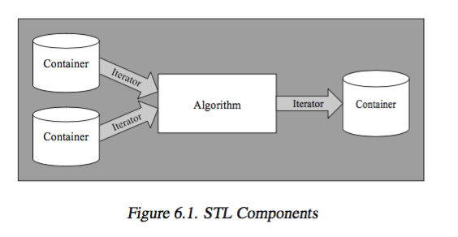
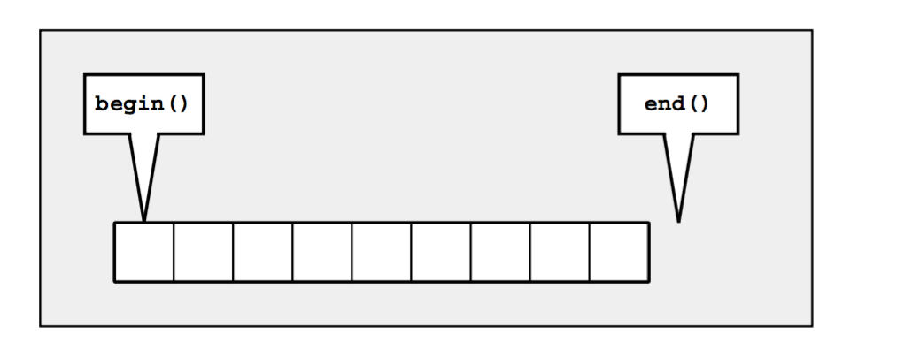
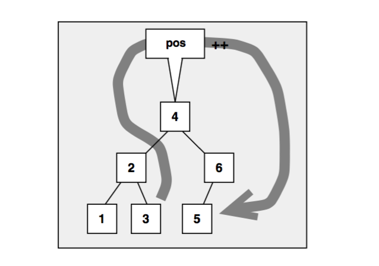
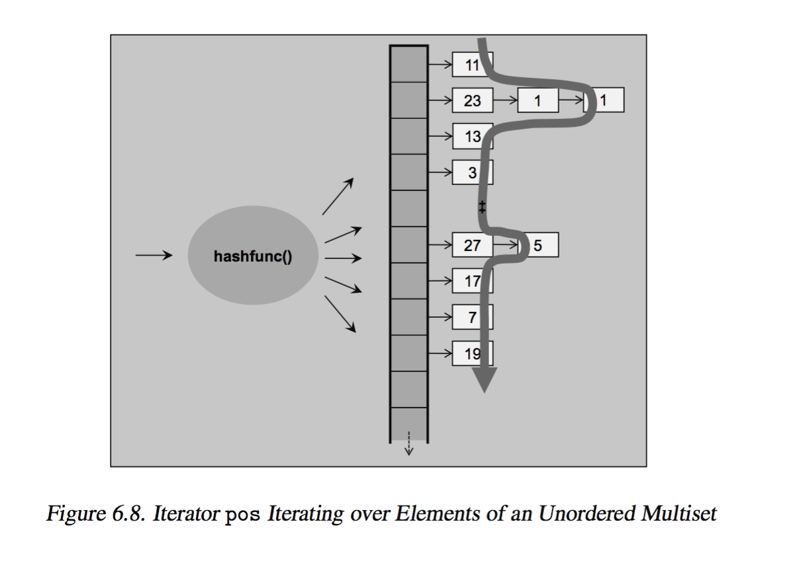
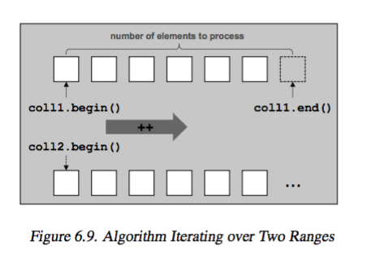

# The Standard Template Library 


### 6.1 STL Components

+ _components_ 
    + _Containers_ 
        + manage collections of objects of a certain kind
    + _Iterators_ 
        + used to step through elements of collections of objects 
        + provides a small but common interface for any arbitrary container types
        + `++` and `*` works as if its a pointer
    + _Algorithms_ 
        + used to process elements of collections 
+ _philosophy_ 
    + 
    + separation of 
        + _data_: managed by container 
        + _operation_: defined by algorithms 
    + and glued together by iterators


### 6.2 Containers

+ _categories_ 
    + _Sequence Containers_ 
        + _ordered collections_ where every element has a certain position
        + position 
            + depends on time/place of insertion 
            + independent of value of the element 
        + `array`, `vector`, `deque`, `list`, `forward_list`
        + impl as arrays or linked list
    + _Associative Containers_ 
        + _sorted collections_ in which position of element depends on its value (or key, if its k-v pair) due to certain ordering criterion
        + position 
            + depends on value 
            + independent of order of insertion 
        + `set`, `multiset`, `map`, `multimap`
        + impl as binary trees
        + _performance_ 
            + fast search (since sorted): `O(log n)`
    + _Unordered (associative) Containers_
        + _unordered collections_ in which position of an element does not matter 
            + only important question if element is in such collection
            + order/position is undefined, and may change over its lifetime
        + `unordered_set`, `unorderd_multiset`, `unorderd_map`, `unorderd_multimap`
        + impl using hash tables
+ _Sequence Containers_ 
    + `vector`
        + _properties_ 
            + impl with dynamic array
            + random access
            + insert/removal
                + fast at _end of array_ (amortized)
                + slow at _middle/beginning of array_  (following elements have to be moved)
        ```cpp
        vector<int> coll;           // vector container 
        for(int i = 1; i<= 6; ++i){
            coll.push_back(i);
        }

        for(int i =0; i < coll.size(); ++i){
            cout << coll[i] << " ";
        }
        cout << endl;
        ```
    + `deque`: 
        + _properties_
            + double ended queue
            + impl with dynamic array, that can grow in both directions
            + random access
            + insert/removal
                + fast at _beginning/end_ of array
                + slow at _middle_ of array
        ```cpp
        deque<float> coll;
        for(int i=1; i <= 6; ++i){
            coll.push_front(i * 1.1);           // insert at front 
        }
        // array elements: [6.6, 5.5, 4.4, 3.3, 2.2, 1.1]
        ```
        + operation 
            + `push_front` works for `deque` and not `vector`
                + otherwise bad runtime ...
    + `array`
        + _properties_ 
            + elements managed in _fixed size_ array 
                + implies have to specify size during initialization
            + random access
        ```cpp
        array<string, 5> coll = {"hello", "world"};
        for(int i = 0; i < coll.size(); ++i){
            cout << i << ": " << coll[i] << endl;
        }
        // array: ["hello", "world", "", "", ""]
        ```
        + _initialization_ 
            + fundamnetal data types _zero initialization_
            + class types are initialized with default constructor of element's type (i.e. `string`)
        + _size as part of type_    
            + `array<int, 5>` and `array<int, 10>` are different types 
    + `list`
        + _properties_ 
            + impl with doubly linked list
            + _no_ random access 
                + hence search is `O(n)`
                + hence no `operator[]` implemented 
            + insert/removal
                + _fast_ even in the middle of a list
        ```cpp
        list<char> coll;
        for(char c='a'; c <= 'z'; ++c){
            coll.push_back(c);
        }
        for(auto& elem: coll){
            // modification of elem modifies the current element in coll
        }
        ```
        ```cpp
        template<typename T> 
        void printElements(const T& coll){
            for(const auto& elem: coll){        
                cout << elem << endl;
            }
        }
        ```
        + `const auto&`
            + avoids copy semantics 
            + avoid accidental modification, checked at compile times
    + `forward_list`
        + _properties_ 
            + impl as singly linked list, 
            + a restricted `list`
                + operations that move backward or cause performance penulty not supported 
                + i.e. `push_back()` and `size()` not provided 
        + _problem_ 
            + cannot search for an element and then delete it or insert another element in front of it
            + Since deletion requires we stand at the preceding element 
        ```cpp
        forward_list<long> coll = {2,3,4,5,6,7};
        // resize 2 times -- poor performance 
        coll.resize(9);
        coll.resize(19, 99);

        // print 
        for(auto elem: coll){ cout << elem << ""};
        cout << endl;
        ```
+ _Associative Containers_ 
    + _summary_ 
        + sort elements automatically according to a certain ordering criterion
        + elements can be 
            + value of any type 
            + key/value pairs 
        + _sorting function_
            + compares value or key 
            + `operator<` by default
        + _impl_
            + binary trees (all of them...)
            + every element has 1 parent and 2 children
            + ancestors to the left have lesser values, ancestors to the right have greater values
        + _performance_ 
            + _search_ is fast `O(log n)` 
                + (compare to `O(n)` in all sequence containers)
            + _modification_ to values directly not allowed, since doing so corrupt the automatic sorting of elements 
    + _categories_ 
        + `set`
            + a collection in which elements are sorted according to their own values 
            + each element occur once, no duplicates allowed 
            + a special kind of `map`
                + where value is identical to the key
        + `multiset`
            + same as `set` except duplicates are allowed 
            + _order of equivalent elements_ (with equal key) 
                + newly inserted elements are inseretd at the end of equivalent elements that multisets/multimap already contain
        + `map`
            + contains elements that are key/value pairs. 
                + each elemnt has a key that is basis for sorting criterion and a value
            + key is unique, no duplicate key allowed 
            + can be used as _associative array_, array that has arbitrary index type 
        + `multimap`
            + same as `map` except that duplicates allowed 
                + i.e. may contain multiple element that have the same key 
            + can be used as _dictionary_
    ```cpp
    #include <set>

    multiset<string> cities {
        "Braunschweig", "Hanover", "Frankfurt", "New York", "Chicago", "Toronto", "Paris", "Frankfurt"
    };

    // insert additional element 
    cities.insert( {"London", "Munich", "Hanover", "Braunschweig"} );

    // print 
    for(const auto&: cities){ cout << elem << " ";}
    cout << endl;

    /* outputs (Note the elements are sorted alphabetically)
    Braunschweig Braunschweig Chicago Frankfurt Frankfurt Hanover Hanover London Munich New York Paris Toronto
    */
    ```
    ```cpp
    multimap<int, string> coll;         // container for int/string values 

    // insert some elements in arbitrary order 
    // - a key with 1 gets inserted twice 
    coll = { {5,"tagged"},
                {2,"a"},
                {1,"this"},
                {4,"of"},
                {6,"strings"},
                {1,"is"},
                {3,"multimap"} };
    // print all elements 
    for(auto elem: coll){
        cout << elem.second << " ";
    }
    ```
    + `multimap<int, string>` declares a multiset with key/value pairs
        + _initialization_: pass in key/value pairs by nested initializer list
            + inner lists define key and value of each element 
            + outer list group all these elements 
        + _process_: have to deal with key/value pairs
            + `value_type` is `pair<const key, value>`
                + `const key` to prevent breaking ordering 
            + use `elem.first` as key 
            + use `elem.second` as value 
+ _Unordered Container_ 
    + _summary_ 
        + impl as hash table 
            + internally, container is an _array of linked list_
            + `key/value` -> hash function -> `bucket number`
        + _performance_ 
            + _search_: expected constant complexity `O(1)`
        + _unorderd vs associative_
            + provide the same interface
            + except perhaps that unorderd container provide special member to influence behaivior/ inspect state
    + _categories_ 
        + `unordered_set`
            + collection of unordered elements, where each element occur once (no duplicates)
        +  `unorderd_multiset`
            + same as `unordered_set`, except duplicates are allowed 
        + `unordered_map`
            + contains element that are key/value pairs, 
            + Each key occur only once, duplicate keys not allowed
        + `unordered_multimap`
            + same as `unordered_map` except that duplicates are allowed
            + may contain multiple elements with the same key
    + _additional template args_
        + _hash function_
        + _equivalence criterion_
            + identify duplicates 
            + defaults to `operator==`
    ```cpp
    unordered_multiset<string> cities {
        "Braunschweig", "Hanover", "Frankfurt", "New York", "Chicago", "Toronto", "Paris", "Frankfurt"
    };

    cities.insert( {"London", "Munich", "Hanover", "Braunschweig"} );

    // multiset: [London Hanover Hanover Frankfurt Frankfurt New York Chicago Munich Braunschweig Braunschweig Toronto Paris]
    ```
    ```cpp
    unordered_map<string, double> coll {
        {"tim", 9.9},
        {"struppi", 11.77}
    }
    // square value 
    for(pair<const string, double>& elem: coll){
        elem.second *= elem.second
    }
    for(const auto& elem: coll){
        cout << elem.first << ": " << elem.second << endl;
    }
    /* outputs (order may change)
        struppi: 138.533
        tim: 98.01 */
    ```
+ _associative arrays_ 
    + _definition_
        + an array whose index is not an integer value
    + impl with `map` or `unorderd_map`
        + both provide `operator[]` overload
    + _comments_ 
        + usually would want to use `unorderd_map` for this purpose since fast amortized search time tha `map`
    ```cpp
    unorderd_map<string, float> coll;
    // insert to collection: with associative array syntax
    coll["VAT1"] = 0.16;
    coll["VAT2"] = 0.07;
    coll["Pi"] = 3.1415;
    coll["an arbitrary number"] = 4983.223; coll["Null"] = 0;

    // change value 
    coll["VAT1"] += 0.03;
    ```
    + `operator[]` 
        + not having an element for an index is _not an error_ 
        + in this case, a new index (key) is taken to create and insert a new map element with that index as key
        + so index is _always valid_
    + `at()`
        + access values of element while passing the key 
        + a key not found results in `out_of_range` exception
        + i.e. `coll.at("NOT_IN_MAP") = 0.16; // out_of_range`
+ _Other Containers_ 
    + `string`
        + similar to `vector` but with `char` as element 
    + ordinary _C-style array_
        + not STL containers 
        + no `size()` or `empty()`
        + but algorithms still work...
+ _Container Adaptors_ 
    + _definition_ 
        + predefined containers that provide a restrited interface to meet special needs 
        + implemented by using foundamental container classes
    + _categories_ 
        + `stack`: LIFO policy 
        + `queue`: FIFO policy 
        + `priority queue`: 
            + elements have different priorities 
            + priority is the sorting criterion

--- 

### 6.3 Iterators


+ _iterators_ 
    + _concept_
        + objects that 
            + specify location of elements in a container 
            + able to iterate over elements 
        + has very similar interafce to pointers
    + _fundamental operation_
        + `operator*`: returns element of current position
        + `operator++`: let iterator step forward to next element 
        + `operator==` and `operator!=`: return if 2 iterator represent the same location 
        + `operator=`: assigns an iterator
    + _half-open range_
        +    
        + `begin()`: returns an iterator that represents beginning of elements in container 
        + `end()`: returns an iterator that represents end of elements in container (the position _behind_ the last element)
        + _advantage_ 
            + a simple end criterion for loops. Simply continue as `end()` not reached 
            + avoid special handling for empty ranges, in which case `begin()` is equal to `end()`
    ```cpp
    list<char> coll;
    for(char c='a'; c <= 'z'; ++c){
        coll.push_back(c);
    }

    //iterate over 
    list<char>::const_iterator pos;
    for(pos = coll.begin(); pos != pos.end(); ++pos){
        cout << *pos << " ";
    }

    list<char>::iterator pos;
    for(pos = coll.begin(); pos != pos.end(); ++pos){
        *pos = toupper(*pos);
    }
    cout << endl;
    ```
    + _2 iterator types_ 
        + `container::iterator`: iterate over elements in read/write mode 
        + `container::const_iterator`: iterate over elements in read-only mode
    + _`++pos` versus `pos++`_
        + prefers `++pos` since 
        + `pos++` internally involves a temporary object since it must return old position of iterator
    + _const `cbegin()` and `cend()`_
        + _motivation_ 
            + use of `auto` instead of declaring iterator types 
            + but `auto` iterators losses its constness
            + `auto pos = coll.begin()` yields non-const iterator 
        + _solution_ 
            + use `cbegin()` and `cend()` to denote const iterator
    ```cpp
    for(T elem: coll){ ... }
    // equivalent to 
    for(auto pos=coll.begin(), end=coll.end(); pos!=end; ++pos){
        T elem = *pos;
    }
    ```
    + _ranged-based `for` loop vs iterators_
        + by default range based for loop gives 
            + non-`const` iteration over 
            + _every_ element in the container
+ _Other Examples_ 
    ```cpp 
    typdef set<int> IntSet;
    IntSet coll;
    // sort in ascending order by <

    // insert elements from 1 to 6 in arbitrary order
    // - note that there are two calls of insert() with value 1 coll.insert(3);
    coll.insert(1);
    coll.insert(5);
    coll.insert(4);
    coll.insert(1);
    coll.insert(6);
    coll.insert(2);

    // or in C++11
    coll.insert( { 3, 1, 5, 4, 1, 6, 2 } );

    IntSet::const_iterator pos;
    for(pos = coll.begin(); pos != coll.end(); ++pos){
        cout << *pos << " ";
    }
    ```
    + `set`
        + 
        + 
    ```cpp 
    unordered_multiset(int) coll;
    coll.insert({1,3,5,7,11,13,17,19,23,27,1});
    // outputs: 11 23 1 1 13 3 27 5 17 7 19

    coll.insert(25);
    // outputs: 23 1 1 25 3 27 5 7 11 13 17 19
    ```
    + `unorderd_multiset`
        + note order undefined, but guarantees that elements with equal values are adjacent to each other
        + 
+ _Iterator Categories_ 
    + _for predefined containers_ 
        + _forward iterator_: 
            + iterate only forward 
                + `operatr++`
            + _is iterator of_ 
                + `forward_list`
            + at least is 
                + `unorderd_set`, `unorderd_multiset`, `unorderd_map`, `unordered_multimap`
        + _bidirectional iterator_ 
            + iterate in both direction 
                + `operator++` and `operator--`
            + _is iterator of_ 
                + `list`, `set`, `multiset`, `map`, `multimap`
        + _random-access iterator_ 
            + have all properties of bidirectional iterator, in addition performs _random access_ 
                + _iterator arithmetics_ allowed 
            + _is iterator of_ 
                + `vector`, `deque`, `array`
    + _2 other categories_ 
        + _input iterators_
            + able to read/process while iterating forward 
            + i.e. `cin` 
        + _output iterators_ 
            + able to write values while iterating forward 
            + i.e. `cout`
    ```cpp 
    // works for all container 
    for(auto pos = coll.begin(); pos != coll.end(); ++pos){}

    // works only for random access iterator 
    // because of operator< supported 
    for(auto pos = coll.begin(); pos < coll.end(); ++pos){}
    ```


### 6.4 Algorithms 


+ _algorithms_ 
    + _summary_ 
        + process elements of containers 
            + search, sort, copy, reorder, modify, numeric processing 
        + global functions operate on iterators
            + _advantage_: generic functional programming paradign reduces code, and increase power/flexibility 
            + _disadvantage_
                + usage not intuitive, some combination of 
                + structures/algorithms may not work or has bad performance
    ```cpp
    vector<int> coll = { 2, 5, 4, 1, 6, 3};

    // find and print min/max 
    auto minpos = min_element(coll.cbegin(), coll.cend());
    cout << "min: " << *minpos << endl;
    auto maxpos = max_element(coll.cbegin(), coll.cend());
    cout << "max: " << *maxpos << endl;

    // sort elments 
    sort(coll.begin(), coll.end());

    // find first element with value 3
    auto pos3 = find(coll.begin(), coll.end(), 3);

    // reverse order of found element with value 3 and all following elements 
    reverse(pos3, coll.end());

    //print 
    for(auto elem: coll){ cout << elem << " ";}
    cout << endl;
    ```
    + Note 
        + `sort()` modifies values of element in place, so have to use `begin()` instead of `cbegin()`
        + `find()`
            + on success: return iterator position of element found 
            + otherwise: returns end of range passed as second argument, i.e. `end()`
+ _ranges_ 
    + _valid range_ 
        + end of range is reachable from the beginning by iterating through elements
        + ensure
            + both iterators belong to the same container 
            + beginning is not behind the end s
    + _half-open ranges _disadvantage_ `[begin, end)`
        ```cpp
        list<int> coll;

        // insert elements from 20 to 40
        for (int i=20; i<=40; ++i) {
            coll.push_back(i);
        }

        // find position of element with value 3,
        // -- there is none, so pos3 gets coll.end()
        auto pos3 = find(coll.begin(), coll.end(), 3);

        // reverse order of elements between found element and the end 
        // - since pos3 is coll.end(), reverses an empty range
        reverse(pos3, coll.end());

        // find values of 25, 26
        auto pos25 = find(coll.begin(), coll.end(), 25);
        auto pos35 = find(coll.begin(), coll.end(), 35);

        // print the maximum of the corresponding range
        // - note: including pos25 but excluding pos35
        // - hence finds max as 34 not 35
        cout << "max: " << *max_element (pos25, pos35) << endl;
        // process the elements including the last position
        // -- have to pass position that is one past the last element 
        // -- now yields correct result: 35
        cout << "max: " << *max_element (pos25, ++pos35) << endl;
        ```
        + _when finding first/last element of a subset_ 
            + the passed iterator has a range that will exclude the last element
            + solution: have to increment the end position with `++pos35`
        + However, _not sure which element in front_, (i.e. 25 is before 35?)
            + undefined behavior may easily occur
            + solution: use random access operator `<` to compare 
            ```cpp
            if (pos25 < pos35) {
                // only [pos25,pos35) is valid ...
            }
            else if (pos35 < pos25) {
                // only [pos35,pos25) is valid
            }
            else {
                // both are equal, so both must be end()
            }
            ```
            + _change algorithm to find the first value_, instead of both values 
                + but implementation is inefficient...
            ```cpp 
            pos25 = find(coll.begin(), coll.end(), 25);
            pos35 = find(coll.begin(), pos25, 35);

            if(pos25 != coll.end() && pos35 != pos25){
                // pos35 in front of pos25
                // so only [pos35, pos25) is valid 
            } else {
                pos35 = find(pos25, coll.end(), 35);
                if(pos35 != coll.end()){
                    // pos25 is in front of pos35
                    // so only [pos25, pos35) is valid 
                } else {
                    // 25 and/or 35 not found
                }
            }
            ```
            + Use lambda and `find_if()` to _find first element with either 25 or 35_
            ```cpp
            pos = find_if(coll.begin(), coll.end(), [](int i){
                return i == 25 || i == 35;
            });
            if(pos == coll.end()){
                // no element with value 25 or 35 found 
            } else if(*pos = 25){
                // element with value 25 comes first 
                pos25 = pos
                pos35 = find(++pos, coll.end(), 35);
            } else {
                // element with value 35 comes first 
                pos35 = pos;
                pos25 = find(++pos, coll.end(), 25);
            }
            ```
+ _handling multiple Ranges_ 
    + _algorithm may require_
        + begining and end only for first range 
        + beginnings for other ranges 
            + such that ends of other ranges follows from the number of elements in the first range
        + 
        + example
        ```cpp 
        if(equal(coll1.begin(), coll1.end(), coll2.being()))
        ```
        + `equal`
            + compares all element of `coll1` element by element with elements of `coll2`
    + _consequence_ 
        + _have to make sure second and additional ranges have at least as many elements as the first range_
        ```cpp 
        list<int> coll1 = {1, 2, 3, 4, 5, 6, 7, 8, 9};
        vector<int> coll2;

        // Runtime Error;
        // -- overwrites nonexisting elements in the destination 
        copy(coll1.cbegin(), coll1.cend(), coll2.begin());
        ```
    + _solution_ 
        ```cpp 
        list<int> coll1 = {1,2,3,4,5};
        vector<int> coll2;

        coll2.resize(coll1.size());
        copy(coll1.cbegin(), coll1.cend(), coll2.begin());

        deque<int> coll3(coll1.size());
        copy(coll1.cbegin(), coll1.cend(), coll2.begin());
        ```
        + _resize_
            + with `resize()`
        + _initialize the size_


### 6.5 Iterator Adaptors 

+ _Motivation_ 
    + iterators are _pure abstractions_: anything behaving like iterator is an iterator
+ _Insert Iterator (inserter)_ 
    + _concept_ 
        + allow algorithm operate in insert mode rather than overwrite mode 
        + solves problem of writing to destination that does not have enough room (since inserter grow destination)
    ```cpp 
    list<int> coll1 = {1,2,3,4,5};

    // copy elements of coll1 into coll2 by appending them 
    vector<int> coll2;
    copy(coll1.cbegin(), coll1.cend(), back_inserter(coll2));

    // copy and insert them at the front 
    deque<int> coll3;
    copy(coll1.cbegin(), coll1.cend(), front_inserter(coll3));

    // copy 
    set<int> coll4;
    copy(coll1.cbegin(), coll1.cend(), inserter(coll4, coll4.begin()));
    ```
    + _category_ 
        + 
        + `back_inserter(container)`
            + insert to back by calling `push_back()`
            + only for `vector`, `deque`, `list`, `string`, which implements `push_back`
        + `front_inserter(container)`
            + insert to front by calling `push_front()`
            + only for `deque`, `list`, `forward_list`, which implements `push_front`
            + insertion reverses order of elements 
        + `inserter(container, pos)`
            + insert elements directly in front of position passed as the second arg of its initialization by calling `insert()`
            + every container except `array` and `forward_list`
            + so the only inserter for associative/unordered container
+ _Stream Iterator_ 
    + _motivation_  
        + stream iterator read/write from/to stream 
        + provide abstraction that lets 
            + stream behave as a collection from which u can read.
            + direct output of algorithm into a file/screen
    ```cpp
    vector<string> coll;

    // read all words from the standard input
    // - source: all strings until end-of-file (or error) 
    // - destination: coll (inserting)
    copy (istream_iterator<string>(cin),
            istream_iterator<string>(),
            back_inserter(coll));

    // sort elements
    sort (coll.begin(), coll.end());

    // print all elements without duplicates
    // - source: coll
    // - destination: standard output (with newline between elements) 
    unique_copy (coll.cbegin(), coll.cend(),              // source
                    ostream_iterator<string>(cout,"\n")); // destination
    ```
    + `istream_iterator<string>(cin)`
        + template arg `string` specifies that stream iterator reads elements of this type
            + i.e. read with `operator>>`, which reads one word separated by spaces...
        + istream iterator transform next element in stream with `cin >> string`
    + `istream_iterator<string>()`
        + default istream iterator is a _end-of-stream iterator_, a stream that one can no longer read
    + `ostream_iterator<string>(cout,"\n")`
        + output iterator that writes `string` to `cout` by calling `operator<<` for each element
+ _Reverse Iterator_ 
    + _motivation_ 
        + Let algorithm operate backward 
        + by switching call of `operator++` internally into call of `operator--`
    + _usage_ 
        + create reverse iterator with `rbegin()` and `rend()`, or `const` version with `crbegin()` and `crend()`
        + sequence container except `forward_list` and all associative containers (`>=` bidirectional iterator containers) implements reverse iterator
    ```cpp 
    vector<int> coll;
    // insert elements from 1 to 9
    for (int i=1; i<=9; ++i) {
            coll.push_back(i);
        }
    // print all element in reverse order
    copy (coll.crbegin(), coll.crend(),
            ostream_iterator<int>(cout," "));
    cout << endl;
    ```
    + `crbegin()`
        + when initialized, points to last element of collection
    + `crend()`
        + one position before first element in collection
        + so `*coll.crend()` is invalid
+ _Move Iterator_ 


### 6.6 User-Defined Generic Function 

```cpp
// PRINT_ELEMENTS()
// - prints optional string optstr followed by
// - all elements of the collection coll
// - in one line, separated by spaces
template <typename T>
inline void PRINT_ELEMENTS (const T& coll,
                               const std::string& optstr="")
   {
       std::cout << optstr;
       for (const auto&  elem : coll) {
           std::cout << elem << ’ ’;
       }
       std::cout << std::endl;
   }
```

### 6.7 Manipulating Algorithms

> There is limits/workarounds for STL, especially algorithms that modify destination ranges

+ _Removing elemnts_ 
    ```cpp 
    list<int> coll;
    // insert elements from 6 to 1 and 1 to 6 for (int i=1; i<=6; ++i) {
        coll.push_front(i);
        coll.push_back(i);
    }
    // print all elements of the collection
    cout << "pre:  ";
    copy (coll.cbegin(), coll.cend(),
        ostream_iterator<int>(cout," "));
    cout << endl;
    // remove all elements with value 3 remove (coll.begin(), coll.end(),
    3);
    // print all elements of the collection
    cout << "post: ";
    copy (coll.cbegin(), coll.cend(),
        ostream_iterator<int>(cout," "));
    cout << endl;

    /* 
    pre:  6 5 4 3 2 1 1 2 3 4 5 6 
    post: 6 5 4 2 1 1 2 4 5 6 5 6 */
    ```
    + `remove()` 
        + 
        + number of elements in the collection unchanged 
            + `end()` and `size()` unmodified, 
        + change ordering 
            + each element with value 3 overwritten by the following element
        + the new logical end is not returned   
    ```cpp
    list<int> coll;
    // insert elements from 6 to 1 and 1 to 6 for (int i=1; i<=6; ++i) {
            coll.push_front(i);
            coll.push_back(i);
        }
    // print all elements of the collection
    copy (coll.cbegin(), coll.cend(),
            ostream_iterator<int>(cout," "));
    cout << endl;
    // remove all elements with value 3 // - retain new end
    list<int>::iterator end = remove (coll.begin(), coll.end(), 3);
    // print resulting elements of the collection
    copy (coll.begin(), end,
            ostream_iterator<int>(cout," "));
    cout << endl;
    // print number of removed elements
    cout << "number of removed elements: "
            << distance(end,coll.end()) << endl;
    // remove ‘‘removed’’ elements
    coll.erase (end, coll.end());
    // print all elements of the modified collection
    copy (coll.cbegin(), coll.cend(),
            ostream_iterator<int>(cout," "));
    cout << endl;
    ```
    + `list<int>::iterator end = remove(coll.begin(), coll.end(), 3)`
        + return value of `remove()` assigned to a iterator 
        + this is the new logical end of modified collection
    + `distance(end, coll.end())`
        + returns distance between 2 iterators
    + `coll.erase(end, coll.end())`
        + the real `remove`....
    ```cpp 
    // Remove and erase in one go 
    coll.erase(remove(coll.begin(), coll.end(), 3), coll.end());
    ```
    + `remove()` does not call `erase()`, a Tradeoff...
        + separation of algorithm and container causes issues 
            + `remove` does not know about member funtion of the container 
            + hence cannot call `coll.erase()`
        + Great flexibility 
            + can operate on subset of ranges 
            + can operate on container with no `erase()` member
+ _Manipulating associative and unordered containers_ 
    + _manipulation algorithms_ 
        + algorithm that remove elements and those that reorder or modify elements 
    + _problem_     
        + associative/unordered container cannot be used as destination
        + since changing value/position of elements may 
            + violate ordering for assocative container  
            + violate hashing for unordered container 
        + therefore every iterator for associative/unordered container is declared `const`
    + _solution_ 
        + call member functions instead to manipulate associative/unordered containers 
    ```cpp
    // unordered set with elements from 1 to 9
    set<int> coll = { 1, 2, 3, 4, 5, 6, 7, 8, 9 };
    // print all elements of the collection
    copy (coll.cbegin(), coll.cend(),
            ostream_iterator<int>(cout," "));
    cout << endl;
    // Remove all elements with value 3
    // - algorithm remove() does not work
    // - instead member function erase() works 
    int num = coll.erase(3);
    // print number of removed elements
    cout << "number of removed elements: " << num << endl;
    // print all elements of the modified collection
    copy (coll.cbegin(), coll.cend(),
            ostream_iterator<int>(cout," "));
    cout << endl;
    ```
    + `coll.erase`
        + will remove and erase for associative/unorderd container
+ _Algorithms versus member function_ 
    + _motivation_
        + generic algorithm may not be efficient as member function implementation, which know about the container they resides in 
    + _idea_ 
        + always use member function over an algorithm if performance is the goal
        + however tradeoff of changing lots of code when switch to another container
    ```cpp
     list<int> coll;
    // insert elements from 6 to 1 and 1 to 6 
    for (int i=1; i<=6; ++i) {
            coll.push_front(i);
            coll.push_back(i);
        }
    // remove all elements with value 3 (poor performance) coll.erase (remove(coll.begin(),coll.end(),
                            3),
                    coll.end());
    // remove all elements with value 4 (good performance)
    coll.remove (4);
    ```
    + `list`
        + `remove()` is slow, since 
            + will reorder elements by changing their values 
            + this contradicts main advantage of lists (ability to insert, move, remove, by changing link instead of values)
        + always use member function, since they are faster 


### 6.8 Functions as algorithm arguments

+ _Use functions_ 
    ```cpp
    // function that prints the passed argument
    void print (int elem)
    {
        cout << elem << ’ ’;
    }
    vector<int> coll;
    // insert elements from 1 to 9
    for (int i=1; i<=9; ++i) {
        coll.push_back(i);
    }
    // print all elements
    for_each (coll.cbegin(), coll.cend(),
            print);
    cout << endl;

    // outputs: 1 2 3 4 5 6 7 8 9
    ```
    + `for_each`
        + calls user-defined function for each element in the range
    ```cpp 
    int square (int value)
    {
        return value*value;
    }

    std::set<int>    coll1;
    std::vector<int> coll2;
    // insert elements from 1 to 9 into coll1 for (int i=1; i<=9; ++i) {
            coll1.insert(i);
        }
    PRINT_ELEMENTS(coll1,"initialized: ");
    // transform each element from coll1 to coll2
    // - square transformed values
    std::transform (coll1.cbegin(),coll1.cend(),    // source
                        std::back_inserter(coll2),  // dest
                        square);                    // operation
    PRINT_ELEMENTS(coll2,"squared: ");
    ```
    + `transform`
        + 
+ _predicates_ 
    + _definition_ 
        + a special kind of auxiliary function, return a Boolean and are often used to specify a sorting or a search criterion
        + have to be stateless, i..e same input always yield same result
    + _unary predicate_ 
        ```cpp 
        // predicate, which returns whether an integer is a prime number
        bool isPrime (int number)
        {
            // ignore negative sign
            number = abs(number);
            // 0 and 1 are no prime numbers
            if (number == 0 || number == 1) {
                return false;
            }
            // find divisor that divides without a remainder
            int divisor;
            for (divisor = number/2; number%divisor != 0; --divisor) {
            ; }
            // if no divisor greater than 1 is found, it is a prime number
            return divisor == 1;
        }
        list<int> coll;
        // insert elements from 24 to 30
        for (int i=24; i<=30; ++i) {
            coll.push_back(i);
        }
        // search for prime number
        auto pos = find_if (coll.cbegin(), coll.cend(),     // range
                            isPrime);                       // predicate
        if (pos != coll.end()) {
            // found
            cout << *pos << " is first prime number found" << endl; }
        else {
            // not found
            cout << "no prime number found" << endl;
        }

        // output: 29 is first prime number found
        ```
        + `find_if`
            + return iterator to first element of a given range for which the passed unary predicate yields `true`, otherwise return end of range
    + _binary predicate_
        + compare specific property of 2 arguments 
        + i.e. sorting, may be necessary if
            + `operator>` not implemented 
            + different criterion than default 
        ```cpp 
         class Person {
            public:
                string firstname() const; 
                string lastname() const;
        };
        
        // binary function predicate:
        // - returns whether a person is less than another person
        bool personSortCriterion (const Person& p1, const Person& p2) {
            // a person is less than another person
            // - if the last name is less
            // - if the last name is equal and the first name is less 
            return p1.lastname()<p2.lastname() ||
                (p1.lastname()==p2.lastname() &&
                p1.firstname()<p2.firstname());
        }

        deque<Person> coll;
        sort(coll.begin(),coll.end(),
            personSortCriterion);
        ```

### 6.9 Using Lambdas 

+ _motivation_ 
    + lambda: specify functional behavior inside expression/statement 
    + usage: define objects representing functional behavior and pass these objects as inline arguments to algorithms
    ```cpp
    transform(coll.begin(), coll.end(),     // source
                coll.begin(),               // dest
                [](double d){               // lambda
                    return d*d*d;
                })
    ```
    + Note 
        + `transform` safe where source and dest container are the same container 
+ _Benefits_ 
    ```cpp 
    deque<int> coll = { 1, 3, 19, 5, 13, 7, 11, 2, 17 };
    int x = 5;
    int y = 12;
    auto pos = find_if(coll.cbegin(), coll.cend(),      // range
                        [=](int i){
                            return i > x && i < y;
                        });
    cout << "first elem >5 and <12: " << *pos << endl;
    ```
    + search for first element in `(5,12)` 
        + capture `[=]`, `x` and `y` are copied by value 
    + _advantage over_ 
        + _for loop_
            + ugly `break` when element is found 
        + _A separate function_
            + the search criterion is exactly where the search is taking place
            + i.e. `bool pred(){}; ... find_if(coll.begin(), coll.end(), pred);`
        + _A function object_
            + access to `x` and `y` becomes ugly 
            ```cpp 
            class Pred {
                private:
                    int x;
                    int y;
                public:
                    Pred(int xx, int yy): x(xx), y(yy){}
                    bool operator() (int i) const {
                        return i > x && i < y;
                    }
            };
            // ... 
            pos = find_if(coll.begin(), coll.end(), Pred(x,y));
            ```
        + lambda is better optimized than regular function 
+ _Use lambda as sorting criterion_ 
    ```cpp 
    deque<Person> coll;
    sort(coll.begin(), coll.end(),               // range
        [](const Person& p1, const Person& p2){  // sort criterion
            return p1.lastname() < p2.lastname() || 
                (p1.lastname()==p2.lastname() &&
                p1.firstname()<p2.firstname());
        })
    ```
+ _Limitation_ 
    ```cpp 
    auto cmp = [] (const Person& p1, const Person& p2) { 
        return p1.lastname()<p2.lastname() ||
                          (p1.lastname()==p2.lastname()&&
                           p1.firstname()<p2.firstname());
    };
    std::set<Person,decltype(cmp)> coll(cmp);
    ```
    + _points_ 
        + type of lambda hard to define, may have to use `decltype()`
        + have to pass `cmp` to constructor
        + does not have internal state over multiple calls 


### 6.10 Function Objects 

+ _motivation_ 
    + anything that behaves like a function is a function
    + so if define a funtion that behaves ike a function, it can be used as a function 
+ _definition_ 
    + _function behavior_ 
        + call by parenthesis and pass arguments 
            + `function(args...)`
    + _function object_ (generally)
        + every object that can be used as a function call
        + what is considered a function object?
            + function pointer 
            + conversion to function pointer 
            + an object of a class that provides a function call operator (i.e. `operator()`)
            ```cpp
            class X {
                public:
                    return-value operator() (args) const;
            }
            X fo;
            fo(args)        // equivalent to: fo.operator()(args)
            ```
            + lambdas
+ examples 
    ```cpp 
    // simple function object that prints the passed argument
    class PrintInt {
        public:
            void operator() (int elem) const {
                cout << elem << ’ ’;
            } 
    };
    vector<int> coll;
    // insert elements from 1 to 9
    for (int i=1; i<=9; ++i) {
        coll.push_back(i);
    }
    // print all elements
    for_each (coll.cbegin(), coll.cend(),
            PrintInt());
        cout << endl;
    }
    ```
    + `PrintInt()`
        + creates a temp object of class 
        + passed to `for_each()`
    ```cpp 
    template<typename Iterator, typename Operation>
    Operation for_each(Iterator act, Iterator end, Operation op){
        while(act != end){
            op(*act);           // call op() for each elements 
            ++act;
        }
        return op;
    }
    ```
+ _Advantage_ 
    + _function objects are function with states_
        + function objects may have other member/function, i.e. _state_
        + initialized at runtime before use/call them...
    + _Each function object has its own type_ 
        + _function_ has differing type only if their signatures differ 
        + _function object_ has differing types even if signatures are same
        + able to pass functional behavior as template arguments
    + _Function objects are usually faster than ordinary functions_ 
        + function object are templates, more info at compile time, so better performance
+ _example_ 
    ```cpp 

    // -- compile time function 
    template <int theValue>
    void add (int& elem)
    {
        elem += theValue;
    }
    void f1() {
        vector<int> coll;
        for_each (coll.begin(), coll.end(),
                add<10>);
    }

    // -- runtime function object 
    class AddValue {
        private:
            int theValue; // the value to add 
        public:
            // constructor initializes the value to add
            AddValue(int v) : theValue(v) {}
            // the ‘‘function call’’ for the element adds the value
            void operator() (int& elem) const {
            elem += theValue;
            } 
    };

    list<int> coll;

    // insert elements from 1 to 9
    for (int i=1; i<=9; ++i) {
            coll.push_back(i);
        }
    PRINT_ELEMENTS(coll,"initialized: ");

    for_each (coll.begin(), coll.end(),
            AddValue(10));
    PRINT_ELEMENTS(coll,"after adding 10:");

    // add value of first element to each element
    for_each (coll.begin(), coll.end(),
            AddValue(*coll.begin()));

    PRINT_ELEMENTS(coll,"after adding first element: ");

    /* output 
        initialized: 1 2 3 4 5 6 7 8 9
        after adding 10: 11 12 13 14 15 16 17 18 19
        after adding first element: 22 23 24 25 26 27 28 29 30
    */
    ```
    + add one value to all elments of collection 
        + _compile time_: 
            + ordinary function, have to know which value to add 
            + template function, allows different values to add 
        + _runtime_ 
            + have to pass that vlaue to function before its called...
            + use function object, since it has state, the object can be initialized with right value 
            + hence different instance of function object may have different state, initialized at runtime, but share the same operation
    + `AddValue(10)`
        + creates object of type `AddValue`, initialized with 10
        + value stored in member `theValue`
    + `AddValue(*coll.begin())`
        + creates object, with first element of collection
+ _pre-defined function object_ 
    + usually covers fundamental operations 
        + i.e. in sorting 
    + _default sorting criterion_ 
        + `set<int> coll;` expanded to `set<int, less<int>> coll;`
        + hence can sort in decreasing order with `set<int, greater<int>> coll;`
    + _Used in algorithms_ 
        ```cpp 
        deque<int> coll = { 1, 2, 3, 5, 7, 11, 13, 17, 19 }; PRINT_ELEMENTS(coll,"initialized: ");

        // negate all values in coll
         transform (coll.cbegin(),coll.cend(),
                    coll.begin(),
                    negate<int>()); 
        PRINT_ELEMENTS(coll,"negated: ");

        // square all values in coll
        transform (coll.cbegin(),coll.cend(),
                     coll.cbegin(),
                    coll.begin(),
                    multiplies<int>());
        PRINT_ELEMENTS(coll,"squared: ");

        /* output 
            initialized: 1 2 3 5 7 11 13 17 19
            negated: -1 -2 -3 -5 -7 -11 -13 -17 -19 
            squared: 1 4 9 25 49 121 169 289 361
        */
        ```
        + `negate<int>()`
            + in `<functional>`
            + creates a function object of predefined class template `negate<>`
+ _Binders (function adaptor)_ 
    + _usage_ 
        + combine predefined function objects with other values or use special cases 
    ```cpp 
    set<int,greater<int>> coll1 = { 1, 2, 3, 4, 5, 6, 7, 8, 9 }; deque<int> coll2;

    // Note: due to the sorting criterion greater<>() elements have reverse order: 
    PRINT_ELEMENTS(coll1,"initialized: ");

    // transform all elements into coll2 by multiplying them with 10
    transform(coll1.cbegin(),coll1.cend(),
            back_inserter(coll2),
            bind(multiplies<int>(),_1,10)); 
    PRINT_ELEMENTS(coll2,"transformed: ");

    // replace value equal to 70 with 42
    replace_if (coll2.begin(),coll2.end(),
                bind(equal_to<int>(),_1,70),
                42);
    PRINT_ELEMENTS(coll2,"replaced:    ");

    // remove all elements with values between 50 and 80 
    coll2.erase(remove_if(coll2.begin(),coll2.end(),
                            bind(logical_and<bool>(),
                                bind(greater_equal<int>(),_1,50),
                                bind(less_equal<int>(),_1,80))
                           ),
                coll2.end()); 
    PRINT_ELEMENTS(coll2,"removed: ");
    ```
    + `f1 = bind(multiplies<int>(),_1,10)`
        + multiplies by 10    
        + `_1` bound to future args passed to `f1`
        + `multiplies(_1, 10)` will be called...
    + `bind(equal_to<int>, _1, 70)`
        + a function object that returns `true` if passed arg is 70
    ```cpp 
     bind(logical_and<bool>(),
            bind(greater_equal<int>(),_1,50),
            bind(less_equal<int>(),_1,80))
    ```
        + combination of binders 
        + specifies predicate `x >= 50 && x <= 80`
+ _Function Objects / binders vs Lambdas_
    + _lambda_ 
        + as fast as function object 
        + easier to read 
        + but cannot track internal state 

### 6.11 Container Elements 

+ _Requirements for container elements `T`_ (synthesized...)
    + _copyable_ or _movable_ 
        + `T` must provide copy or move constructor 
        + including default ones.. 
    + must be _(move)assignable_ with `operator=`
    + must be _destroyable_ by destructor 
        + destructor cannot be private
        + otherwise, we have resource leak while destructor never throws so ...
+ _Value semantics or reference semantics_
    + _value semantics_ 
        + container contain _values of object_ inserted rather than objects themselves
        + used when need copies that are independent of the original copy 
    + _reference semantics_ 
        + container contains reference to objects that are their elements 
        + used when copies still refer to original data, so modification gets updated properly 
    + _STL supports value semantics only_ 
        + all container create internal copy of elements and return copies of these elements,
        + _advantage_ 
            + copy elements is simple 
            + references are error prone, have to make sure references don't refer to objects that no longer exists, have to manage circular reference...
        + _disadvantage_ 
            + copy elements results in bad performance 
            + Managing same object in several container not possible
    + _reality_ 
        + have to use both approach 
        + but STL only supports value semantics 
    + _reference semantics impl_ 
        + use pointer (prefer smart pointer) as elements in container 
+ _Error exception in STL_
    + _Little to none error checking, arguments_ 
        + error checking reduce performance 
        + can get more safety by creating wrapper 
    + _undefined behavior_ 
        + STL that violates precondition results in undefined behavior
        + i.e. index, iterator, range not valid, result not found...
    + _preconditions_ 
        + _iterators must be valid (initialized)_
            + can be invalidated as side-effect of other operation 
            + ex.   
                + `vector`, `deque`, elements inserted or deleted or rellocation take place 
                + unordered container, if rehashing takes place (possible as a result of a insertion)
        + _iterator refering to past-the-end position have no elements to which to refer_
            + `*` and `->` is not allowed for `end()`, `cend()`, `rend()`...
        + _ranges must be valid_ 
            + both iterator must refer to same container 
            + second iterator must be reachable from first iterator
        + _if more than one source range used, second/later ranges usually have at least as many elements as the first one_ 
        + _destination range must have enough elements that can be overwritten_ 
            + `back_inserter()`
    ```cpp
    vector<int> coll1;
    vector<int> coll2;
    // empty collection // empty collection
    // RUNTIME ERROR:
    // - beginning is behind the end of the range vector<int>::iterator pos = coll1.begin(); 
    reverse (++pos, coll1.end());
    // insert elements from 1 to 9 into coll1 
    for (int i=1; i<=9; ++i) {
        coll1.push_back (i);
    }
    // RUNTIME ERROR:
    // - overwriting nonexisting elements
    copy (coll1.cbegin(), coll1.cend(),
        coll2.begin());
    // RUNTIME ERROR:
    // - collections mistaken
    // - cbegin() and cend() refer to different collections 
    copy(coll1.cbegin(), coll2.cend(), // source
        coll1.end()); // destination
    ```
    + Note 
        + runtime error since they cause undefined behavior
+ _exception handling_ 
    + _problem_ 
        + difficult to determine degree of safety the standard library should provide 
            + safety and performance are tradeoffs
        + presence of code to handle exceptions could adversely affect performance      
            + use `noexcept`...
    + _solution_ 
        + standard library will not leak resources or violate container invariants in face of exception
    + _supported atomic operation w.r.t. exception_ 
        + no `erase()`, `clear()`, `pop_back()`, `pop_front()`, `swap()` function throws exception 
        + _node-based containers (`list`, `forward_list`, `set`, `multiset`, `map`, `multimap`) and unorderd containers_, any failure to construct a node simply leaves the container as it was.
            + so removing a node cant fail
            + most `list` operation either succeeds or have no effect. (so good idea to use `list` as transaction-safe container)
        + _array-based container_ (`array`, `vector`, `deque`) do not fully recover when element gets inserted 
            + since require copy of all subsequent elements before any insert 
            + huge performance breakdown
    + _Consideration_ 
        + require _commit-or-rollback_ ability 
            + use `list` (except calling `remove()`, `remove_if()`, `merge()`, `sort()`, `unique()`)
            + associative/unordered container (except calling multi-element insert operation)
        + require _commit-or-rollback_ but cant use the above container 
            ```cpp 
            template <typename T, typename Cont, typename Iter>
            void insert (Cont& coll, const Iter& pos, const T& value) {
                
                Cont tmp(coll);     // copy container and all elements 
                try {
                    coll.insert(pos,value); // try to modify the copy
                }
                catch (...) {    // in case of an exception
                    coll.swap(tmp); // - restore original container 
                    throw;      // - and rethrow the exception
            } }
            ```

