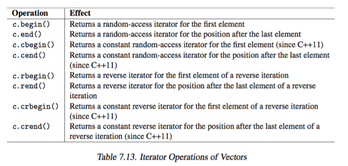

# 7 STL containers 

### 7.1 Common Container Abilities and Operations 

+ _core abilities for all containers_ 
    + _Value rather than reference semantics_
        + copy/move elements internally during insertion rather than managing reference to them
    + _Elements have specific ordering_
        + able to obtain iterator over any container (including unordered) and iterate over elements, the order is consistent between iteration (assume no insert/delete)
    + _Operation are not safe_ 
        + must ensure precondition is met
+ _Container Operation_ 
    + 
    + 
    + _constructor_ 
        ```cpp 
        // Initialize container with initializer list
        const std::vector<int> v1 = { 1, 2, 3, 5, 7, 11, 13, 17, 21 };
        const std::vector<int> v2 { 1, 2, 3, 5, 7, 11, 13, 17, 21 };
        std::unordered_set<std::string> w = { "hello", std::string(), "" };
        ```
        ```cpp
        // Initialize container with ranges
        std::list<int> l; 
        // copy semantics with ranges
        std::vector<float> c(l.begin(),l.end());
        // move semantics with ranges
        std::vector<std::string> c(std::make_move_iterator(l.begin()),
                                        std::make_move_iterator(l.end()));
        ```
        ```cpp
        // Initialize container with C-style array 
        int carray[] = { 2, 3, 17, 33, 45, 77 };
        // copy all elements of the C-style array into a set
        std::set<int> c(std::begin(carray),std::end(carray));
        ```
        ```cpp
        // Initialize container from stdin
        std::deque<int> c{std::istream_iterator<int>(std::cin),
                        std::istream_iterator<int>()};
        // Otherwise have to put extra parentheses to prevent confusion with function declaration
        std::deque<int> c((std::istream_iterator<int>(std::cin)),
                       (std::istream_iterator<int>()));
        ```
        ```cpp
        // move constructor
        std::vector<int> v1;
        v2 = std::move(v1);
        ```
        ```cpp 
        std::vector<int> v1;
        std::vector<int> v2;
        // move contents of v1 into v2, state of v1 undefined afterward 
        v2 = std::move(v1);
        ```
    + `swap`
        + guaranteed constant complexity (except for `array<>` which is linear)
        + iterater/reference still refer to same elements as before, but are in a different container then 
    + _size_
        + `empty()` 
            + similar to `begin() == end()`
            + preferred over `size() == 0`, as 
                + may be faster 
                + `forward_list` does not have `size()`
        + `size()`
            + not for `forward_list`, since not `O(1)`
        + `max_size()`
    + _comparison_ 
        + _logic_ 
            + 2 container have same type 
            + 2 container equal if elements 
                + are equal (by `operator==`) and 
                + have same order 
            + `<` is evaluated lexicographically 
        + _unordered containers_
            + only `==` and `!=` defined
                + return true if elements in one container has an equal elements in the other 
                + order does not matter 
    + _access_
        ```cpp 
        // read 
        for (const auto& elem : coll) {}                            // C++11
        for (auto pos=coll.cbegin(); pos!=coll.cend(); ++pos){}     // C++11
        // read+write
        for (auto& elem : coll) {}                                  // C++11
        for (auto pos=coll.begin(); pos!=coll.end(); ++pos) {}      // C++11
        ```
        + _validity after deletion_ 
            + all container except `vector` and `deque` 
                + guarantees iterator/reference to elements remain valid if other elements are deleted
            + `vector`
                + only elements before point of erase remain valid
        + _validity after `clear()`_
            + `vector`, `deque`, `string`
                + past-the-end iterator (`end()`, `cend()`) may be invalidated
        + _validity after insertion_
            + only `list`, `forward_list`, and associative container 
                + guarantee iterator/reference to elements remain valid 
+ _Common Container type definition_ 
    + 


### 7.2 Arrays


+ _motivation_ 
    + 
    + sequence of elements with constant size 
        + models static array
    + safer than C-array and no worse performance
    ```cpp 
    namespace std {
        template<typename T, size_t N>
        class array;
    }
    ```
+ _abilities_ 
    + _properties_
        + memory allocated on stack (as array)
        + rellocation never happens 
        + have random access 
    + _initialization_ 
        ```cpp 
        // default initialized 
        // -- i.e. fundamental types value maybe undefined instead of 0
        std::array<int,4> x;                // OOPS: elements of x have undefined value
        // value initialized
        // -- i.e. fundamental types zero initialized 
        std::array<int,4> x = {};           // OK: all elements of x have value 0 (int())
        std::array<int,10> c2 = { 42 };     // one element with value 42
                                            // followed by 9 elements with value 0
        // No constructor/assignment operator for initializer list exists for array 
        std::array<int,5> a({ 1, 2, 3, 4, 5, 6 });  // ERROR 
        std::vector<int> v({ 1, 2, 3, 4, 5, 6 });   // OK

        // Move semantics
        std::array<std::string,10> as1, as2;
        ...
        as1 = std::move(as2);
        ```
    + `swap`
        + cannot swap pointers internally 
        + `O(n)`
        + iterator/reference refer to same container but different elements afterwards
+ _Array operation_ 
    + _constructor_ 
        + 
        + _behavior_ 
            + `array<>` is aggregate type 
                + _aggregate_: an array or class with no user-provided constructors, no private or protected nonstatic data member, no virtual function
            + hence _default initialization_ for 
                + default constructor 
                + initializer list that do not pass enough elements 
    + _non-modifying operation_ 
        + 
    + _assignment_ 
        + 
    + _element access_ 
        + 
        + _indexing_
            + `n`-th element has index `n-1`
        + _return-type_
            + element access returns a reference to the element 
        + _error-checking_
            + no range-checking except,
                + `at()`, which throws `out_of_range`
            + requires manual checking 
                + single threaded only, require synchronization mechanism to prevent `coll` from being modified between check for its size
            ```cpp 
            template <typename C>
                void foo (C& coll)
            {
                if (coll.size() > 5) { 
                    coll[5] = ...;          // OK
                }
                coll.at(5) = ...;           // throws out_of_range exception
            }
            ```
    + _iterator functions_ 
        + 
+ _use `array` as C-style array_ 
    + _model_ 
        + `array<>` are in contiguous memory 
            + i.e. `&a[i] == &a[0] + i` yields true
    + _consequence_ 
        + can use `array<>` just like C-style array
        ```cpp 
        std::array<char, 41> a;         // create static array of 41 chars

        strcpy(&a[0], "hello world");       // copy a C-string into array
        strcpy(a.data(), "hello world");    // copy a C-string into array

        printf("%s\n", &a[0]);              // print contents of array as C-string
        printf("%s\n", a.data());           // print contents of array as C-string
        ```
        + `data()`
            + Returns a pointer to the first element in the array object.
+ _Tuple Interface_ 
    + `array<>` implements a tuple interface (not sure if its useful...)
        ```cpp 
        typedef std::array<std::string,5> FiveStrings; 
        FiveStrings a = { "hello", "nico", "how", "are", "you" };
        std::tuple_size<FiveStrings>::value                 // 5
        std::tuple_element<1,FiveStrings>::type             // std::string
        std::get<1>(a)                                      // std::string("nico")
        ``` 


### 7.3 Vectors 

+ _Motivation_  
    + 
    + an abstraction that manages dynamic C-style arraye
        + models dynamic array 
    ```cpp 
    namespace std {
        template<typename T, typename Allocator=allocator<T>>
        class vector;
    }
    ```
+ _Ability of vectors_ 
    + _properties_ 
        + ordered 
        + random access 
        + good performance for insertion/deletion at end 
    + _reallocation_ 
        + _reallocation_  
            + invalidates all references, pointers, iterators,
            + takes time
        + `capacity()` 
            + number of elements a vector holds in actual memory 
            + if exceed capacity, reallocate internal memory 
        + `reserve()`
            + reserve a certain capacity
            + if capacity required is less than current capacity, then no-op
        ```cpp 
        std::vector<int> v; // create an empty vector 
        v.reserve(80); // reserve memory for 80 elements

        std::vector<T> v(5); // creates a vector and initializes it with five values // (calls five times the default constructor of type T)
        ```
        + `shrink_to_fit()`
            + request to shrink capcity to fit the number of elements 
            + invalidates all references, pointers, iterators
    + _constructors_ 
        + elements are value initialized, unlike `array`
        + 
+ _Vector operations_   
    + _non-modifying operations_ 
        + 
    + _assignmnet_ 
        + 
        ```cpp 
        std::list<Elem> l; std::vector<Elem> coll;
        // make coll be a copy of the contents of l 
        coll.assign(l.begin(),l.end());
        ```
    + _access_
        + 
        ```cpp 
        std::vector<Elem> coll;
        if (coll.size() > 5) {
            coll[5] = elem;             // OK
        }
        if (!coll.empty()) {
            cout << coll.front();       // OK
        }
        coll.at(5) = elem;              // throws out_of_range exception
        ```
+ _Iterator Functions_ 
    + 
+ _insert and remove_ 
    + 
    + _efficiency_ 
        + multiple elements inserted by a single call faster 
        + insertion/deletion at end is fast 
    + _invalidation_    
        + insertion/deletion invalidates reference, pointer, iterator that refer to _the following_ elements 
        + insertion that causes reallocation invalidates _all_ references, pointers, iterators
    ```cpp 
    // Remove elements with certain value
    std::vector<Elem> coll;
    // remove all elements with val 
    coll.erase(remove(coll.begin(), coll.end(), val), coll.end());
    ```
    ```cpp
    // Remove first element with certain value 
    std::vector<Elem> coll;
    // remove first element with value val 
    std::vector<Elem>::iterator pos; 
    pos = find(coll.begin(),coll.end(),
                val);
    if (pos != coll.end()) {
        coll.erase(pos);
    }
    ```
+ _Use vectors as C-style array_ 
    + say as `char *`
    ```cpp 
    std::vector<char> v;            // create vector as dynamic array of chars
    v.resize(41);                   // make room for 41 characters (including ’\0’) strcpy(&v[0],"hello, world");   // copy a C-string into the vector 

    printf("%s\n", v.begin());      // ERROR (might work, but not portable)
    printf("%s\n", v.data());       // OK (since C++11)
    printf("%s\n", &v[0]);          // OK, but data() is better
    ```
+ _Exception handling_ 
    + `push_back()`:  if exception occur, then function has no effect 
    + `insert()`, `emplace()`, `emplace_bacl()`, `push_back()`: succeed or have no effect
    + `pop_back()` does not throw 
    + `erase()` does not throw if copy/move operation of elements do not throw 
    + `swap()` and `clear()` do no throw 
+ `vector<bool>`
    + _optimization_
        + change 1 byte/ element -> 1 bit / element 
    + _problem_ 
        + smallest addressable value is 1 byte
        + so needs special handling of references and iterators
    + _specialization_
        + 
    + `c[idx].flip()`
        + a `bool` has member `flip()` ?
        + a _proxy_, the return type off `operator[]` is an auxiliary class 
            + if need `bool`, automatic conversion used 
        ```cpp 
        namespace std {
            template <typename Allocator> 
            class vector<bool,Allocator> {
                public:
                    // auxiliary proxy type for element modifications:
                    class reference {
                        ...
                        public:
                        reference& operator= (const bool) noexcept;
                        reference& operator= (const reference&) noexcept;
                        operator bool() const noexcept; // automatic type conversion to bool 
                        void flip() noexcept; // bit complement
                    };
                    ...
                    // operations for element access return reference proxy instead of bool: 
                    reference operator[](size_type idx);
                    reference at(size_type idx);
                    reference front();
                    reference back();
                    ...
            }; }
        ```    


### 7.4 Deques 


### 7.4 Sets and Multisets 

+ _motivation_ 
    ```cpp 
    template<typename T,
                typename Compare = less<T>,
                typename Allocator = allocator<T>>
    class set;
    ```
+ _strict weak ordering_ 
    + _antisymmetric_ 
        + `x < y` true => `y < x` false 
        + `op(x,y)` true => `op(y,x)` false 
    + _transitive_ 
        + `x < y` and `y < z` => `x < z`
    + _irreflexive_ 
        + `x < x` is always false
        + `op(x,x)` always false 
    + _transitivity of equivalence_ 
        + `a == b` and `b == c` => `a == c`
+ _abilities_ 
    + _impl_
        + RB tree
    + _consequence_ 
        + fast search `O(lg n)`
        + cannot change value of element directly
            + have to remove element with old value and insert new element with new value
            + therefore, no operation for direct element access, and iterator is const 
+ _operations_ 
    + _specify sorting criterion_
        + _as template parameter_ 
            + sorting criterion part of type, so type system ensure only containers with same sorting criterion can be combined 
            + `std::set<int, greater<int>> coll;`
        + _constructor parameter_
            + one type for several sorting criteria
            + useful when sorting criterion determined at runtime
    + _sorting criterino_ 
        + _default sorting criterion_ 
            + `less<>` functional object
        + _equivalence_ 
            + `if(!(elem1<elem2 || elem2<elem1))` (element by element)
            + so only need one argument as sorting criterion 
            + dont have to provide `operator==` for the element type, only `operator<` required
            + can have contrary definitions between equivalence and equality
        + _equality_ 
            + container by container still uses `operator==`
    + _constructor_ 
        + 
    + _non-modifying operation_ 
        + 
        + comparison provided only for container of same type!
            + i.e. value_type and sorting criteion must have same type
        + comparison is lexicographical
    + _special search operations_ 
        + 
        + use this instead of algorithm for `O(lg n)`
        + `set.find(val)`: returns iterator to element with `val` if found otherwise `end()`
        + `set.lower_bound(val)`
            + return position of first element with same or a greater value than `val`
        + `set.upper_bound(val)`
            + return position of first element with a greater value 
        + `set.equal_bound(val)`
            + return `lower_bound()` and `upper_bound()` as a `pair`
    + _assignment_ 
        + 
        + container must have same type
    + _iterator_ 
        + bidirectional 
        + elements are considered constant 
            + i.e. cant use `remove()` algorithm
    + _insert/remove_
        + 
        + `set` vs `multiset`
        ```cpp 
        // sets
        pair<iterator, bool> insert(const value_type& val);
        iterator insert(const_iterator posHint, const value_type& val);

        template <typename... Args>
        pair<iterator, bool> emplace (Args&&... args);
        template <typename... Args>
        iterator emplace_hint (const_iterator posHint, Args&&... args);

        // multisets
        iterator insert (const value_type& val); 
        iterator insert (const_iterator posHint, const value_type& val);

        template <typename... Args>
        iterator emplace (Args&&... args);
        template <typename... Args>
        iterator emplace_hint (const_iterator posHint, Args&&... args);
        ```
        + `set` does not allow duplicates, so 
            + insertion might fail if a set already contain an element with same value 
            + hence return a `pair`
                + `second`: returns whether insertion is successful 
                + `first`: returns position of newly inserted element or the position of the still existing element
        ```cpp 
        // insert to set 
        set<double> c;

        if(c.insert(3.3).second){
            cout << "3.3 inserted " << endl;
        } else {
            cout << "3.3 already exists " << endl;
        }
        
        // insert value and process return value 
        auto status = c.insert(value);
        if(status.second){
            cout << value << " inserted as an element "
        } else {
            cout << value << " already eixsts as element"
        }
        cout << std::distance(c.begin(), status.first) + 1 << endl;
        ```
        + `status` has type `std::pair<std::set<float>::iterator, bool>`
        ```cpp 
        set<Elem> coll;
        coll.erase(value)       // remove all elements with `value`
                                // returns number of element removed

        // remove first element in multiset, cant use erase()
        multiset<Elem> coll;
        auto pos = coll.find(value);
        if(pos != coll.end()){
            coll.erase(pos);
        }
        ```
+ _Exception handling_ 
    + node based container, so failure to construct simply leaves container as is
+ _Specify sorting criterion at Runtime_ 
    ```cpp 
    class RuntimeCmp {
        publc:
            enum cmp_mode {normal, reverse};
        private:
            cmp_mode mode;
        public:
            // defaults to normal 
            RuntimeCmp(cmp_mode=normal): mode(m){}

            // comparison of elements 
            template<typename T>
            bool operator()(const T& t1, const T& t2) const {
                return mode == normal ? t1 < t2 : t2 < t1;
            }

            // compare sorting criteria 
            bool operator==(const RuntimeCmp& rc) const {
                return mode == rc.mode;
            }
    }

    typedef set<int, RuntimeCmp> IntSet;

    IntSet coll1 = {4, 7, 5, 1, 6, 2, 5};
    PRINT_ELEMENTS(coll1, "coll1: ");

    // create sorting criterion with reverse element order
    RuntimeCmp reverse_order(RuntimeCmp::reverse);
    
    // create, fill, and print set with reverse element order
    IntSet coll2(reverse_order);
    coll2 = { 4, 7, 5, 1, 6, 2, 5 };
    PRINT_ELEMENTS (coll2, "coll2: ");
    
    // assign elements AND sorting criterion
    coll1 = coll2;
    coll1.insert(3);
    PRINT_ELEMENTS (coll1, "coll1: ");

    // just to make sure...
    if (coll1.value_comp() == coll2.value_comp()) {
        cout << "coll1 and coll2 have the same sorting criterion" << endl;
    } else {
        cout << "coll1 and coll2 have a different sorting criterion" << endl;
    }

    /* output 
    coll1: 1 2 4 5 6 7
    coll2: 7 6 5 4 2 1
    coll1: 7 6 5 4 3 2 1
    coll1 and coll2 have the same sorting criterion
    */
    ```

### 7.8 Maps and Multimaps 

+ _motivation_ 
    + 
    ```cpp 
    namespace std {
        template <typename Key, typename T,
                 typename Compare = less<Key>,
                 typename Allocator = allocator<pair<const Key,T> > > 
        class map;
        template <typename Key, typename T,
                 typename Compare = less<Key>,
                 typename Allocator = allocator<pair<const Key,T> > > 
        class multimap;
    }
    ```
    + Note 
        + `K` and `T` must be copyable and movable 
        + `K` must be comparable with sorting criterion
        + `value_type` is `pair<const K, T>`
+ _Abilities_ 
    + sort elements automatically 
    + can be used as associative arrays
    + search by key has good performance, by value is slow
    + _cannot change key directly_
        + since have to maintain order 
        + to modify a key, remove the element that holds the old key and insert a new element that has the new key 
    + _but can change value_
+ _operations_ 
    + _constructor_ 
        + 
        + 
            + `map` and `multimap` types 
    + _sorting criterion_ 
        + define  
            + _as template parameter_ 
                + criterion part of type 
            + _as constructor param_ 
    + _non-modifying ans special search operation_ 
        + 
        + _comparison_ 
            + must be on container of same type 
                + i.e. `K`, `V`, and `Cmp`
            ```cpp 
            std::map<float,std::string> c1; // sorting criterion: less<> std::map<float,std::string,std::greater<float> > c2;
            if (c1 == c2) { // ERROR: different types }
            ```
    + _special search operations_ 
        + 
        + Note 
            + operates on keys mostly (i.e. `val` are key values)
        + _search key_ 
            + use `c.find(val)`
        + _search value_ 
            + use `find_if()` algorithm or explicit loop
            ```cpp 
            multimap<std::string, float> coll;

            for(auto &elem: coll){
                if(elem.second == value){
                    do_something();
                }
            }
            ```
    + _assignment_ 
        + 
    + _iterator and access_ 
        + iterator 
            + _bidirectional_ 
            + cannot modify keys, so no `remove()`...
            ```cpp 
            elem.first = "hello"        // ERROR: compile time
            elem->first = "hello"       // ERROR: compile time
            ```
        + _iterate with `for_each`_
            ```cpp 
            map<string, float> coll;
            for_each(coll.begin(), coll.end(), 
                    [](pair<const string, float>& elem){
                        elem.second += 10;
                    })
            /* Equivalence
                -- pair<const string, float>
                -- map<string, float>::value_type
                -- decltype<coll>::value_type
            */
            ```
        + _change keys_ 
            ```cpp 
            namespace MyLIb {
                template<typename Cont> 
                inline 
                bool replace_key(Cont& c, 
                                const typename Cont::key_type& old_key, 
                                const typename Cont::key_type& new_key){
                    typename Cont::iterator pos;
                    pos = c.find(old_key);

                    if(pos != c.end()){
                        // insert new element with value of old element 
                        c.insert(typename Cont::value_type(new_key, pos->second));

                        // remove old element 
                        c.erase(pos);
                        return true;
                    } else {
                        return false;
                    }
                                }
            }

            map<string, float> coll;
            MyLib::replace_key(coll, "old key", "new key");
            ```
            ```cpp 
            // insert new element with value of old element 
            coll["new_key"] = coll["old_key"];
            // remove old element 
            coll.erase("old_key")
            ```
    + _insert removal_ 
        + 
        + _insertion_ 
            ```cpp 
            // with _initializer list_ 
            map<string, float> coll;
            coll.insert({"otto", 22.3});
            ```
            ```cpp
            // use value_type or decltype (avoid implicit type conversion)
            coll.insert(map<string, float>::value_type("otto", 22.3));
            coll.insert(decltype(coll)::value_type("otto", 22.3));
            ```
            ```cpp
            // with pair
            // use implicit conversion 
            coll.insert(pair<string, float>("otto", 22.3));
            // use no implicit conversion 
            coll.insert(pair<const string, float>("otto", 22.3));
            ```
            ```cpp
            // make_pair
            coll.insert(make_pair("otto", 22.3));
            ```
        + _example of insertion_
            ```cpp 
            map<string, float> coll;

            if(coll.insert(make_pair("otto", 22.3)).second){
                cout << "OK ";
            } else {
                cout << "OOPS ";
            }
            
            // with emplace 
            map<string, complex<float>> m;

            m.emplace(std::piecewise_construct,
                    std::make_tuple("hello"),   // key
                    std::make_tuple(3.4, 7.8)); // value
            ```
        + _removal_
            ```cpp 
            map<string, float> coll;
            coll.erase(key);            // remove all with passed key value

            // remove first one only in multimap 
            map<string, float> coll;
            auto pos = coll.find(key);
            if(pos != coll.end()){
                coll.erase(pos);
            }
            ```
            + calling `erase(pos)` invalidates iterator `pos`, 
                + so cant increment it afterwards
                + C++11, `erase()` returns value of following element
            ```cpp 
            map<string, float> coll;
            for(auto pos = coll.begin(); pos != coll.end(); ){
                if(pos->second == value){
                    coll.erase(pos);        // RUNTIME ERROR
                }
            }

            // C++11
            for(auto pos = coll.begin(); pos != coll.end(); ++pos){
                if(pos->second == value){
                    pos = coll.erase(pos);
                } else {
                    ++pos;
                }
            }
            ```
+ _Using `map` as associaive arrays_ 
    + 
    + `at()`
    + `operator[]`
        + key always valid... 
        + if key not in `map`, a new element gets inserted into map automatically 
            + new element default initialized 
        + _advantage_ 
            + _a more convenient interface_ 
                + `coll["otto"] = 1.1;`
                    + _process `coll["otto"]`_
                        + if key exists,  return value of element by reference, 
                        + otherwise, inserts a new elements automatically, with `otto` as key and value of default constructor of the value type as element value, then return reference to new value of new element 
                    + _assign value `1.1`_
        + _disadvantage_ 
            + _might inesrt new element by mistake_ 
                + `cout << coll["ottto"]`
                    + actually inserts element with key `ottto` and prints a value, which is 0 by default
            + _less efficient than `insert()`_
+ _Example_ 
    + algorithm and lambda
    ```cpp 
    map<string, double> coll { {"tim", 9.9}, {"struppi", 11.77}};

    // square each element 
    for_each(coll.begin(), coll.end(), 
            [](pair<const string, double>& elem){
                elem.second *= elem.second;
            });
    ```
    + _as associative arrays_
    ```cpp
    typedef map<string, float> StringFloatMap;

    StringFloatMap stocks;

    // insert some elements
    stocks["BASF"] = 369.50;
    stocks["VW"] = 413.50;
    stocks["Daimler"] = 819.00;
    stocks["BMW"] = 834.00;
    stocks["Siemens"] = 842.20;

    // double price 
    for(pos = stocks.begin(); pos != stock.end(); ++pos){
        pos->second += 2;
    }
    // remove key from "VM" to "Volkswagen" 
    stocks["Volkswagen"] = stock["VM"];
    stocks.erase("VM");
    ```
    + _as dictionary_ 
    ```cpp 
    // create multimap as string/string dictionary multimap<string,string> dict;
    // insert some elements in random order
    dict.insert ( { {"day","Tag"}, 
                    {"strange", "fremd"},
                    {"car","Auto"}, 
                    {"smart","elegant"}, 
                    {"trait","Merkmal"}, 
                    {"strange","seltsam"}, 
                    {"smart","raffiniert"}, 
                    {"smart","klug"}, 
                    {"clever","raffiniert"} } );

    
    // print all values for "smart"
    string word("smart");
    cout << word << ": " << endl;
    for(auto pos = dict.lower_bound(word); pos != dict.upper_bound(word); ++pos){
        cout << "   " << pos->second << endl;
    }

    /* outputs 
    smart:
        elegant
            raffiniert
        klug
    */
    ```
    + _find elements with certain values_ 
    ```cpp 
    // map with floats as key and value
    // - initializing keys and values are automatically converted to float 
    map<float,float> coll = { {1,7}, {2,4}, {3,2}, {4,3}, {5,6}, {6,1}, {7,3} };

    // search an element with *key* 3.0 (logarithmic complexity)
    auto posKey = coll.find(3.0);
    if(posKey != coll.end()){
        cout << "key found"
    }

    // search and element with *value* 3.0 (linear complexity)
    auto posVal = find_if(coll.begin(), coll.end(), 
                        [](const pair<float, float>& elem){
                            return elem.second == 3.0;
                        });

    if(posVal != coll.end()){
        cout << "value found";
    }
    ```
+ _Example with maps, strings, sorting criterion_ 
    ```cpp 

    class RuntimeStringCmp  {
        public: 
            enum normal {normal, nocase};
        private:
            const cmp_mode mode;

            // compare case insensitive 
            static bool nocase_compare(char c1, char c2){
                return toupper(c1) < toupper(c2);
            }
        public: 
        RuntimeStringCmp(cmp_mode m=normal): mode(m){}

        // the comparison 
        bool operator()(const string& s1, const string& s2) const {
            if(mode == normal){
                return s1 < s2;
            } else {
                return lexicographical_compare(s1.begin(), s1.end(), s2.begin(), s2.end(), nocase_compare);
            }
        }
    }

    typedef map<string, string, RuntimeStringCmp> StringStringMap;

    void fillAndPrint(StringStringMap& coll);

    StringStringMap coll1;

    RuntimeString ignorecase(RuntimeString::nocase);
    // create a container with case-insensitive comparison criterion 
    StringStringMap coll2(ignorecase);
    ```


### 7.9 Unordered Containers 


