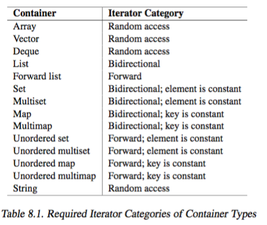

# STL container member 

+ _nonmodifying operation for associative/unordered container_
    + provide better performance than general algorithm
        + all `O(lg n)`
    + `size_t count(const T& value) const`
        + return number of elements equivalent to `value`
        + `T`
            + type of element for set and multiset
            + type of key for map and multimap
    + `iterator container::find(const T& value)`
        + return position of first element that has a value equivalent to `value`, return `end()` if not found
    + `iterator container::lower_bound(const T& value)`
        + return first position where a copy of `value` should get inserted according to the sorting criterion, otherwise `end()`
    + `upper_bound()`
    + `equal_range()`
+ _direct element access_
    + `operator[]`
        + `T& map::operator[] (const key_type& key)`
            + equivalent to `(*((insert(make_pair(key, T()))).first)).second`
        + `T& map::operator[] (const key_type&& key)` (the move version)
        + return corresponding value to `key` in map, if no such element exists, create a new element with this key and a value that is default initialized 
            + note `mapped_type` instead of `value_type` is returned for `map` only
        + different from `set`'s version, which returns the element
+ _iterator_
    + 
+ _insert/removal_
    ```cpp 
    iterator container::insert(const T& value)
    iterator container::insert(T&& value)
    pair<iterator, bool> container::insert(const T& value)
    pair<iterator, bool> container::insert(T&& value)
    ```
    + _insert_
        + for unordred/associative containers
        + _semantics differences_
            + 1,3 copy `value`, 
            + 2,4 move `value`
        + _return value differences_
            + Containers allowing duplicates ((unordered)`multiset` and `multimap`) use the first version, 
                + return position of inserted element 
            + Container disallowing duplicates 
                + if element already exists, `first` return position of existing element and `second` return `false` (no-op)
                + if element does not already exists, `first` return position of inserted element, and `second` is `true`
        + `T` 
            + is type of container elements, hence for `(unordered_){map, multimap}` it is `pair<const K, V>`
        + _exception handling_
            + function succeeds or have no effect (provided hashing does not throw)
        + _validity on insert_
            + _iterator_
                + remain valid only if no rehashing happens 
            + _reference_ 
                + remains valid for all 
+ _inserting multiple elements_ 
    + `void container::insert(init-list)`
        + for associative/unordered container 
        + _validity_ 
            + reference valid for all container 
            + iterator may change for unordered containers if rehashing happens
    + `iterator container::insert(const_iterator pos, init-list)`
        + for sequential containers
        + insert copies of elements of `init-list` at position `pos`
        + _validity_ 
            + invalidates iterator/reference for `vector` if realloation happens
            + invalidates iterator/reference for `deque`
            + no effect for `list`
+ _removing elements_ 
    + `size_type erase(const T& value)`
        + removes all elements with equivalent value to `value` for associative/unordered container
        + return number of elements removed (destructor called)
    + `iterator erase(const_iterator pos)`
        + removes element at `pos` 
        + return position of following element or (`end()`)
        + _validity_
            + may invalidate iterator/reference for `vector` and `deque` 
            + fine for all other containers 
    + `iterator erase(const_iterator beg, const_iterator end)`
    + `void pop_front()`
        + for `deque`, `list`, `forward_list`
        + equivalent to `erase(container.begin())`
    + `void pop_back()`
    + `void clear()`
        + empties container, call destructor of removed elements 
