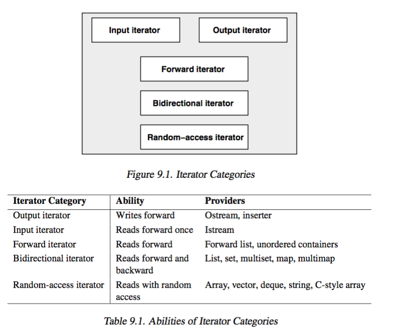
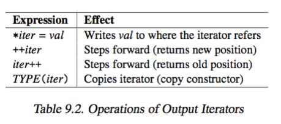
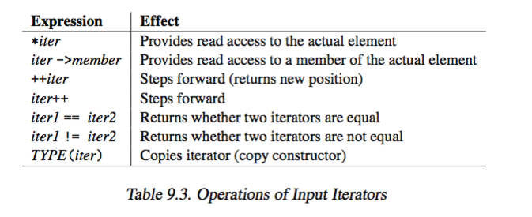
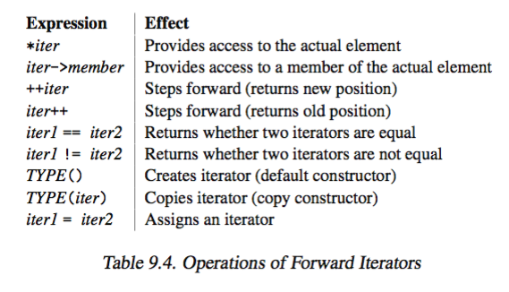
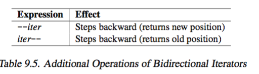
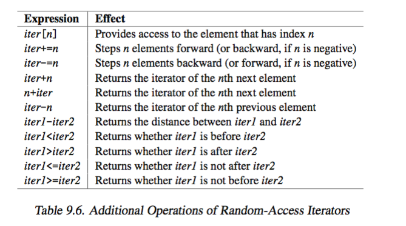

# STL Iterators 


### 9.2 Iterator Categories

+ _header file_ 
    + in `<iterator>`
+ _category_ 
    + 
    + _iterator_    
        + objects that iterate over elements of a sequence via a common interface that is adapted from ordinary pointers 
        + follows from pure abstraction, anything that behaves like an iterator is an iterator
        + _mutable iterator_: all iterator that provides ability to write, i.e. implements `*iter = val`
    + _output iterator_ 
        + _properties_ 
            + only step forward with write access
            + cannot iterate twice over the same range
        + 
        + i.e. `stdout`, `inserter`
    + _input iterator_ 
        + _properties_ 
            + only step forward with read access 
            + return values element wise
        + 
        + i.e. `stdin` same input  cant be read twice
    + _forward iterator_
        + _properties_ 
            + builds upon from _input iterator_, satisfies
            + 2 forward iterator 
                + refer to same element, `operator==` yields `true`
                + will refer to same value if both are incremented
        + 
        + i.e. `forward_list` and unordered containers (at least forward iterator)
        ```cpp 
        ForwardIterator pos1, pos2;

        pos1 = pos2 = begin;
        if(pos1 != end){
            ++pos1;                     // pos1 1 element ahead
            while(pos1 != end){
                if(*pos1 == *pos2){
                    // process duplicates
                    ++pos1;
                    ++pos2;
                }
            }
        }
        ```
    + _bidirectional iterator_
        + _properties_
            + additional decrement operator
        + 
        + i.e. `list<>`, associative container
    + _random access iterator_ 
        + _properties_
            + provides all abilities of bidrectional iterator plus random access
            + i.e. _iterator arithmetics_, add, subtract, difference, compare with `<` and `>`
        + 
        + i.e. `array`, `vector`, `deque`, `string`, `wstring`, C pointer
+ _increment/decrement problem of vector iterator_
    + `array`, `vector`, and `string` whose iterators are ordinary pointer
        + may fail to compile if use temporary values with increment/decrement operators, since cannot modify temporary values 
        + if iterator impl with class, then works
    ```cpp 
    vector<int> coll;
    if(coll.size() > 1){
        sort(++coll.begin(), coll.end())    // NOT PORTABLE
    }
    ```
    + _solution_ use `next()`
    ```cpp
    vector<int> coll;

    // PORTABLE since C++11
    if(coll.size() > 1){
        sort(std::next(coll.begin()), coll.end());
    }
    ```


### 9.3 Auxiliary Iterator Functions


+ _Random-access like abilities_
    + `void advance(InputIterator& pos, Dist n)`
        + increment input iterator `pos` step `n` elements forward (or backward)
        + _for bidirectional, random-access iterator, `n` may be negative_
        + `Dist` a template type, but normally `int` 
        + does not check for `end()`
        + _impl_ 
            + _random access iterator_: `pos += n`, `O(1)`
            + _other iterators_: call `++pos` or `--pos` `n` times,`O(n)`
        ```cpp 
        list<int> coll = {1,2,3,4,5,6,7,8,9};
        list<int>::iterator pos = coll.begin();

        cout << *pos << endl;
        advance(pos, 3);
        cout << *pos << endl;
        advance(pos, -1);
        cout << *pos << endl;

        // outputs: 
            1
            4
            3   */
        ```
        + _usage_: might use `advance` to skip input from input stream
    + `ForwardIterator next(ForwardIterator pos [, Dist n])`
        + yields forward iterator `pos` that would have moved 1 or `n` positions
        + _for bidirectional, random-access iterator, `n` may be negative_
        + `Dist` has type `std::iterator_traits<ForwardIterator>::difference_type`
        ```cpp
        auto pos = coll.begin();
        while(pos != coll.begin() && next(pos) != coll.end()){
            //.. 
            ++pos;
        }
        ```
        ```cpp 
        // otherwise may need temporaries 
        auto pos = coll.begin();
        auto nextPos = pos;
        ++nextPos;
        while(pos != coll.end() && nextPos != coll.end()){
            //.. 
            ++pos, ++nextPos;
        }
        ```
        + note
            + have to check for `coll.end()` first so that `nextPos` is a valid index
    + `BidirectionalIterator prev(BidirectionalIterator pos [, Dist n])`
        + yields bidrectional iterator `pos` would have if moved backward 1 or `n` positions
        + `Dist` has type `std::iterator_traits<BidirectionalIterator>::difference_type`
    + `Dist distance(InputIterator pos1, InputIterator pos2)`
        + return distance between `pos1` and `pos2`
        + _precondition_
            + both iterator have to refer to same container 
            + `pos2` must be reachable from `pos1`, i.e. `pos2` must have a later position
        + `Dist` is of type `iterator_traits<InputIterator>::difference_type`
        + _impl_
            + _random access iterator_: use `pos2-pos1`
            + _other iterators_: `pos1` incremented until reached `pos2` 
+ _swapping iterators_ 
    + `void iter_swap(ForwardIterator pos1, ForwardIterator2 pos)`
        + swaps value `pos1` and `pos2` refer 
        + doesn have to be of same type, but must be assignable
