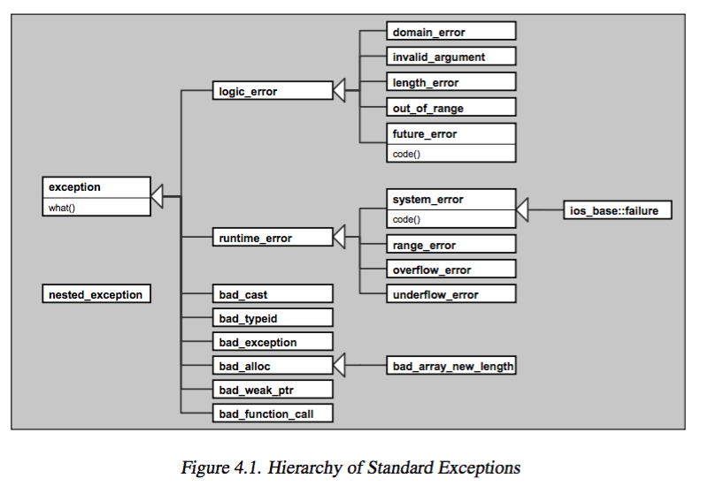
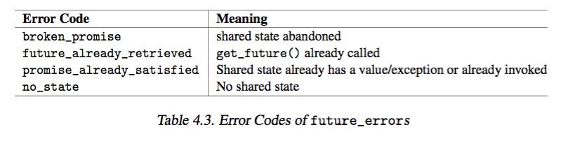

# 3 New Language Features 


+ `nullptr` 
    + `f(nullptr)` now calls `f(void*)` instead of `f(int)`
    + has type `std::nulltpr_t`
+ `auto` 
    + automatic type deduction 
        + deduced from initializer, hence initialization is required 
        + usefull for long/complicated expression
    + example 
        + `auto i = 42;`: `i` is type `int` 
        + `auto pos = v.begin();` where `pos` has type `vector<string>::iterator` 
        + `auto l = [] (int x) -> bool { ... };` where `l` has type of a lambda `int -> bool`
+ _uniform initialization and initializer list_
    + _uniform initialization_ 
        + idea is braces can be used for any initialization 
            + `int values[] {1,2,3}`
            + `std::vector<int> v {2, 3, 4}`
            + `std::vector<std::string> cities {"berlin", "london"}`
    + initializer list forces _value initialization_ 
        + built-in types are initialized to zero, where its not usually nondefined 
            + `int i;`: `i` is undefined 
            + `int j{};`: `j` initialized by 0
            + `int* p`: `p` is undefined 
            + `int* q{}`: `q` initialized to `nullptr`
    + _narrowing initialization_ are not possible with braces...
        + i.e. converting float to int `int x{5.0}`
        + give error 
    + user-defined class initializer list 
        + `std::initializer_list<T>`
        + support initializations by a list of values 
        ```cpp 
        void print(std::initializer_list<int> vals){
            for(auto p = vals.begin(); p != vals.end(), ++p){
                std::cout << *p << "\n";
            }
        }
        print({1,2,3,4})        // prints a list of values to print()
        ```
        + for constructors for both a specific number of args and an initializer list, the version with initializer list is preferred 
        ```cpp 
        class P
        {
            public:
                P(int, int);
                P(std::initializer_list<int>)
        }

        P p(1,2)        // calls P::P(int, int)
        P q{1,2}        // calls P::P(initializer_list)
        P r{1,2,3}      // calls P::P(initializer_list)
        P s = {1,2}     // calls P::P(initializer_list)
        ```
        + now `explicit` is relevant for constructor with more than 1 args, 
            + use `explicit` to disable automatic type conversions from multiple values 
        ```cpp 
        class P{
            public:
                P(int a, int b);
                explicit P(int a, int b, int c);
        }
        P x(1,2)        // OK
        P x{1,2}        // OK 
        P z {1,2,3}     // OK
        P v = {1,2}     // OK (allows implicit type conversion)
        P w = {1,2,3}   // ERROR, due to explicit

        void fp(const P&);

        fp({1,2})       // OK, implicit conversion of {1,2} to P 
        fp({1,2,3})     // ERORR due to explicit 
        fp(P{1,2})      // OK, explicit conversion of {1,2} to P
        fp(P{1,2,3})    // OK, explicit conversion of {1,2,3} to P
        ```
+ _range-based for loop_ 
    + a for loop that iterates over all elements of a given range, array, collection
        + a _foreach_ loop
        ```cpp 
        for(decl: coll){
            statement
        }

        // equivalent to 
        for(auto _pos=begin(coll), _end=coll.end(); _pos != _end; ++ _pos){
            decl = *_pos
            statement
        }
        ```
        + `decl`: declaration of each element of 
        + `coll`: collection
    + works for initializer list (since `std::initializer_list<>` provides `begin()` and `end()` member)
        ```cpp 
        for(int i: {1,2,3,4}){
            std::cout << i << std::endl;
        }
        ```
    + iterate over containers
        ```cpp 
        // multiply each element of vector by 3
        std::vector<double> vec;
        for(auto& elem: vec){      // declare elem as reference to mutate original value
            elem += 3
        }
        ```
    + declare `decl` as const reference to avoid copy constructor and destructor 
        ```cpp
        // print all elements of a collection 
        template <typename T> 
        void printElements(const T& coll)
        {
            for(const auto& elem: coll){
                std::cout << elm << std::endl;
            }
        }
        ```
    + use C-style array 
        ```cpp
        // use C-style array of fixed size 
        int array[] = {1,2,3,4};
        long sum = 0;
        for(int x: array){
            sum += x;
        }
        ```
    + cannot use explicity type conversion for elements initialized as `decl` inside range `for` loop
        ```cpp 
        class C
        {
            public:
                // explicit type conversion from string 
                // cannot use = for initialization
                explicit C(const std::string& s);
        }

        std::vector<std::string> vs;
        for(const C& elem: vs){}    // ERORR, no conversion from string to C 
        ```
+ _move semantics and Ralue References_ 
    + _move semantics_ 
         + avoids unnecessary copies/temporaries 
    + example 
        ```cpp 
        void createAndInsert(std::set<X>& coll)
        {
            X x;
            ...
            coll.insert(x); // insert it
        }

        namespace std: {
            template <typename T, ...> class set {
                ... 
                insert(const T& v);     // copy value of v
            } 
        } 
        ```
        + inserting a new object to a collection with `set.insert`
            + which creates an _internal copy_ of the passed element 
    + _behavior_
        ```cpp 
        X x;
        coll.insert(x);     // insert copy of x 
        coll.insert(x + x); // insert copy of temporary value 
        coll.insert(x);     // insert copy of x (although x not used any longer)
        ```
        + behavior for the latter two 
            + passed value result of `x + x` and `x` are no longer used by the caller so `coll` internally could _avoid creating a copy_ and somehow _move_ the contents of them into its new elements 
            + critical if copying `x` is expensive
    + _usage_
         ```cpp 
            X x;
            coll.insert(x);     // inserts copy of x (OK, since x still used)
            coll.insert(x+x);   // moves (or copies) contents of temporaries 
            coll.inesrt(std::move(x))   // moves contents of x into coll
        ```
        + temporary is `rvalue` so is _moved_ 
        + specify a _move_ is possible by `std::move()`, 
            + i.e. converts `lvalue -> rvalue reference`
    + `std::move()`
        + `<utility>`
        + converts arg into _rvalue reference_, 
    + _rvalue reference_ 
        + a type declared with `X&&`
        + stands for rvalue (anonymous temporaries that can appear on RHS of an assignment) that can be modified 
        + contract: a (temporary) object that is not needed any longer so that we can _steal_ its content/resource
    + overloaded `insert()` in collection 
        ```cpp 
        namespace std{
            template<typename T, ...> class set{
                public: 
                    insert(const T& x);     // for lvalues, copies the value 
                    insert(T&& x);          // for rvalues, moves the value
            }
        }
        ```
    + _move constructor_ defines such behavior
        ```cpp 
        class X {
            public: 
                X(const X& lvalue);     // copy constructor 
                X(X&& rvalue);          // move constructor 
        }
        ```
        + initialize `x` with _move constructor_ of `class X`
            + assign internal memory to new object instead of creating a copy 
            + i.e. `string` move constructor simply assigns existing internal `char[]` to new object instead of creating a new array and copying all elements 
        + clear content of passed argument 
            + ensure modification - especially destruction - of passed object, where value was stolen from, doesnt impact the state of new object that now owns the value 
            + i.e.,  assigns `nullptr` to its internal member 
            + `std` library
                + guaranteed after a move, objects are in a _valid but unspecified_ state 
                    + can assign new values afterwards 
                    + but current value not defined
            +  `stl` containers 
                + containers are empty after the move 
    + _move assignment operator_ 
        ```cpp 
        class X {
            public: 
                X& operator= (const X& lvalue);     // copy assignment operator 
                X& operator= (X&& rvalue);          // move assignment operator
        }
        ```
        + example 
            + `string` and `collections` operator should be simply swapping the internal contents and resources
    + _overloading rules for rvalue/lvalue reference_   
        ```cpp 
        void foo(X&);                   // args: lvalue only 
        void foo(const X&);             // args: either rvalue and lvalue 
        void foo(X&); void foo(X&&);    // able to distinguish rvalues/lvalues
        void foo(X&&);                  // args: rvalue only, lvalue -> compiler error             
        ```
        + idea 
            + for class that does not provide move semantics but only the copy constructor/assignment operator. these will be used for `rvalue reference` (by 2nd example)
            + hence `std::move()` means to call move semantics if provided, and copy semantics otherwise
    + _returning rvalue references_ 
        ```cpp 
        X foo(){
            X x;
            return x;
        }
        ```
        + do not have to and should not `move()` return values since 
            + if `X` has copy/move constructor, compiler may choose to elide the copy, (named return value optimization (NRVO))
            + otherwise `X` has a move constructor, `x` is moved 
            + otherwise `X` has a copy constructor, `x` is copied 
            + otherwise, compile-time error 
        + cannot return rvalue reference where the returned object is a local nonstatic object 
            + since returning reference to a local object means returning reference to object that doesnt exist any more 
        ```cpp 
        X&& foo(){
            X x;
            return x;       // ERROR, returns reference to nonexisting object
        }
        ```
+ _new string literals_ 
    + _raw string literal_ 
        + define a char sequence by writing exactly its content 
        + avoids having to escape special characters 
        + syntax: `R"delim(..)delim"`
            + `R"(\\n)" -> "\\\\n"`
            ```cpp 
            R"nc(a\
                b\n()"
                )nc";

            // eqvuivalent to 
            "a\\\n     b\\nc()\"\n     "
            ```
    + _encoded string literal_ 
        + _encode prefix_ 
            + `u8`: utf-8 encoding 
                + char has type `const char` 
            + `u`: char type of `char16_t`
            + `U`: char type of `char32_t`
            + `L`: wide string literal of `wchar_t`
+ `nonexcept` 
    + specify a function cannot throw or is not prepared to throw 
    + usage 
        + `void foo() noexcept`
    + behavior 
        + if an exception not handled inside `foo()` then 
            + `foo` throws 
            + program terminates `std::terminate()`
            + calls `std::abort()`
    + solution to 
        + _runtime checking_ 
            + exception checked at runtime instead of compile time, so offer no guarantees that all exceptions have been handled
        + _runtime overhead_ 
            + runtime checking hampers optimization 
        + _unusable in generic code_ 
            + usually not known what type of exceptions may be thrown, so a precise exception specification cannot be written 
    + idea 
        + useful to know 
            + an operation that might throw 
                + omit `noexcept` 
            + an operation that never throw 
                + specify `noexcept` 
+ `constexpr`
    + enable expressions be evaluated at compile time 
    ```cpp 
    constexpr int square(int x)
    {
        return x * x
    }
    float a[square(9)]              // OK since C++11: a has 81 elements                     
    ```
    + fixed problem with numeric limits 
        + `std::numeric_limit<short>::max()`
            + cannot be used as int constant even though its equivalent to macro INT_MAX
        + now its declared as `constexpr` hence 
            + `std::array<float, std::numeric_limist<short>::max()> a;` is valid at compile time
        + in essence, able to use function/variable where constant expression is required 
            ```cpp 
            int n = 1;
            std::array<int, n> a1; // error, n is not a constant expression
            const int cn = 2;
            std::array<int, cn> a2; // OK, cn is a constant expression
            ```
+ _template features_  
    + _variadic templates_ 
    ```cpp 
    void print(){}   // non template overload of print() to end recursion
    template<typename T, typename...Types>
    void print(const T& firstArg, const Types&...args)
    {
        std::cout << firstArg << std::endl;
        print(args...);     // call print() for remaining args 
    }
    ```
    ```cpp 
    template<typename T> 
    void print(const T& arg)
    {
        std::cout << arg << std::endl;
    }
    template<typename T, typename...Types>
    {
        std::cout << firstArg << std::endl;
        print(args...)
        // note sizeof...(args) yields number of args 
    }
    ```
    + _alias template_
        ```cpp 
        template<typename T>
        using Vec = std::vector<T, MyAlloc<T>> 
        ```
+ _lambdas_ 
    + _functor_ 
        + objects that overloads `operator ()`
        + maintains state, unlike function pointers
    + definition 
        + functionality that can be defined inside statements and expressions 
            + use lambda as inline functions
        + object of _autogenerated class_ with overloading `operator()const` . 
            + Creates _closure_ and
            + created by compiler.
    + note 
        + lambdas cannot be templates, so have to specify all types
    + _syntax_
        + `[capture] (params) mutable throwSpec -> retType {}`
            + _lambda introducer_ 
                + brackets within which u can specify a _capture_ to access _nonstatic outside objects_ inside the lambda
            + _retType_ 
                + deduced from return value if not specified
        ```cpp 
        [] {
            std::cout << "hi lambda" << std::endl;
        }()     // call it 

        auto l = [] {
            std::cout << "hi lambda" << std::endl;
        };          // pass to object
        l();        // invokes lambda

        auto l = [] (const std::string& s) {
            std::cout << s << std::endl;
        }
        l("hi")     // prints "hi"

        [] {
           return 42;       // retType deduced to be int 
        }

        [] () -> retType {  // require () now for specifying retType
            return 42;      // retType is now a double 
        }
        ```
    + _capture_     
        + specify access to data of outer scope not passed as args 
            + static variables are captured by default
        + `[]`: empty square bracket -> no variable accessible from enclosing scope
        + _default capture mode_
            + `[=]`: outer scope passed to lambda by value, 
                + able to read but not modify all data 
                + i.e.  `auto qqq = [=, &y]` pass `y` by ref and all other object by value
                + creates _closure_ 
            + `[&]`: outer scope passed to lambda by reference 
                + have write access to all data, if possible
        ```cpp 
        int x = 0;
        int y = 42;
        auto qqq = [x, &y]{
            std::cout << "x: " << x << std:endl;
            std::cout << "y: " << y << std:endl;
            ++y;            // OK
            ++x;            // compiler error
        }
        x = y = 77;
        qqq();
        qqq();
        std::cout << "final y: : << y << std::endl;

        /* outputs: 
        x: 0
        y: 77
        x: 0
        y: 78
        final y: 79
        */
        ```
    + `mutable` 
        + objects are passed by value, but inside the function object defined by lambda, you have write access to passed value
        + cause lambda function to be stateful, even if state is passed by value...
            + creating closure! for variables captured!
        + cause `operator()` be defined as `non-const` member function
        ```cpp 
        int id = 0;
        auto f = [id] () mutable {
            std::cout << "id: " << id << std::endl;
            ++id;           // OK
        }
        id = 42;
        f();
        f();
        f();
        std::cout << id << std::endl;
        /* outputs: 
        id: 0
        id: 1
        id: 2
        42
        */

        // roughly equivalent to 
        class {
            private:
                int id;         // copy of id 
            public:
                void operator() (){
                    std::cout << "id: " << id << std::endl;
                    ++id;           // OK
                }
        }
        ```
    + _types of lambdas_
        + anonymous function object (functor) unique for each lambda
        + requires 
            + `auto`, or
            + templates with `std::function<>`
                + specify return type of a function returning a lambda
                ```cpp 
                #include <functional> 
                
                std::function<int(int, int)> returnLambda () 
                {
                    return [](int x, int y) {
                        return x * y;
                    }
                }
                int main() {
                    auto lf = returnLambda();
                    std::cout << lf(6,7) << std::endl;      // 42
                }
                ```
                + store, copy, and invoke any Callable target
                ```cpp 
                // store a lambda
                std::function<void()> f_display_42 = []() { print_num(42); };
                f_display_42();
                ```
+ `decltype`
    + Inspects the declared type of an entity or the type and value category of an expression.
        + the `typeof` feature
        ```cpp 
        std::map<std::string, float> coll;
        delctype(coll)::value_type elem;
        ```
    + use case 
        + want to declare a new variable with exactly the same type as the original variable
        ```cpp 
        const char* x;
        decltype(x) y;      // y is const char*
        ```
+ function declaration syntax 
    ```cpp 
    template <typename T1, typename T2> 
    auto add(T1 x, T2 y) => decltype(x+y);
    ```
+ _scoped enumeration_
    + _enum_ 
        ```cpp 
        enum Days { Saturday,Sunday,Tuesday,Wednesday,Thursday,Friday};
        Days day = Saturday;    // note Saturday is in global scope
        if(day == Saturday){ ... }      
        ```
        + `Days` is a type, not an object
    + _enumeration classes_ 
        + `enum class Salutation: char {mr, ms, co, none}`
        + specify `class` after `enum`
            + implicity conversion from/to `int` not possible 
            + `mr` not part of scoped where enumeration is declared, have to use `Salutation::mr`, so is scoped
+ new _data types_ 
    + `char16_t` and `char32_t`
        + 16bit or 32bit characters
    + `std::nullptr_t`
        + `typedef decltype(nullptr) nullptr_t;`
+ _old feature refreshre_ 
    + _default template param_ 
        ```cpp 
        template<typename T, typename container=vector<T>>
        MyClass<int> x1;        // equivalent to MyClass<int, vector<int>>
        ```
    + `typename`
        + used clarify that `SubType` is a type defined within class `T` 
            + `typename T::SubType * ptr`
            + so `ptr` is a pointer to type `T::SubType`
        + if not specified, `T::SubType` is considered a static member
            + `T::SubType * ptr`
            + is just multiplication of `T::SubType` with `ptr`
        ```cpp 
        template<typename T>
        class MyClass{
            typename T::SubType * ptr
        }
        ```
+ _explicit initialization for fundamental types_ 
    + initialize fundamental types 
        + with explicit constructor call without arguments 
    ```cpp 
    int i1;             // undefined value 
    int i2 = int();     // initialized with zero 
    int i3{};           // initialized with zero (C++11)
    ```
    + handy for writing templates 
    ```cpp 
    template <typename T>
    void f()
    {
        T x = T();
    }
    ```
    + forces zero-initialization on fundamental types as well!
+ _definition of main_
    + C++ implicitly defines `return 0;` at end of main
        + i.e. program leaving main without is successful 


--- 


# 4 General Concepts 


+ _namespace `std`_
    + _namespace_ 
        + a certain scope for identifiers 
        + properties 
            + open for extension at any source, 
            + so can define component that are distributed over several physical modules 
            + i.e. `std` 
    + 3 ways of using `namespace` 
        + qualify identifier directly 
            + `std::cout << std::hex << 3.4 << std::endl;`
        + with _`using` declaration_
            + `using std::cout`, `using std::endl`
            + `cout << std::hex << 3.4 << endl;`
        + with _`using` directive_
            + all identifiers of the namespace are available as if declared globally 
            + `using namespace std;`
            + `cout << hex << 3.4 << endl;`
+ _header files_ 
    + compatibility issues
        + older header files not compatible, i.e. not under namespace `std`
    + standardization 
        + prefix `c` instead of old extension `.h`
        + `#include <cstdlib>   // instead of <stdlib.h>` 
    + `#include <stdlib.h>`: in effect, declared in global space behave as if they declare all identifiers in namespace `std`
+ _error handling_ 
    + _standard exception classes_  
        + 
        + categories 
            + language support 
                + part of language, used by language features 
                + `bad_cast`: thrown by `dynamic_cast`
                + `bad_exception`: handled unexpected exception
                    + `unexpected()` used to throw the exception 
            + logic errors 
                + usually can be avoided...
                + usually defined in `<stdexcept>`
                + `invalid_argument`: report invalid arg 
                + `length_error`: exceed max allowable size 
                + `out_of_range`: not in range
                + `domain_error`
                + `future_error`: for async syscalls
                    + in `<future>`
            + runtime errors 
                + usually defined in `<stdexcept>`
                + `range_error`: report range error in internal computation 
                + `overflow_error`: report arithmetic overflow 
                + `underflow_error`
                + `system_error`: caused by OS, can be thrown by `thread` and `async()`
                + `bad_alloc`: fails on `new` operator. 
                    + `<new>`
                + `bad_weak_ptr`: creation of weak pointer out of a shared pointer fails 
                    + `<memory>`
                + `bad_function_call`: `function` wrapper gets invokded but has no target...
                    + `<functional>`
                + `ios_base::failure`: thrown when a stream changes its state due to error/EOF
                    + `<ios>`
    + header files for dealing with exception classes 
        ```cpp 
        #include <exception>    // for classes exception and bad_exception
        #include <stdexcept>    // for most logic and runtime error classes
        #include <system_error>  // for system errors (since C++11)
        #include <new>           // for out-of-memory exceptions
        #include <ios>           // for I/O exceptions
        #include <future>        // for errors with async() and futures (since C++11)
        #include <typeinfo>       // for bad_cast and bad_typeid
        ```
    + member of exception class 
        + `what()` returns null-terminated byte string (C-string)
        ```cpp 
        namespace std {
            class exception {
                public:
                    virtual const char* what() const noexcept;
            }
        }
        ```
        + error codes vs error conditions 
            + _error codes_: light-weight objects that encapsulate erorr code values 
                + i.e. `std::io_errc` provides error codes 
                + i.e. `std::future_errc` provides erorr code by concurrency library
                + 
            + _error conditions_: objects providing portable abstraction of error descriptions
                + i.e. `std::errc` provides error condition for `system_error`
                + it is _scoped enumerators_!
                + 
        + handling `std::error_code` and `std::error_condition`
            + same way to check...
            + difference between code or condition doesnt matter
        ```cpp 
        if(ec == std::errc::invalid_argument){} // checks error condition
        if(ec == std::future_errc::no_state){}  // check error code
        ```
    + `std::system_error` and `std::_future_error` 
        + member nonvirtual `code()` returning object of type `std::error_code`
        + `error_code` class 
            + provides member function to get detail of error 
            + `category()` and `value()` together distinguishes the error 
            + `message()`: usually what `what()` gives 
            + `operator bool()`: if an error code is set (0 -> no error), evalutes to true if exception caught 
            + `default_error_condition()`: return corresponding class `error_condition`
        + `error_category`
            + `name()` name of _category_
                + `"iostream` for `ios_base::failure`
                + `"generic` for `system_error` with a corresponding POSIX `errno` 
                + `"system` for `system_error` without a corresponding POSIX `errno`
                + `"future` for `future_error`
                + global function returns category 
                ```cpp 
                const error_category& generic_category() noexcept;  // in <system_errror> 
                const error_category& system_category() noexcept;       // in <system_error>
                const error_category& iostream_category();      // in <ios>
                const error_category& future_category() noexcept;       // in <future>
                ```
                + usage 
                    + `if(e.code().category() == std::iostream_category())` ...
            + `operator ==` and `operator !=` allows compare error categories
        ```cpp 
        namespace std {
            class system_error: public runtime_error {
                public: 
                    virtual const char* what() const noexcept;
                    const error_code& code() const noexcept;
            };

            class future_error: public logic_error {
                public: 
                    virtual const char* what() const noexcept;
                    const error_code& code() const noexcept;
            }

            class error_code {
                public: 
                    const error_category& category() const noexcept;
                    int value() const noexcept;
                    string message() const;
                    explicit operator bool() const noexcept;
                    error_condition default_error_condition() const noexcept
            }

            class error_condition {
                public: 
                    const error_category& category() const noexcept;
                    int value() const noexcept; 
                    string mesasge() const;
                    explicit operator bool() const noexcept;
            }

            class error_category {
                public: 
                    virtual const char* name() const noexcept = 0;
                    virtual string message(int ev) const = 0;
                    virtual error_condition default_error_condition(int ev) const noexcept;
                    bool operator == (const error_category& rhs) const noexcept;
                    bool operator != (const error_category& rhs) const noexcept;
            }
        }
        ```
    + _throw std exceptions_   
        + `logic_error` and `runtime_error`
            + by throwing error class constructor 
            ```cpp 
            namespace std {
                class logic_error: public exception {
                    public: 
                        explicit logic_error(const string& whatStr);
                        explicit logic_error(const char* whatStr);      //  since C++11
                }
            }
            ```
        + `system_error`
            + create exception object by passing 
                + an error code 
                + a `what()` string 
                + optional category 
            ```cpp 
            namespace std{
                class system_error: public runtime_error {
                    public: 
                        system_error(error_code ec, const string& what_arg);
                        system_error(error_code ec, const char * what_arg);
                        system_error(error_code ec);
                        system_error(int ev, const error_category& ecat, const string& what_arg);
                        system_error(int ev, const error_category& ecat, const char* what_arg);

                }
            }
            ```
        + examples 
            ```cpp 
            throw std::out_of_range("out_of_range (somewhere, somehow)");
            throw std::system_error(std::make_error_code(std::errc::invalid_argument), "arg... is not valid")
            ```
    + _derive from standard exception classes_ 
+ _callable object_     
    + definition 
        + objects that can be used to call some functionality 
            + a function, 
            + pointer to a member function 
            + function object (functor)
            + lambda, which is a function object
        ```cpp 
        void func (int x, int y);
        auto l = [] (int x, int y){ ... };
        class C {
            public: 
                void operator() (int x, int y) const;
                void memfunc(int x, int y) const;
        }

        int main() {
            C c;
            std::shared_ptr<C> sp(new C);

            // bind() uses callable objects to bind args 
            std::bind(func, 1, 2)();          // func(1,2)
            std::bind(l, 1, 2)();             // l(1,2)
            std::bind(C(), 1, 2)();           // C::operator()(1, 2)
            std::bind(&C::memfunc c, 1, 2)(); // c.memfunc(1, 2)
            std::bind(&C::memfunc, sp, 1, 2)();     // sp->memfunc(1, 2)

            // async() uses callable objects to start background tasks:
            std::async(func, 1, 2);           // func(1, 2)
            ...
        }
        ```
    + might use `std::function<>` to declare _callable object_ 
+ _concurrency_ 
    + supported 
        + _stl_ 
            + read-only access is safe 
                + i.e. calling nonconstant member function 
                + `begin()`, `end()`, `find()`, `at()`, `operator[]`, ...
            + read/write to different element of same container is safe
        + I/O is synchronized 
            + string stream, file stream, stream buffers concurrent access results in undefined behavior 
        + member function of default allocator is synchronized 
+ _allocator_ 


--- 

# Utilities 

+ _Pairs and Tuples_ 
    + _pair_ 
        + treats 2 values as a single unit 
        + `<utility>`
        + used in container `map`, `multimap`, `unordered_map`, `unordered_multimap`
        ```cpp 
        namespace std {
            template <typename T1, typename T2>
            struct pair {
                T1 first;
                T2 second;
            }

            template<typename T1, typename T2> 
            std::ostream& operator << (std::ostream& strm, const std::pair<T1,T2>& p)
            {
                return strm << "[" << p.first << ", " << p.second << "]";
            }
        }
        ```
        + 
        + a tuple like interface 
        ```cpp 
        typedef std::pair<int, float> intFloatPair;
        intFloatPair p(1, 1.1);

        std::get<0>(p)      // p.first
        std::get<1>(p)      // p.second 
        std::tuple_size<intFloatPair>::value        // 2
        std::tuple_element<0, intFloatPair>::type   // int
        ```
    + _

                