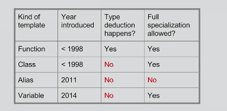
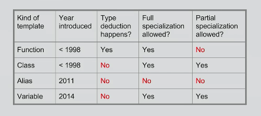

[video](https://www.youtube.com/watch?v=vwrXHznaYLA)


+ _function templates_
    ```cpp 
    template<typename T>
    T abs(T x){
        return (x >= 0) ? x : -x;
    }

    double (*foo)(double) = abs<double>;
    printf("%d\n", abs<int>(-42));
    ```
+ _generic types_ 
    + `void *` not type safe
+ _class templates_
    + templates for making classes
    + dont pay for what you dont use, if nobody use `mylist<int>` it wont be instantiated
        ```cpp 
        template<typename T>
        struct mylist
        {
            T data;
            mylist<T> *next;
        };

        mylist<int> *intlist = ...;
        mylist<double> *doublelist = ...;
        ```
    + follow all same rules as normal classes
        + for example, static data member must be defined...
        ```cpp 
        template<typename T>
        struct ST {
            static int sdm;
        };

        template<typename T>
        int ST<T>::sdm = 42;

        int main(){
            return ST<char>::sdm;
        }
        ```
        + _note_
            + normally, static member must be defined in `.c` otherwise multiple `#include` leasds to multiple-definition and gets linker error
            + static member `sdm` can be put in header file
                + since same rules for `inline` function/variable governs definition of templates
+ _variable templates_
    + syntactic sugar for static data member of a class template
    ```cpp
    // C++98
    template<typename T>
    struct is_void {
        static const bool value = { expr };
    };

    // C++14
    template<typename T>
    const bool is_void_v = ( expr );
    // in STL, usually both exists 
    template<typename T>
    constexpr bool is_void_v = is_void<T>::value;

    int main(){
        is_void<int>::value;       // 0
        is_void<void>::value;      // 1

        is_void_v<int>;             // 0
        is_void_v<void>;            // 1
    }
    ```
+ _alias templates_
    ```cpp 
    typedef std::vector<int> myvector_int;      // C++03 alias

    using myvec_double = std::vector<double>;   // C++11 

    template<T>
    using myvec = std::vector<T>;               // C++11 alias templates 

    int main(){
        static_assert(is_same_v(myvec_int, std::vector<int>));
        static_assert(is_same_v(myvec_double, std::vector<double>));
        static_assert(is_same_v(myvec<float>, std::vector<float>));
    }
    ```
    ```cpp 
    using myint = int;

    template<typename T>
    using myvec = std::vector<T>;

    void f(const myint& mv);
    void g(const myvec<int>& mv);

    int main(){
        int i;
        f(i);           // OK, since myint is int 

        std::vector<int> v = {1,2,3};
        g(v);           // OK, since myvec<int> is std::vector<int>
    }
    ```
+ _type deduction_
    + use `__PRETTY_FUNCTION__`!!!
    + _rules_
        + Any template parameter that were _explicitly specified_ by caller are fixed, and dont participate further in deduction
        + Each function parameter may contribute (or not) to the deduction of template parameter (or not)
        + all deduction carried out _in parallel_, they dont influence each other 
        + If any template parameter (wasnt specified by caller) couldnt be deduced, but has a _default value_, then it is fixed as its default value
        + At end of process, compiler checks to make sure 
            + each template parameter has been deduced at least once
            + all deduction agree with each other 
        + any function parameter that _does_ contribute to deduction must match its function argument type _exactly_, no implicit conversions!
    ```cpp 
    template<typename T>
    T foo(T x)
    {
        puts(__PRETTY_FUNCTION__);
    }

    int main(){
        foo(4);         // void foo(T) [T = int]
        foo(4.2);       // void foo(T) [T = double]
        foo("hello");   // void foo(T) [T = const char *]
    }
    ```
    ```cpp 
    template<typename T, typename U>
    void f(T x, U y);

    template<typename T>
    void g(T x, T y);

    int main(){
        f(1,2);     // void f(T,U) [T=int, U=int]
        g(1,2);     // void g(T,T) [T=int]
        g(1,2u);    // error! no matching function call for g(int, unsigned int)
    }
    ```
    ```cpp 
    template<typename T, typename U>
    void foo(std::array<T, sizeof(U)> x,
                std::array<U, sizeof(T)> y,
                int z)
    {
        puts(__PRETTY_FUNCTION__);
    }

    int main(){
        foo(std::array<int, 8>{}, std::array<double, 4>{}, 0.0);
        foo(std::array<int, 9>{}, std::array<double, 4>{}, 0.0);
    }
    ```
    + _note_
        + `std::array<int, 9>` implicitly converts to `std::array<int, 8>`
        + 1st one compiles
        + 2nd one does not compile
            + `x` does not contribute to deduction of `U` from `sizeof(U)` 
            + but still `sizeof(U)` has to agree
    ```cpp 
    template<typename R, typename A>
    void foo(R (*fptr)(A))
    {
        puts(__PRETTY_FUNCTION__);
    }
    int main(){
        foo([](double x){ return int(x);});     // error
        foo(+[](double x){ return int(x);});    // compiles
    }
    ```
    + _note_
        + _captureless lambda_ types always implicit conversion to function pointer 
        + but being _implicitly convertible_ does not help with deduction!
        + if absolutely needs function pointer conversion, use _unary `+`_
    ```cpp 
    short f();

    int main(){
        int x = 42;
        return std::max(f(), x);    // error, not matching f..
    }
    ```
    + _note_
        + every parameter contributing to deduction must match
            + `short` and `int` are different types, so error
        + _solution_
            + _explict conversion with `static_cast`_
            + _supply template arguments, so parameter stop contributing to deduction_
        ```cpp 
        // #1   
        return std::max(static_cast<int>(f()), x);
        // #2   preferred
        return std::max<int>(f(), x);
        ```
    ```cpp 
    template<typename T, typename U>
    void add(T x, U y)
    {
        puts(__PRETTY_FUNCTION__);
    }
    int main(){
        add<int, int>('x', 3.1);        // [T=int, U=int]
        add<int>('x', 3.1);             // [T=int, U=double]
        add<>('x', 3.1);                // [T=char, U=double]
        add('x', 3.1);                  // [T=char, U=double]
    }
    ```
    + _call specialization explicitly_
        + _supply template parameter explicitly_
    ```cpp 
    template<typename T>
    void add(){
        ...
    }

    template<typename T = char*>
    void add_default(){
        ...
    }

    int main(){
        add<int>();     // [T=int]
        add<>();        // couldnt infer template arg T
        add();          // ditto

        add_default<>();    // [T=char*]
        add_default();      // [T=char*]
    }
    ```
    + _note_
        + _default template parameter_
            + give value of type if `<>` used or `<>`  are omitted
    ```cpp 
    template<typename T>
    void f(T &t)            // lvalue reference
    {
        puts(__PRETTY_FUNCTION__);
    }

    int main(){     
        int i;      // lvalue
        f(i);       // void f(T&) [T=int]
    }
    ```
    ```cpp 
    template<typename T>
    void f(T &&t)               // rvalue reference
    {
        puts(__PRETTY_FUNCTION__);
    }

    int main(){     
        int i;                 // lvalue
        f(42);                 // void f(T&&)  [T=int]
        f(std::move(i));       // ditto
    }
    ```
    + _note_
        + `T&&` is a forwarding reference
        ```cpp 
        int i;                 // i is lvalue reference
        f(i);                  // [T=int&]
        ```
        + want to convert `int&` to `int&&`, so we get `T = int&`
        ```cpp              
                              // 42 is rvalue reference
        f(42);                // [T=int]
        ```
        + `T=int` (`T=int&&` also works, but wants to deduce fewer `&`s)
    + _reference collapsing_
        + _combining 2 references, take `min` of number of `&`s between them_
            + `& + & = &`
            + `& + && = &`
            + `&& + & = &`
            + `&& + && = &&`
        ```cpp
        template<typename R>
        void f(R r)
        {
            R& x = ...;     // int& x 
            R&& y = ...;    // int& y 
        }

        int main(){
            int i;
            f<int&>(i);
        }
        ```
    + _reference (and cv-) collapsing_
        ```cpp 
        template<typename T>
        void f(T&& t)
        {
            puts(__PRETTY_FUNCTION__);
        }

        int main(){
            const int i=42;
            f(i);                   // [T=const int&]
            f(std:move(i)); 
        }
        ```
        + _note_
            + `f(i)`
                + `i` is `const int&`
                + deduce `T` such that `T&&` is `const int&`
                + so `T` is `const int&`
            + `f(std::move(i))`
                + `i` is `const int&&`
                + deduce `T` is `const int&&` 
                + so `T` is `const int` works
    + _Deducing `T&`_
        ```cpp 
        template<typename T>
        void f(T& t)
        {
            puts(__PRETTY_FUNCTION__);
        }

        int main(){
            int i = 42;
            f(static_cast<int&>(i));        // [T=int]
            f(static_cast<int&&>(i));       // error
            f(static_cast<volatile int&>(i));   // [T = volatile int]
            f(static_cast<volatile int&&>(i));  // error
            f(static_cast<const int&>(i));   // [T=const int]
            f(static_cast<const int&&>(i));  // [T=const int]
        }
        ```
        + _note_
            + `i` is `int&&` does not work because 
                + minning paramtype `T&` and any possible type gives `T&`, so cannot accept `T&&`
            + `i` is `const int&&` works because
                + `rvalue` is like `const` `lvalue`
    + _applicability_ 
        + only function templates do deduction
            + _class_, _alias_, _variable_ templates dont do deduction since no parameter
+ _template full specialization_ 
    + _rules_
        + prefix definition with `template<>`
        + write function definition as if we are _using_ the specialization that we want to write
        + _for function templates_
            + by deduction rules, implies dont need to write more angle brackets 
            + if a type cannot be _deduced_ (function templates) or _defaulted_, have to write brackets
            ```cpp 
            template<typename T>
            int my_sizeof() {return sizeof(T);};

            template<>
            int my_sizeof<void>(){return 1;};
            ```
    + _defining a specialization_
    ```cpp 
    template<typename T>
    struct is_void 
    {
        static constexpr bool value = false;
    }
    template<>
    struct is_void<void>
    {       // specialization
        static constexpr bool value = true;
    }

    int main(){
        is_void<int>::value;        // 0
        is_void<void>::value;       // 1
    }
    ```
    ```cpp 
    template<typename T>
    T abs(T x)
    {
        return (x >= 0) ? x  : -x;
    }

    template<>
    // int abs<int>(int x)  // by explicitly supply template arg
    // int abs<>(int x)     // by deduction
    int abs(int x)          // by deduction also
    {
        if(x == INT_MIN) throw std::domain_error("opps");
        reutrn (x >= 0) ? x : -x;
    }
    ```
    + _coverage_
        + 
    + _alias templates cant be specialized_
        ```cpp 
        template<typename T>
        using myvec = std::vector<T>;

        template<typename T>
        void foo(myvec<T>& mv){     // void foo(std::vector<T>&)
            puts(__PRETTY_FUNCTION__);
        }

        int main(){
            std::vector<int> v;
            foo(v);         // void foo(myvec<T> &) [T=int]
        }
        ```
        + _note_
            + parameter substituted with `std::vector<T>` 
            + easier for deduction to work
    + _specializing class templates_
        ```cpp 
        template<typename T>
        struct myvec {
            using type = std::vector<T>;
        }

        template<typename T>
        void foo(typename myvec<T>::type& mv){
            puts(__PRETTY_FUNCTION__);
        }

        int main(){
            std::vector<int> v;
            foo(v);             // couldnt infer T
        }
        ```
        + _note_
            + because do not know what `myvec<T>::type` is until we know what `T` is
+ _partial specialization_ 
    + specialization that is, itself, a template. 
    + still requires furthr customization by user before it can be used
    + _partial specialization_   
        + may have additional template parameter that must be deducible, or partial specialization never used
        + number of template parameter on partial specialization unrelated to the original template
    ```cpp 
    // is_array type trait...
    // primary template
    template<typename T>
    constexpr bool is_array = false;

    // partial specialization
    template<typename Tp>
    constexpr bool is_array<Tp[]> =true;

    template<typename Tp, int N>
    constexpr bool is_array<TP[N]> = true;

    // full specialization
    template<>
    constexpr bool is_array<void> = true;

    int main(){
        is_array<int>;      // 0
        is_array<int[]>;    // 1
    }
    ```
    + _which specialization is called_ 
        + first, deduce all template type parameters from _base template_
        + then if exactly match some full specialization, use full specialization 
        + otherwise look for _best-matching_ partial specialization
        + if _best match_ is hard to identify, give an error instead
        ```cpp 
        template<typename T> class A;
        template<> class A<void>;
        template<typename Tp> class A<Tp*>;
        template<typename Tp> class A<Tp**>;

        A<int *> a;     // T=int* in base template,  A<Tp*> fits best
        A<int***> a;    // T=int*** in base template, A<Tp**> fits best 
        ```
    + _coverage_
        + 
    + _function templates cannot be partially specialized_
        ```cpp
        template<typename T>
        bool is_pointer(T x);

        template<typename Tp>
        bool is_pointer(Tp *x);
        ```
        + _gives rise to 2 different templates_
    
