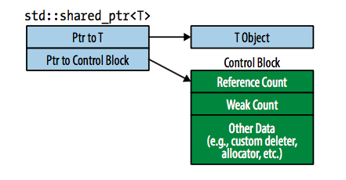
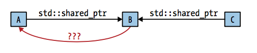
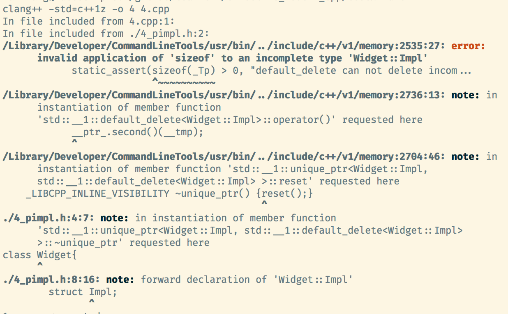

# 4 Smart Pointers 


+ _motivation_ 
    + _why raw pointers are bad_
        + declaration doesn't indicate whether it points to a single object or to an array 
        + declaration does not indicate ownership 
            + if we should destroy what it points when done using it, or
            + just a view to a non-owning piece of memory 
        + if determined to destroy pointer, there is no way to tell how
            + use `delete` or some other different destruction mechanism
        + if try to delete with `delete`, not sure if its `delete` or `delete[]`
        + Assume pointer is owning, and know how to destroy, it's difficult to ensure that destruction is performed _exactly_ once along every path in code (including exception), 
            + missing a path leads to resource leaks and 
            + doing destruction more than once leads to undefined behavior
        + no way to tell if a pointer dangles 
            + i.e. points to memory that no longer holds the pointer it supposed to pointer to 
    + _smart pointers_  
        + wrappers around raw pointers that act much like raw pointers they wrap, but avoid many of the pitfalls
        + implicit conversion deleted
        + `std::unique_ptr`, `std::shared_ptr`, `std::weak_ptr`
            + manage lifetime of dynamically allocated objects
            + avoid resource leaks 


#### Item 18: Use `std::unique_ptr` for exclusive-ownership resource management 


+ `std::unqiue_ptr`
    + _efficiency_ 
        + about same size as raw pointer 
        + most operations (include dereferencing), they execute the same instructions
        + 2 word size if use custom deleter
            + deleter size depends on how much state stored  (capture)
            + so captureless lambda is preferred
    + _exclusive ownership_  
        + a non-null `std::unique_ptr` always _owns_ what it points to 
    + _ownership transfer_
        + via moving a `std::unique_ptr` from the source pointer (later set to null) to target pointer
    + _move-only type_
        + _copy not allowed_,
        +  since end up hainvg multiple owning pointers, each thinking it owned, (hence should destroy) that resource
    + _destruction_ 
        + a non-null `unique_ptr` frees its resource on destruction
        + i.e. apply `delete` to raw pointer inside `std::unique_ptr`
+ _application_ 
    ```cpp 
    class Investment;
    class Stock: public Investment;
    class Bond: public Investment;
    class RealEstate: public Investment;

    template<typename... Ts>
    std::unique_ptr<Investment> makeInvestment(Ts&&... params);

    {
        auto pInvestment = 
            makeInvestment(args);      
    }       // destroy *pInvestment
    ```
    + _factory method_
        + factory methods for allocating an object on heap and returns pointer to it
        + caller required for deleting object when no longer needed
        + use `std::unique_ptr` since the caller acquires ownership and underlying resources are automatically deleted when `unique_ptr` destroyed
    + _owndership-migration_
        + `unique_ptr` returned from factory moved to a container as a data member of a class
        + when object destroyed, the resources are released as wells, 
        + if ownership chain got interrupted due to exception... `std::unique_ptr` owning the managed resource will eventually have its destructor called, and resources it manages will be destroyed
+ _custom deleters_ 
    + arbitrary callables to be invoked when its time for resources to be destroyed
    + accepts a raw pointer to object to be destroyed
    ```cpp 
    class Investment {
        pulic:
            virtual ~Investment();
    };

    auto delInvmt = [](Investment* pInvestment){
        makeLogEntry(pInvestment);
        delete pInvestment;
    };
    ```
    + _note_
        + write a log before destroying 
        + deleting all derived class from a base class pointer `Investment *`
            + implies have to make base class virtual destructor
    ```cpp
    template<typename... Ts>
    std::unique_ptr<Investment, decltype(delInvmt)>
    makeInvestment(Ts&&...params)
    {
        std::unique_ptr<Investment, decltype(delInvmt)> pInv(nullptr, delInvmt);

        if(/* create stock */)
            pInv.reset(new Stock(std::forward<Ts>(params)...));
        
        if(/* create bond */)
            pInv.reset(new Bond(std::forward<Ts>(params)...));

        if(/* create realestate */)
            pInv.reset(new RealEstate(std::forward<Ts>(params)...));
        return pInv;
    }
    ```
    + _note_
        + must supply custom deleter's type as second type to `std::unique_ptr`
        + Note cannot just assign `new Stock(...)` since this implies implicit conversion
        + `std::forward` prefect-forward arguments 
    ```cpp 
    template<typename...Ts>
    auto makeInvestment(Ts&&... parmas)
    {
        auto delInvmt = [](Investment* pInvestment){
            makeLogEntry(pInvestment);
            delete pInvestment;
        };

        std::unique_ptr<Investment, decltype(delInvmt)> pInv(nullptr, delInvmt);

        if()
            ...

        return pInv;
    }
    ```
    + _note_    
        + C++14 auto return type deduction 
        + better encapsulation
+ _2 forms of `std::unique_ptr`_
    + `std::unique_ptr<T>`
        + no indexing operator (`operator[]`)
    + `std::unique_ptr<T[]>`
        + lacks dereferencing operator (`operator*` and `operator->`)
+ _Conversion to `std::shared_ptr`_ 
    ```cpp 
    std::shared_ptr<Investment> sp = makeInvestment(args);      
    ```
    + _note_
        + implicit conversion of `unique_ptr` to `shared_ptr`
        + good in factory pattern, since function can't know if caller will want to use exclusive-ownership semantics or shared ownership
            + returning `unique_ptr` provides with most efficient smart pointer,
            + and dont hinder caller from replacing it with its more flexible siblings 
+ _summary_ 
    + `std::unique_ptr` is small, fast, move-only smart pointer for managing resources with exclusive-owndership semantics 
    +  By default resource destruction takes place via `delete`, but custom deleters can be specified. Stateful deleters and function pointers as deleteres increase size of `std::unique_ptr` objects 
    + Converting from `unique_ptr` to `shared_ptr` is easy
        
---

#### Item 19: Use `std::shared_ptr` for shared-ownership resource management 


+ `std::shared_ptr`
    + _combines the best of two worlds_
        + a system tht works automatically (like garbage collection) 
        + yet applies to all resources and has predictable timing (like destructors)
    + _shared ownership_ 
        + no specific `std::shared_ptr` owns the object. 
        + all `std::shared_ptr` pointing to it collaborates to ensure its destruction at the point wheree its no longer needed
        + when last `std::shared_ptr` pointing to an object stops pointing there (destroyed or made to point to a different object) the underlying object is destroyed
    + _conversion_ 
        + `unique_ptr` to `shared_ptr` is easy
        + but if `shared_ptr` already, have to stay this way till it gets destroyed...
    + _array_ 
        + does not work with `shared_ptr`
            + `shared_ptr` has interface to single objects only 
            + no `shared_ptr<T[]>`
        + _work around_
            + use a custom deleter with `delete[]`
            + _problem_
                + no `operator[]` overload so access syntax to array element is awkward
    + _reference count_
        + a value associated with a resource that keeps track of how many `shared_ptr` point to it
        + _constructor_ increments it
        + _destructor_ decrements it 
        + _copy constructor_   (i.e. `sp1 = sp2`)
            + decrements that of the object originally pointed to by `sp1`
            + increments that of the object pointed to by `sp2`
        + _0_
            + `std::shared_ptr` is destroyed...
    + _performance penalties_ 
        + _`shared_ptr` twice the size of raw pointer_
            + _raw pointer_
            + _pointer to resource reference count_ 
        + _memory for reference count must be dynamically allocated_
            + since _pointed to object_ has no way of knowing the reference count 
            + so dont have space to store a reference count 
                + _good_: event built-in types can be managed by `shared_ptr`
                + _bad_: cost of dynamic allocation 
                    + can be avoided when `shared_ptr` created by `std::make_shared`
        + _Increments/decrements of reference count must be atomic_
            + can be simultaneous reader/writer in multiple threads 
            + atomic operations are typically slower than non-atomic operations
    + _move-constructing `shared_ptr`_  
        + sets source `shared_ptr` to null
        + old `shared_ptr` stops pointing to the resource the moment the new `shared_ptr` starts 
        + so no need to manipulate reference count... it just stays the same...
        + _move construction is faster than copy construction_ 
            + since no need for reference count manipulation
    ```cpp
    auto loggingDel = [](Widget *pw)
    {
        makeLogEntry(pw);
        delete pw;
    };

    std::unique_ptr<Widget, decltype(loggingDel)>
        upw(new Widget, loggingDel);
    
    std::shared_ptr<Widget>
        spw(new Widget, loggingDel);
    ```
    + _`shared_ptr` custom deleter_ 
        + use `delete` by default 
        + unlike `unique_ptr`, the type of deleter is not part of the type for `shared_ptr`
            + so more _flexible_
            + `shared_ptr` with different deleters have the same type
                + can be in same container 
                + can be passed as function args 
            ```cpp 
            auto customDeleter1 = [](Widget * pw){...};
            auto customDeleter2 = [](Widget * pw){...};

            std::shared_ptr<Widget> pw1(new Widget, customDeleter1);
            std::shared_ptr<Widget> pw1(new Widget, customDeleter2);

            // CAN BE PLACED IN
            std::vector<std::shared_ptr<Widget>> vpw{pw1, pw2};
            ```
        + _unliked `unique_ptr`, size is always two pointers in size_
            + deleter does not change `shared_ptr` size
            + but function object with states are stored somewhere on heap
    + 
    + _control block_ 
        + each object managed by `shared_ptr` has a control block for which `shared_ptr` holds a pointer to 
        + _contains_
            + _reference count_ 
            + _copy of custom deleter_ 
            + ...
        + _cost_
            + few words in size 
            + there is a virtual function...
            + custom deleter and allocator incur additional cost
        + _problem_ 
            + should be created by the function creating the first `shared_ptr` object
            + but no way to know if some other `shared_ptr` already points to that object...
        + _rules for creation_ 
            + `std::make_shared` always creates a control block. 
                + because for certain no control block for that object at the time its called 
            + created when a `shared_ptr` is constructed from `unique_ptr` 
                + since `unique_ptr` dont use control block
                + (also note `unique_ptr` sets to null)
            + when `std::shared_ptr` constructor is called with a raw pointer, it creates a control block 
                + if want to create a `shared_ptr` for which the object already has a control block, should pass `shared_ptr` or `weak_ptr` as a constructor argument 
    + _problems with control block creation rules_ 
        + constructing more than one `shared_ptr` from a single raw pointer (as arg to `shared_ptr` constructor) yields _an object with multiple control blocks_
        ```cpp 
        auto pw = new Widget;

        // create 1st control block 
        std::shared_ptr<Widget> spw1(pw, loggingDel);
        // create 2nd control block
        std::shared_ptr<Widget> spw2(pw, loggingDel);
        ```
        + _note_
            + destructor called twice, calling undefined behavior for the second call 
    + _lessons_
        + use `std::make_shared` instead of passing raw pointer to `shared_ptr` constructor 
            + if use custom deleter, not possible with `make_shared`
        + pass the result of `new` directly during `shared_ptr` construction instead of going through a raw pointer variable
        ```cpp 
        std::shared_ptr<Widget> spw1(new Widget, loggingDel);
        ```
        + Creating additional `shared_ptr` pointing to the same object by passing in smart pointers (`shared_ptr`, `weak_ptr`) as initialization arguments 
        ```cpp 
        // same control block
        std::shared_ptr<Widget> spw2(spw1);     
        ```
    + _another problem case with raw pointer construction of `shared_ptr`_
        ```cpp 
        class Wiget {
            public:
                void process();
        };

        std::vector<std::shared_ptr<Widget>> processedWidgets;

        void Widget::process()
        {
            processWidget.emplace_back(this);   // wrong!
        }
        ```
        + _note_
            + `this` is a raw pointer 
            + so a container of `shared_ptr` will construct a new `shared_ptr` in place by calling its `shared_ptr(this)`
            + implies will create a new control block for the pointed-to `Widget(*this)`
            + undefined behavior if there are other `shared_ptr` outside of the container that already points to `Widget`...
    + _solution with `enable_shared_from_this`_
        ```cpp 
        class Widget: public std::enable_shared_from_this<Widget>{}

        void Widget::process()
        {
            processWidgets.emplace_back(shared_from_this());
        }
        ```
        + `enable_shared_from_this` 
            + is a template for a base class 
            + type parameter the name of class being derived
            + `enable_shared_from_this<T>::shared_from_this()` 
                + member function that creates `shared_ptr` to the current object
                + does it without duplicating control blocks
                + use in member function whenever want to use `shared_ptr` that points to the same object as the `this` pointer
        + `shared_from_this()` internal
            + looks up control block (assumes to exists) for current object  
            + creates a new `shared_ptr` referring to that control block
            + relies on the fact that current object have an associated control block
                + i.e. there is a `shared_ptr` pointing to current object outside of member function
        ```cpp 
        class Widget: public std::enable_shared_from_this<Widget>{
            public:
                // factory function that perfect-forward args to a private ctor 
                template<typename... Ts>
                static std::shared_ptr<Widget> create(Ts&&...params);

            private:
                // ctors
        }
        ```
        + _note_
            + used to prevent clients from calling `shared_from_this` before a `shared_ptr` points to the object by 
                + _declare constructor `private`_
                + _use factory function to return a `shared_ptr`_
+ _summary_ 
    + `shared_ptr` offer convenience approaching that of garbage collection for shared lifetime management of arbitrary resources 
    + Compared to `unqiue_ptr`, `shared_ptr` are typically twice as big, incur overhead for control block, and require atomic reference count manipulation
    + Default resource destruction is via `delete`, custom deleter is not part of the type of `shared_ptr`
    + avoid creating `shared_ptr` from variables of raw pointer type
        + pass `new Foo` directly or use `make_shared()`


--- 

#### Item 20: Use `std::weak_ptr` for `std::shared_ptr`-like pointers that can dangle


+ `weak_ptr`
    + _motivation_ 
        + a smart point that acts like a `shared_ptr` but doesn't participate in shared ownership of the pointed-to resource
            + i.e. a pointer that doesnt effect an object's reference count
        + have to deal with possibility of _dangling_
            + i.e. points to an object that has been destroyed
            + not a problem for `shared_ptr`
    ```cpp 
    auto spw = std::make_shared<Widget>();  // RC = 1
    std::weak_ptr<Widget> wpw(spw);         // RC = 1
    spw = nullptr;                          // RC = 0
    
    // Widget is destroyed, wpw now dangles...
    ```
    + _construction_ 
        + typically created from `shared_ptr`
        + points to same place as the `shared_ptr` initializing it
        + but does not affect the reference count of the object they point to 
    ```cpp 
    if(wpw.expired())   ... // if wpw does not point to an obj
    ```
    + _expired_
        + `weak_ptr` that dangle are said to have expired
    + _note_
        + `weak_ptr` cannot be dereferenced
        + separating checking expired and dereference would introduce a _race condition_ 
            + between `expired` and dereference, another thread may destroy the last `shared_ptr`...
    + _creating `shared_ptr` from `weak_ptr`_ 
        ```cpp 
        // equivalent 
        shared_ptr<Widget> spw1 = wpw.lock();       
        auto spw2 = wpw.lock();                 
        ```
        + `weak_ptr::lock()` 
            + returns a `shared_ptr`, 
            + `null` if `weak_ptr` has expired
        ```cpp 
        std::shared_ptr<Widget> spw3(wpw);  // if expired, throw std::bad_weak_ptr
        ```
        + `shared_ptr` constructor taking `weak_ptr` as an argument
            + if `weak_ptr` expired, exception thrown
    + _usage 1: factory method caching_
        ```cpp 
        std::unique_ptr<const Widget> loadWidget(WidgetID id);
        ```
        + _note_
            + factory method returning a read-only object
        ```cpp
        std::shared_ptr<const Widget> fastLoadWidget(WidgetID id)
        {
            static std::unordered_map<WidgetID, 
                std::weak_ptr<const Widget>> Cache;

            // objPtr is shared_ptr to cached object 
            // or null if not in cache
            auto objPtr = cache[id].lock();

            if(!objPtr){
                objPtr = loadWidget(id);
                cache[id] = objPtr;
            }
            return objPtr;
        }
        ```
        + _note_    
            + would want to optimize `loadWidget` if computationally expensive, or involve IO, with
            + _caching_ 
                + destroy cached `Widget` when they are no longer in use
                + use `shared_ptr` for client, and `weak_ptr` for cache
                    + client manage lifetime 
                    + cache needs a pointer too, 
                    + cache needs to be able to detect when pointer dangle, i.e. when factory client finished using the object, the object would be destroyed
    + _usage 2: observer design pattern_
        + _scenario_ 
            + _subjects_: whose state may change 
            + _observer_: object to be notified when state change occurs
        + _impl ideas_
            + each subject contains a data member holding pointers to observers 
                + _issue state change notifications_
                + no interest in controling lifetime of observers
                + but have to ensure that subject dont access destroyed observers
            + _a container of `std::weak_ptr` to observers_
                + possible for subject to determine if a pointer dangles before using it 
    + _usage 3: cyclic reference_
        + 
        + _scenario_ 
            + data structure with cyclic reference...
        + _cases_
            + _raw pointer_
                + If `A` destroyed, but `C` continues point to `B`, `B` has pointer to `A` that will dangle
                + `B` will not detect dangling pointer and may dereference the dangling pointer
            + _`shared_ptr`_
                + forms a `shared_ptr` cycle, `A -> B -> A`, prevents `A` and `B` from being destroyed
                + reference count of 1 for both `A` and `B` even if pointers are destroyed... 
            + _`weak_ptr`_
                + avoids both problem 
                + if `A` detroyed, `B` pointer back to it will dangle
                + `B`'s pointer does not affect `A`'s reference count, so `A` will be destroyed if no `shared_ptr` points to it
        + _discussion_ 
            + `weak_ptr` in breaking cyclic reference not too common
            + _trees_
                + `unique_ptr` for links from parent to child 
                    + child owned by parent 
                    + so child should be destroyed when parent nodes are destroyed
                + _raw pointer_ for link from child to parent 
                    + since child node cannot have a lifetime longer than parent
                    + so raw pointer always valid, i.e. able to de-reference a parent pointer 
    + _efficiency_ 
        + same size as `shared_ptr`
        + make use of same control blocks as `shared_ptr`
        + atomic reference count operation 
            + for weak reference count...
+ _summary_
    + use `weak_ptr` for `shared_ptr`-like pointers that can dangle 
    + potential use caes for `weak_ptr` 
        + caching 
        + observer lists
        + prevention of `shared_ptr` cycles 

---

#### Item 21: Prefer `make_unique` and `make_shared` to direct use of `new`

+ `make_unique` impl in C++11
    ```cpp 
    template<typename T, typename... Ts>
    std::unique_ptr<T> make_unique(Ts&&...params)
    {
        return std::unique_ptr<T>(new T(std::forward<Ts>(params)...))
    }
    ```
+ _Use `make_` functions to avoid repeating writing types_
    ```cpp
    auto upw1(std::make_unique<Widget>());      // with make func
    std::unique_ptr<Widget> upw2(new Widget);   // without 

    auto spw1(std::make_shared<Widget>());      // with make func
    std::shared_ptr<Widget> spw2(new Widget);   // without
    ```
+ _`make` functions are exception safe_
    ```cpp 
    void processWidget(std::shared_ptr<Widget> spw, int priority);
    int computePriority();

    // call 
    processWidget(std::shared_ptr<Widget>(new Widget),
        computePriority());
    ```
    + _note_
        + may introduce _resource leaks_
        + _argument for function evaluated before function invocation_
            + `new Widget` evaluated, so `Widget` must be created on heap 
            + constructor responsible for managing pointer produced by `new`
            + `computePriority()` runs
        + _compilers not required to generate code that executes in order_, so maybe ...
            + perform `new Widget`
            + execute `computePriority`
            + run `shared_ptr` constructor
        + _problem_
            + at runtime, if `computePrioriy()` throws exception, then dynamically allocated `Widget` will be leaked,
            + since it will never be stored in `shared_ptr` thats suppose to manage its lifetime 
        + _solution_
            + use `make_shared` avoids the problem 
            ```cpp  
            processWidget(std::make_shared<Widget>(), 
                computePriority());
            ```
            + either function called first will complete...
+ _`make` functions are more efficient that `new`_  
    ```cpp
    std::shared_ptr<Widget> spw(new Widget);
    ```
    + _note_
        + 2 memory allocation, 
        + one for control block, the other the actual object
    ```cpp 
    auto spw = std::make_shared<Widget>();
    ```
    + _note_
        + 1 memory allocation 
        + one single chunk of memory to hold both `Widget` and the control block
        + _reduces static size of program_
            + since just 1 `malloc`
        + _faster program_
            + since memory needs to be allocated once
+ _Cases where using `new` with constructor is preferred over `make` functions_
    + _custom deleters_
        + use `new` for custom deleters
        ```cpp 
        auto WidgetDeleter = [](Widget* pw){...};
        std::unique_ptr<Widget, decltype(WidgetDeleter)>
            upw(new Widget, WidgetDeleter);
        std::shared_ptr<Widget> spw(new Widget, WidgetDeleter);
        ```
        + or separate statement to make it exception safe 
        ```cpp 
        std::shared_ptr<Widget> spw(new Widget, cusDel);
        processWidget(spw, computePriority());
        ```
        + _note_
            + exception safe 
            + but passing in `lvalue` instead of `rvalue`
            + optimization with `std::move(spw)`
                + since copy `shared_ptr` involves changing reference count twice
        ```cpp 
        processWidget(std::move(spw), computePriority());
        ```
    + _braced initialization_
        ```cpp 
        auto upv = std::make_unique<std::vector<int>>(10, 20);
        auto spv = std::make_shared<std::vector<int>>(10, 20);
        ```
        + _note_
            + `make` functions perfect-forward parameters to consturctor with `()` and not `{}`
                + so will make `vector` of size `10` with value `20`
            + so cannot construct pointed-to object using _braced initializer_
        + _workaround_
            ```cpp 
            // create init list 
            auto initList = {10,20};
            // calls initializer_list ctor
            auto spv = std::make_shared<std::vector<int>>(initList);
            ```
+ _Cases where `make_shared` is ill-adviced_
    + _custom `new`_
    + _problem with weak count_
        + _weak count_
            + number of `weak_ptr` pointing to the object
            + as long as weak count is non-zero the control block is not destroyed, even if the object is destroyed
        + Since `make` functions allocate both object and control block in one go 
            + memory cannot be deallocated until the last `shared_ptr` and the last `weak_ptr` have been destroyed
        + _problem_
            + lag between when an object is destroyed and when memory occupied is freed 
            ```cpp 
            class ReallyBigType: {}

            auto pBigObj = std::make_shared<ReallyBigObj>();

            // use shard_ptr, weak_ptr 
            // shard_ptr destroyed, but weak_ptr remains
            // memory occupied by large object remains allocated 
            // finially weak_ptr destroyed, memory for control block and object released in one free call
            ```
        + _solution_: with `new`
            ```cpp 
            class ReallyBigType{};

            std::shared_ptr<ReallyBigType> pBigObj(new ReallyBigType);
            ```
+ _summary_ 
    + Compare to using `new`, `make` functions eliminate source code duplication, improve exception safety, and (for `make_shared`, `allocate_shared`) generate code that is smaller and faster 
    + situations where use of `make` functions is inappropriate include need to 
        + _specify custom deleters_
        + desire to _use braced initializer_
    + For `shared_ptr`, it maybe ill-adviced 
        + _class with custom memory management_
        + _very large objects_
        + _`weak_ptr` outlives `shared_ptr`_

                
--- 

#### Item 22: When using the Pimpl Idiom, define special member functions in the implementation file


+ _motivation_ 
    + reduce build time 
+ _Pimpl (point to implementation)_
    + _declaration of a data member that is a pointer to an incomplete type_
        + replace data member of a class with a pointer to an implementation class (struct), that has been _declared_ but _not defined_
    + _dynamic allocation/deallocation of object holding data members used in original class_ 
        + put data members that used to be in primary class into implementation class
    + access data members indirectly through pointers
    ```cpp 
    // Widget.h
    #include <string>
    #include <vector>
    #include "Gadget.h"

    class Widget{
        public:
            Widget();
        private:
            std::string name;
            std::vector<double> data;
            Gadget g1, g2, g3;      
    };
    ```
    + _note_
        + data member have types `string`, `vector`, `Gadget`, so require those headers to compile
        + _increased compilation time_ and 
        + _make client code dependent on contents of headers_
            + i.e. if header's content changes (i.e. `Gadget.h`), the code have to be recompiled 
    ```cpp 
    // Widget.h
    class Widget {
        public:
            Widget();
            ~Widget();
        
        private:
            struct Impl;        // declare struct
            Imipl *pImpl;       // create ptr 
    };
    ```
    + _note_
        + since `Widget.h` does not mention types `string`, `vector`, `Gadget`, no longer need `#include`
        + _speed up compilation_ 
        + _`Widget` client is unaffected if something in headers changes_
    + _Incomplete types_ 
        + A type that has been declared, but not defined
        + `Widget::Impl` is a incomplete type
        + note can take pointer to incomplete types
    + _Complete types_ 
        + A type that has been decalred and defined
    ```cpp 
    // Widget.cpp 
    #include "Widget.h" 
    #include "Gadget.h"
    #include <string>
    #include <vector>

    // definition of incomplete type 
    struct Widget::Impl {
        std::string name;
        std::vector<double> data;
        Gadget g1, g2, g3;
    };

    // allocate data members for Widget class 
    Widget::Widget()
        :pImpl(new Impl)
        {}
    
    // destroy data members for this object
    Widget::~Widget()       
        { delete pImpl; }
    ```
    + _note_
        + dependencies on headers `<string>`, `<vector>`, `"Gadget.h"` exists, but move from `Widget.h` to `Widget.cpp`
            + so headers will be visible to implementers and not to client (user of `Widget.h`)
+ _modern Pimpl with `unique_ptr`_ 
    ```cpp 
    // Widget.h
    class Widget {
        public:
            Widget();
        private:
            struct Impl;
            std::unique_ptr<Impl> pImpl;
    }
    ```
    ```cpp
    // Widget.cpp 
    #include "Widget.h" 
    #include "Gadget.h"
    #include <string>
    #include <vector>

    // definition of incomplete type 
    struct Widget::Impl {
        std::string name;
        std::vector<double> data;
        Gadget g1, g2, g3;
    };

    Widget::Widget()
        : pImpl(std::make_unique<Impl>())
        {}
    ```
    + _note_
        + no longer need destructor, since `unique_ptr` automatically deletes object it points to when `unique_ptr` destroyed
        + however 
    ```cpp
    #include "Widget.h"

    Widget w;       // error!s
    ```
    + _note_
        + compiles, but client usage gives error
        + 
        + `sizeof` or `delete` to incomplete type is not allowed
    + _problem_ 
        + compiler generates destructor
        + containing instruction to destroy `Widget::pImpl` 
        + default deleter called for `std::unique_ptr<Widget::Impl>`
        + default deleter employ `static_assert` to ensure raw pointer doesn't point to incomplete types 
    + _solution_
        + make sure that at the point where code to destroy `unique_ptr<Wiget::Impl>` is generated, `Widget::Impl` is a complete type
        + specifically, have compiler see body of `Widget`'s destructor (i.e. place where compiler generate code to destroy `unique_ptr` data member) only inside `Widget.cpp` after `Widget::Impl` has been defined
    ```cpp 
    // Widget.h
    class Widget {
        public:
            Widget();
            ~Widget();
        private:
            struct Impl;
            std::unique_ptr<Impl> pImpl;
    }
    ```
    ```cpp
    // Widget.cpp 
    #include "Widget.h" 
    #include "Gadget.h"
    #include <string>
    #include <vector>

    // definition of incomplete type 
    struct Widget::Impl {
        std::string name;
        std::vector<double> data;
        Gadget g1, g2, g3;
    };

    Widget::Widget()
        : pImpl(std::make_unique<Impl>())
        {}

    // equivalent 
    Widget::~Widget(){}     // definition 
    Widget::~Widget() = default // emphasize compiler synthesized dtor
    ```
+ _pImpl with move support_ 
    + pImpl is natural candidate for move operation
        + compiler-generated move operation perform move on underlying `unique_ptr`
    + but declaring dtor in `Widget` preveents compiler generation
        + so must _declare move operations_
    ```cpp 
    class Widget {
        public: 
            Widget();
            ~Widget();


            // correct idea, wrong code!
            Widget(Widget&& rhs) = default;
            WIdget& operator(Widget&& rhs) = default;
        private:
            struct Impl;
            std::unique_ptr<Impl> pImpl;
    };
    ```
    + _note_
        + same problem as declaring class without a destructor 
        + _compiler-generated move assignment operator_ 
            + needs to destroy the object pointed to by `pImpl` before reassigning it, 
            + but in header file, `pImpl` points to incomplete types
        + _move constructor_
            + compiler typically generates code to destroy `pImpl` in evenrt that exception arises inside move constructor, destroying `pImpl` requires `Impl` to be complete 
    + _solution_
        + move defiintion of move operation to implementation file 
    ```cpp 
    // Widget.h
    class Widget {
        public: 
            Widget();
            ~Widget();

            // declaration only 
            Widget(Widget&& rhs);
            WIdget& operator(Widget&& rhs);
        private:
            struct Impl;
            std::unique_ptr<Impl> pImpl;
    };
    ```
    ```cpp
    #include <string> 
    ... 

    struct Widget::Impl {...};

    // ctor + dtor
    ...

    // move operator definitions
    Widget::Widget(Widget&& rhs) = default;
    Widget& Widget::operator(Widget&& rhs) = default;
    ```
+ _pImpl with copy support_
    + Note have to write copy operators ourselves because 
        + compilers wont generate copy operations with _move-only types_ like `unique_ptr` 
        + even if they did, generated function would copy only the `unique_ptr` (_shallow copy_) and we want to copy what the pointer points to (_deep copy_)
    ```cpp 
    // Widget.h
    class Widget {
        public: 
            Widget();
            ~Widget();

            // declaration only 
            Widget(const Widget& rhs);
            WIdget& operator(const Widget& rhs);
        private:
            struct Impl;
            std::unique_ptr<Impl> pImpl;
    };
    ```
    ```cpp
    #include <string> 
    ... 

    // copy operator definitions
    Widget::Widget(const Widget& rhs)
        :pImpl(std::make_unique<Impl>(*rhs.pImpl))
        {}
    
    Widget& Widget::operator=(const Widget& rhs)
    {
        *pImpl = *rhs.pImpl;
        return *this;
    }
    ```
    + _note_
        + copy fields of `Impl` struct from `rhs` to `*this`
        + _Use compiler-generated copy operations for `Widget::Impl`_
+ _Consider `shared_ptr` for pImpl_
    + no need to declare destructor in `Widget`, so we can just use compiler generated dtor, copy/move operations. 
    + _difference from `unique_ptr`_ 
        + `unique_ptr` _greater efficiency_
            + type of deleter part of type of smart pointer 
            + makes it possible for compilers to generate smaller runtime data structures, and faster runtime code
            + but pointed-to-type (i.e. `struct Impl`) must be complete when compiler-generate special functions (i.e. dtor, move operation) 
        + `shared_ptr` _greater flexibility_
            + type of deleter not part of smart pointer 
            + larger runtime data structure and somewhat slower code 
            + but pointed-to types need not be complete when compiler-generated special functions are employed
    ```cpp 
    // Widget.h
    class Widget{
        public:
            Widget();

            // no declaration for dtor, or move oper
        private:
            struct Impl;
            std::shared_ptr<Impl> pImpl;
    };
    ```
    ```cpp 
    // main.cpp
    Widget w1; 
    auto w2(std::Move(w1));     // move-construct w2
    w1 = std::Move(w2);         // move-assign w1
    ```
+ _verdict_
    + `unique_ptr` is the right tool in this case, since pimpl idiom exhibits exclusive ownership
+ _Pimpl also hides implementation details_
    + so client using the header files need not recompile should the implementation changes, as long as the interface does not
+ _summary_
    + Pimpl idiom decreases build time by reducing compilation dependencies between class client and class implementation 
    + for `unique_ptr` pImpl pointers, decalre special member functions in class header, but implement them in the implementation file. 
    + applies to `unique_ptr` but not `shared_ptr`
+ _[Rule of zero](http://oliora.github.io/2015/12/29/pimpl-and-rule-of-zero.html)_ 
    + Either specify all (5, ctor/dtor, move/copy ctor + operator=) or none
    ```cpp
    // Parser.h
    #include <memory>

    class Parser {
    public:
        Parser(const char *params);

        // Destructor, move constructor and move assignment are compiler-generated.
        // Copy constructor and copy assignment are implicitly deleted.
        
        void parse(const char *input);
        ...

    private:
        class Impl; // Forward declaration of the implementation class.
        
        // Stores the implementation and the implementation's deleter as well.
        // Deleter is a pointer to a function with signature `void func(Impl *)`.
        std::unique_ptr<Impl, void (*)(Impl *)> impl_;
    };
    ```
    ```cpp 
    // Parser.cpp 
    // Include all headers the implementation requires

    // The actual implementation definition:
    class Parser::Impl { ... };

    // Create an implementation object with custom deleter
    Parser::Parser(const char *params)
    : impl_(
        new Impl(params),
        [](Impl *impl) { delete impl; })
    {}

    // Forward an operation to the implementation
    void Parser::parse(const char *input) {
        impl_->parse(input);
    }
    ...
    ```
    + _note_ 
        + trick
            + store pointer to `Impl` in custom deleter's place
            + reduce boilerplates for special functions

