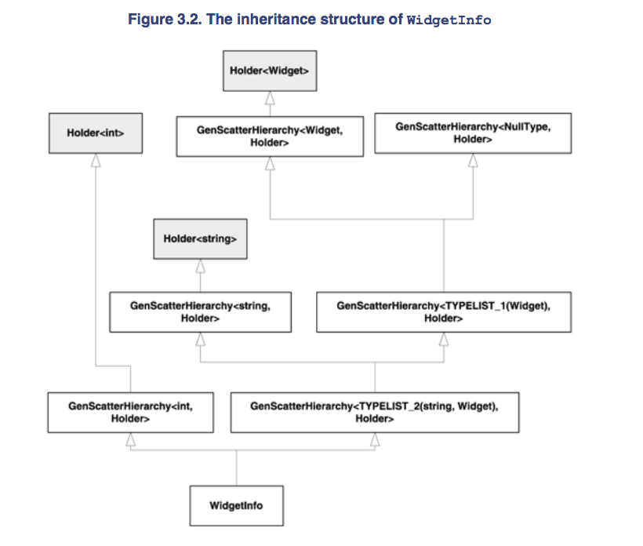
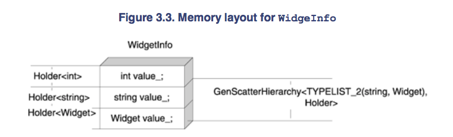
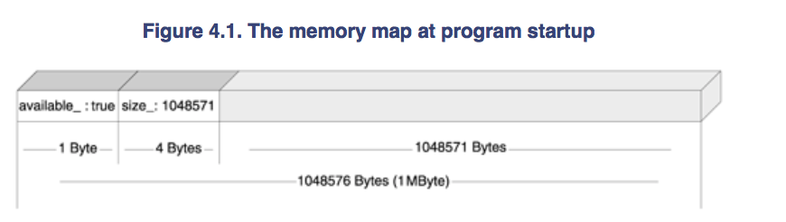
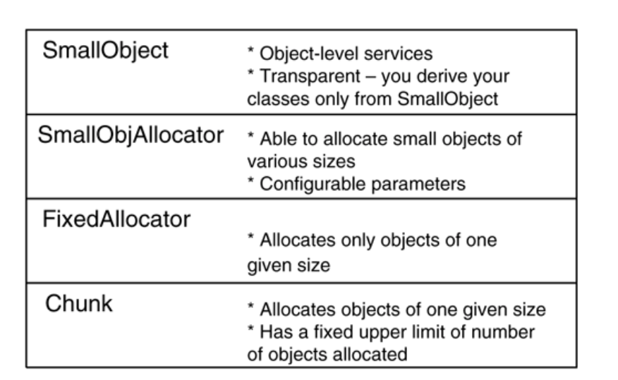

# Chapter 1 Policy-Based Class Design 


+ _motivation_ 
    + idea is to assemble a class with complex behavior out of many little classes (called policies), each of which takes care of only one behavioral or structural aspect 
    + _policy_ 
        + establishes an interface pertaining to a specific issue
+ _multiplicity of software design_ 
    + _idea_ 
        + software can do same thing in different ways
        + design of a software system is a choice of solutions out of a combinatorial solution space 
        + often the choice is a puzzle for beginners and also trouble for library writers
+ _failure of do-it-all interface_ 
    + _do-it-all class_
        + define a single class with a rich interface that implements various behavior
        + _problem_
            + mental overhead, size, inefficiency
            + overly rich interface is a loss of static type safety
                + users may write syntactically valid but semantically invalid code 
    + _do-just-one class_ 
        + write different behavior in distinctive small classes
        + _problem_
            + combination can be difficult to accomodate
            + inflexible, and overwhelms implementers
    + _multiple inheritance?_
        + behavior of parents are inherited, idea is this can help to handle combinatorial explosion of design choices through a small number of cleverly chosen base classes 
        + _problem_
            + _mechanics_ 
                + no boilerplate code to assemble the inherited components in a controlled manner
                + a simple _superposition_ in combining base class and establishes rules for member access
                + in reality, might need careful control over the workings of inherited class to obtain the behavior 
            + _type information_ 
                + base classes do not have enough type information to carry out their tasks 
            + _state manipulation_ 
                + behavior implemented with base classes must manipulate the same state
                + so must use virtual inheriance to inherit a base class that holds the state
                + design is rigid since the premise is user must inherite library class, not vice versa
+ _Benefit of templates_ 
    + _as candidates for combinatorial behaviors_ 
        + _compile-time specification_ 
            + generate code at compile time based on types provided by user
        + _customizable_ 
            + idea is able to specialize any member functions of a class template for a specific instantiation of the class template 
                + i.e. `SmartPtr<T>` can specialize `SmartPtr<Widget>`
            + _partial template specialization_ 
                + ability to specialize a class template for only some of its arguments
                ```cpp
                template<class T, class U> class SmartPtr {};
                template<class U> class SmartPtr<Widget, U> {};
                ```
    + _problems_    
        + _cannot specialize a structure_ 
            + only function but not data member can be specialized
        + _specialization of member function does not scale_ 
            + able to specialize member function of a class template with one template parameter, 
            + cannot specialize invidivual member functions for templates with multiple template paramter
            ```cpp 
            template <class T> class Widget
            {
                void Fun() { .. generic implementation ... }
            };
            // OK: specialization of a member function of Widget 
            template <> Widget<char>::Fun()
            {
                    ... specialized implementation ...
            }
            template <class T, class U> class Gadget
            {
                void Fun() { .. generic implementation ... }
            };
            // Error! Cannot partially specialize a member class of Gadget 
            template <class U> void Gadget<char, U>::Fun()
            {
                    ... specialized implementation ...
            }
            ```
        + _library writer cannot provide multiple default values_ 
            + can provide a single default 
            + but not several defaults 
    + _comparison_  
        + multiple inheritance has 
            + scarse mechanics
            + loss type info
            + can have unbounded number of base classes
        + templates
            + rich mechanics
            + have type info
            + specialization do not scale
+ _policies and policy classes_ 
    + _policy_ 
        + defines a class interface or a class template interface
        + interface consists of 
            + inner type definitions
            + member functions 
            + member variables
        + _properties_ 
            + have common traits, but differ in that they put less emphasis on type and more emphasis on behavior
            + similar to _strategies_ design pattern, with a twist that its compile-time bound
    ```cpp 
    template <class T>
    struct OpNewCreator
    {
        static T* Create()
        {
            return new T;
        } 
    };
    template <class T>
    struct MallocCreator
    {
        static T* Create()
        {
            void* buf = std::malloc(sizeof(T));
            if (!buf) return 0;
            return new(buf) T;
        } 
    };
    template <class T>
    struct PrototypeCreator
    {
        PrototypeCreator(T* pObj = 0)
            :pPrototype_(pObj)
        {}
        T* Create() 
        {
            return pPrototype_ ? pPrototype_->Clone() : 0; 
        }
        T* GetPrototype() { return pPrototype_; }
        void SetPrototype(T* pObj) { pPrototype_ = pObj; } 
    private:
        T* pPrototype_;
    };
    ```
    + _note_ 
        + 3 policy class implementing `Creator` policy, i.e. have a member `Create` function that returns a pointer
    + _compare to interfaces (virtual functions)_
        + _policies_ 
            + loosely defined 
            + syntax oriented
                + does not specify `Create` must be static or virtual, 
                + only requires that class template define a `Create` member function, and _should_ (not _must_) return a pointer to a new object
        + _class interface_ 
            + signature defined
    + _idea_ 
        + can have several policy classes for a given policy
        + must all respect interface as defined by the policy
    ```cpp
    // library code
    template<class CreatorPolicy>
    class WidgetManager: public CreationPolicy
    {
        //...
    };

    // application code 
    typedef WidgetManager<OpNewCreator<Widget>> MyWidgetMgr;
    ```
    + _host class_ 
        + classes that uses one or more policies are called host or host classes 
        + responsible for assembling structures and behavior of their policies in a single unit
    + _idea_ 
        + allows user to configure aspect of class's functionality 
+ _implementing policy classes with template template parameters_ 
    + _observation_ 
        + policy's template parameter is redundant
        + usually host class already knows the template argument to policy class template
        + i.e. 
            + `WidgetManager` always manages type of `Widget` 
            + no need to pass in `OpNewCreator<Widget>`
    ```cpp 
    // library code 
    template<template <class Created> class CreationPolicy>
    class WidgetManager: public CreationPolicy<Widget>
    {
        //...
    };

    // application code 
    typedef WidgetManager<OpNewCreator> MyWidgetMgr;
    ```
    + _template template parameter_ 
        + `Created` does not contribute to definition of `WidgetManager`
        + cannot use `Created` inside `WidgetManager`
        + since its argument to `CreationPolicy` and simply can be omitted
    ```cpp 
    // library code 
    template<template <class> class CreationPolicy>
    class WidgetManager: public CreationPolicy<Widget>
    {
        void DoSomething()
        {
            Gadget* pW = CreationPolicy<Gadget>().Create();
        }
    }
    ```
    + _other conveniences_  
        + able to access `Creator` template for perhaps create objects of another type, i.e. `Gadget`
    + _advantages of policies_ 
        + can change policies from _outside_ easily by changing template argument when instantiating `WidgetManager`
        + able to supply custom policies specific to concret application 
    ```cpp 
    template<template <class> class CreationPolicy = OpNewCreator>
    class WidgetManager ... 
    ```
    + _default template argument_
    + _vs. virtual functions_ 
        + policies come with enriched type knowledge and static binding 
+ _Implementing policy class with template member functions_ 
    ```cpp
    struct OpNewCreator
    {
        template <class T>
        static T* Create() 
        {
            return new T;
        }
    }
    ```
    + _alternative_ 
        + use template member functions in conjunction with simple classes
        + i.e. policy class is a simple class with some templated member functions 
    + _discussion_ 
        + harder to define, implement and use
+ _Enriched policies_ 
    ```cpp
    template <class T>
    struct PrototypeCreator
    {
        PrototypeCreator(T* pObj = 0)
            :pPrototype_(pObj)
        {}
        T* Create() 
        {
            return pPrototype_ ? pPrototype_->Clone() : 0; 
        }
        T* GetPrototype() { return pPrototype_; }
        void SetPrototype(T* pObj) { pPrototype_ = pObj; } 
    private:
        T* pPrototype_;
    };

    // application code 
    typedef WidgetManager<PrototypeCreator> 
        MyWidgetManager;
    
    Widget* pPrototype= ...;
    MyWidgetManager mgr;
    mgr.SetPrototype(pPrototype);
    ```
    + _observation_ 
        + `GetPrototype` and `SetPrototype` are public member thus inherited, 
        + class definition accessible to clients 
        + client can exploit this _enriched interface_
    + _idea_ 
        + customly-defined policy classes may have enriched interface for which the user is able to use
+ _Destructors of Policy Classes_ 
    ```cpp
    typedef WidgetManager<PrototypeCreator>
        MyWidgetManager;
    //...
    MyWidgetManager wm;
    PrototypeCreator<Widget>* pCreator = &wm; // dubious, but legal delete pCreator; // compiles fine, but has undefined behavior
    ```
    + _observation_     
        + usually, host class uses public inheritance to derive from its policies
        + user can automatically convert a _host class_ to a _policy class_ and later `delete` the pointer
            + introduces undefined behavior if `policy` does not supply virtual destructor 
    + _argument against virtual destructor_ 
        + works against its static nature 
        + hurts performance 
            + first virtual function added incurs some size overhead for objects of the class
    ```cpp
    template<class T>
    struct OpNewCreator
    {
        static T* Create() 
        {
            return new T;
        }
    protected:
        ~OpNewOperator(){}
    }
    ```
    + _solution: use non-virtual protected destructor_ 
        + have host class use protected or private inheritance when deriving from policy class
        + only derived class can destroy it, 
        + calling `delete` to a policy class pointer raises compiler error
        + destructor, not virtual, so no size/speed overhead
+ _Optional Functionality through Incomplete Instantiation_ 
    + _idea_    
        + member function of a class template, if never used, is not instantiated
    ```cpp 
    // Library code
    template<template <class> class CreationPolicy>
    class WidgetManager: public CreationPolicy<Widget>{
        void SwitchPrototype(Widget* pNewPrototype)
        {
            CreeationPolicy<Widget>& myPolicy = *this;
            delete myPolicy.GetPrototype();
            myPolicy.setPrototype(pNewPrototype);
        }
    }
    ```
    + _note_ 
        + if `WidgetManager` instantiated with a creator policy class that supports prototypes, allowed to ues `SwitchPrototype`
        + if instantiated with a creator policy class that does not support prototype and try to use `SwitchPrototype`, gets compile-time error 
        + if instantiated with a creator policy class that does not support prototype and do not use `SwitchPrototype`, program valid
    + _idea_ 
        + `WidgetManager` benefit from richer interface, but still works correctly with poorer interface
        + incomplete instantiation brings freedom as library designer, able to implement lean host class able to use additional features and degrade graciously
+ _Combining Policy Classes_ 
    + _idea_ 
        + highly configurable class uses several policies for various aspects of its workings 
        + library user selects desired behavior by combining several policy classes
    ```cpp 
    template<
        class T,
        template <class> class CheckingPolicy,
        template <class> class ThreadingModel
    >
    class SmartPtr 
        : public CheckingPolicy<T>
        , public ThreadingModel<SmartPtr>
    {
        T* operator->()
        {
            typename ThreadingModel<SmartPtr>::Lock guard(*this);
            CheckingPolicy<T>::check(pointee_);
            return pointee_;
        }
    private:
        T* pointee_;
    }

    typedef SmartPtr<Widget, NoChecking, SingleThreaded>
        WidgetPtr;
    typedef SmartPtr<Widget, EnforceNotNull, SingleThreaded>
        SafeWidgetPtr;
    ```
    + _note_ 
        + policies
            + threading model 
            + checking before dereferencing 
        + able to specify several smart pointer classes
    + _design overview_ 
        + `CheckingPolicy<T>` must expose a `Check` member function, callable with lvalue of type `T* SmartPtr`, passing it the pointee object before dereferencing
        + `ThreadingModel<T>` must expose an inner time called `Lock`, whose constructor accepts `T&`, such that for the lifetime of `Lock` object, operation on `T` are serialized
    ```cpp 
    template <class T>
    struct NoChecking 
    {
        static void Check(T*) {}
    };
    template <class T> 
    struct EnforceNotNull
    {
        class NullPointerException:public std::exception {...};
        static void Check(T* ptr)
        {
            if(!ptr) throw NullPointerException();
        }
    };
    template<class T>
    struct EnsureNotNull
    {
        static void Check(T*& ptr)
        {
            if(!ptr) ptr = GetDefaultValue();
        }
    }
    ```
+ _Customizing structure with policy classes_ 
    + _policy based design supports structural customization_
    + `SmartPtr` example
        + want to support nonpointer representation of `SmartPtr`
            + perhaps integral value into some table which contains the real pointer 
        + solution
            + use indirect pointer access through a policy, _structure_ policy
            + abstracts pointer storage
            + exposes types called `PointerType` and `ReferenceType` and functions such as `GetPointer` and `SetPointer`
    ```cpp 
    template<class T>
    class DefaultSmartPtrStorage
    {
        public: 
            typedef T* PointerType;
            typedef T& ReferenceType;
        protected:
            PointerType GetPointer() { return ptr_; }
            void SetPointer(PointerType ptr) { ptr_ = ptr; }
        private:
            PointerType ptr_;
    };

    template<
        class T,
        template<class> class CheckingPolicy,
        template<class> class ThreadingModel,
        template<class> class storage = DefaultSmartPtrStorage
    >
    class SmartPtr;
    ```
    + _note_ 
        + actual storage is hidden behind `structure`'s interface
+ _Compatible and Incompatible Policies_ 
     + _idea_ 
        + how to handle conversion between different instantiation of template class with varying policies
    + _example_ 
        + `FastWidgetPtr` and `SafeWidgetPtr`
        + should be able to convert `FastWidgetPtr` to `SafeWidgetPtr` 
            + since `SafeWidgetPtr` is more restrictive
        + conversion of the other way round would be dangerous...
    + _solution_ 
        + implement conversions between policies by initialize and copy `SmartPtr` objects _policy by policy_
    ```cpp 
    template<
        class T, 
        template <class> class CheckPolicy
    >
    class SmartPtr: public CheckingPolicy<T>
    {
        template<
            class T1
            template <class> class CP1,
        >
        SmartPtr<const SmartPtr<T1, CP1>& other>
            : pointee_(other.pointee_), 
                CheckingPolicy<T>(other)
        { ... }
    };
    ```
    + _note_    
        + `SmartPtr` implements _copy constructor_
    + _inner-workings_ 
        + suppose `ExtendedWidget : Widget`
        + want to initialize `SmartPtr<Widget, NoChecking>` with `SmartPtr<ExtendedWidget, NoChecking>`
            + for `pointee_`, `Widget *` initialized with `ExtendedWidget *`
            + try to initialize `NoChecking` with a `SmartPtr<ExtendedWidget, NoChecking>`
                + this is reasonable, since `SmartPtr` is derived from `NoChecking`
        + want to initilize `SmartPtr<Widget, EnforceNotNull>` with `SmartPtr<ExtendedWidget, NoChecking>`
            + `ExtendedWidget*` to `Widget*` conversion works OK
            + compiler tryto match `SmartPtr<ExtendedWIdget, NoChecking>` to `EnforceNotNull` constructors
                + if implements ctor that accepts `NoChecking` object, then compiler matches ctor
                + if `NoChecking` implements a conversion operator to `EnforceNotNull`, then conversion invoked, 
                + otherwie code fails 
    + _comments_ 
        + conversion that changes ownership policy should not be allowed implicitly
+ _Decomposing a class into policies_ 
    + _design rule of thumb_ 
        + identify and name design decisions taking part in class's behavior
        + anything can be done more than one way should be identified and migrated from the class to a policy
    + _goal_ 
        + host class delepted of intrinsic policy, delegates design decision and constraints to policies
        + host class is a shell over a collection of policies and deals only with assembling policies into a coherent behavior
    + _disadvantage_
        + abundance of template parameters is hard to work with
        + use `typdef`s to remedy this, always use `typedef`-ed instead of hardcoded instantiation
    + _Example `WidgetManager`_
        + if manager creates new `Widget` internally, creation should be deferred to a policy
        + if manager stores a collection of `Widget`, make sense to make that collection a storage policy
    + _look for orthogonal decomposition_
        + i.e. policies completely independent of each other
        + example
    ```cpp 
    template <class T>
    struct IsArray 
    {
        T& ElementAt(T* ptr, unsigned int index)
        {
            return ptr[index];
        }
        const T& ElementAt(T* ptr, unsigned int index) const 
        {
            return ptr[index];
        }
    };
    template <class T> struct isNotArray {};
    ```
    + _counter-example_ 
        + interact unfavorably with _Destruction_ policy
        + since `delete` and `delete[]` are different 
        + so _Array_ and _Destruction_ are not orthogonal   
    + _take-away_ 
        + non-orthogonal policies are imperfectinos and should strive to avoid
        + resolve non-orthogonal policies, by minimizing dependencies by passing a policy class as an template argument to policy class's template function
+ _summary_ 
    + _library_
        + exposes _specification_, from which _policies_ are built
        + _policies classes_ are implementations of _policies_
    + _policies_ 
        + _mechanics_ 
            + a combination of templates with multiple inheritance
        + _host class_ 
            + templates with template parameters, as policies
            + indirects part of its functionality through its policies
            + act as receptable that combines several policies in an aggregate 
        + _support_ 
            + _enriched behaivor_
            + _graceful degradation of functionality_
    + _power_
        + ability to mix and match policies, i.e. combine simple behaviors that its policies implement 
        + able to customize behavior, and also its structure


# Chapter 2 Techniques


+ _compile-time assertion_
    ```cpp 
    template<class To, class From>
    To safe_reinterpret_case(From from)
    {
        assert(sizeof(From) <= sizeof(To));
        return reinterpret_cast<To>(from);
    }

    int i = 9;
    char *p = safe_reinterpret_cast<char *>(i);
    ```
    + _note_ 
        + a function for safe casting, i.e. cannot cast smaller type to larger type
        + runtime `assert` for incorrect cast 
    + _idea_ 
        + desirable to detect such error during compilation
    ```cpp 
    #define STATIC_CHECK(expr) { char unnamed[(expr) ? 1 : 0]; }
    ```
    + _note_ 
        + impl of static assert
        + compiler complains when trying to create array of size 0
        + _problem_ 
            + error message not informative
    ```cpp 
    template<bool> struct CompileTimeError;
    template<> struct CompileTimeError<true> {};

    #define STATIC_CHECK(expr) \    
        (CompileTimeError<(error) != 0>())
    ```
    + _note_ 
        + `CompileTimeError` 
            + a template taking a nontype parameter (`bool`) 
            + defined only for `true` value of boolean constant 
            + instantiating `CompileTimeError<false>` gives _undefined specialization_, a better hint
    ```cpp 
    template<bool> struct CompileTimeChecker 
    {
        CompileTimeChecker{};
    }
    template<> struct CompileTimeChecker<true> {};
    #define STATIC_CHECK(expr, msg) \
        { \
            class ERROR_##msg {}; \
            (void)sizeof(CompileTimeChecker<(expr) != 0> \
                ((ERROR_##msg()))); \
        }
    
    STATIC_CHECK(sizeof(From) <= sizeof(To), 
        Destination_Type_Too_Narrow);
    // unpack macro 
    {
        class ERROR_Destination_Type_Too_Narrow {};
        (void) sizeof(
            CompileTimeChecker<(sizeof(From) <= sizeof(To))>(
                ERROR_Destination_Type_Too_Narrow()
            )
        );
    }
    ```
    + _note_ 
        + macro defines a _local class_ `ERROR_Destination_Type_Too_Narrow` with empty body
        + creates temp value of type `CompileTimeChecker`, initialized with `ERROR_Destination_Type_Too_Narrow`
        + `sizeof` gauges size of resulting temporary variable
    + _trick_ 
        + `template<> struct CompileTimeChecker<true> {};`
            + specialization has a constructor that accepts anything
        + if compile-time expression evaluates to `true`, program valid 
        + if comparison between sizes evaluates to `false`, compile-time error errors 
            + cannot find conversion from `ERROR_Destination_Type_Too_Narro` to `CompileTimeChecker<false>`
            + gives erorr message of `ERROR_Destination_Type_Too_Narrow` to `CompileTimeChecker<false>`
+ _Partial template specialization_ 
    + _partial template specialization_ 
        + allows to specialize a class template for subsets of that template's possiblie instantiation sets 
        + specify some of template arguments and leaves other ones generic
        + compiler does _pattern matching_ of existing partial and total specialization to find the best candidate
    ```cpp 
    template<class Window, class Controller>
    class Widget{ /* generic impl */};

    template<>
    class Widget<ModalDialog, MyController>{/* specialized impl */};
    ```
    + _Full template specialization_ 
        + compiler uses specialized implementation whenever define an object of type `Widget<ModalDialog, MyController>` 
    ```cpp 
    template<class Window>
    class Widget<Window, MyController>
    {
        // partially specialized impl
    }

    template<class ButtonArg> 
    class Widget<Button<ButtonArg>, MyController>
    {
        // further specialized impl
    }
    ```
    + _partial template specialization_ 
        + specialize `Widget` for any `Window` and `MyController`
        + further specialize `Widget` for all `Button` instantiation and `MyController`
    + _partial template specialization does not apply to functions_ 
        + can _totally specialize_ member function of class template, cannot _partially specialize_ member functions
        + cannot _partially specialize_ nonmember template function
            + use _overloading_ in this scenario
        ```cpp 
        template<class T, class U> T Fun(U obj);    // primary template
        template<class U> void Fun<void, U>(U obj); // illegal partial specialization
        template<class T> T Fun(Window obj)         // legal, overloading
        ```
+ _Local classes_ 
    ```cpp 
    void Fun()
    {
        class Local
        {
            // member
        };
    }
    ```
    + _local classes_ 
        + cannot define static member variables
        + cannot access nonstatic local variables
        + _use in template functions_ 
            + local classes defined inside template functions can use template parameters of the enclosing functions 
    ```cpp 
    class Interface 
    {
        public:
            virtual void Fun() = 0;
    };

    template<class T, class P>
    Interface* MakeAdaptor(const T& obj, const P& arg)
    {
        class Local : public Interface
        {
            public:
                Local(const T& obj, const T& arg)
                    :obj_(obj), arg_(arg) {}
                virtual void Fun()
                {
                    obj_.Call(arg_);
                }
            private:
                T obj_;
                P arg_;
        };
        return new Local(obj, arg);
    }
    ```
    + _note_ 
        + `Local` stores members of generic type
        + `MakeAdaptor` implements an interface on the fly with help of a local class
    + _feature_     
        + simplify implementation, improves locality of symbols
        + _final_, i.e. users cannot derive from a class hidden in a funcion
+ _Mapping Integral Constants to Types_ 
    ```cpp 
    template<int v>
    struct Int2Type
    {
        enum { value = v };
    };
    ```
    + `Int2Type`
        + generates a distinct type for each distinct integral value passed 
            + since different template instantiation are different types
            + `Int2Type<0>` is different from `Int2Type<1>`
        + used to _typify_ constant quickly
            + to allow for static dispath on a constant integral value 
        + then pass a temporary variable of the type (from a value) to an overloaded function for compile time dispatch
            + works since compiler does not compile template function that is never used 
    + _usage_ 
        + use `Int2Type` when both condition satisfied
            + need to call one of several functions, depending on a compile-time constant
            + need to dispatch at compile time
    + _runtime function dispatch_
        + use `if-else`, or `switch`
        + but might not be able to do this... since requires both branch be compiled successfully 
    ```cpp 
    template <class T> 
    class NiftyContainer
    {
        void DoSomething()
        {
            T* pSomeObj = ...;
            if(isPolymorphic)
            {
                T* pNewObj = pSomeObj->Clone();
                // handle polymorphic
            } else {
                T* pNewObj = new T(*pSomeObj);
                // handle non-polymorphic
            }
        }
    };
    ```
    + _note_ 
        + _goal_    
            + to duplicate object, need to call either _copy ctor_ (for nonpolymorphic types) or a `Clone()` virtual function (for polymorphic types)
        + _problem_ 
            + compiler error since it tries to compile both branch, when it knows clearly which one is used.
            + `NiftyContainer::DoSomething` does not complie for any type that doesnt define a member function `Clone()`
            + nonpolymorphic types might also not compile if `T` disables copy ctor so that `new T(*pObj)` fails
            + calling `NiftyContainer<int, false>()->DoSomething()` the compiler stops at `pObj->Clone()` even though its not going to be executed
    ```cpp 
    template<typename T, bool isPolymorphic>
    class NiftyContainer
    {
    private:
        void DoSomething(T* pObj, Int2Type<true>)
        {
            T* pNewObj = pObj->Clone();
            // ..
        }
        void DoSomething(T* pObj, Int2Type<false>)
        {
            T* pNewObj = new T(*pObj);
            // ..
        }
    public:
        void DoSomething(T* pObj)
        {
            DoSomething(pObj, Int2Type<isPolymorphic>());
        }
    };
    ```
    + _solution_ 
        + transform ad hoc boolean `isPolymorphic` into 2 distinct types corresponding to `true` and `false`, then use `Int2Type<isPolymorphic>` with simple overload
+ _Type-to-Type Mapping_ 


+ _Type Selection_ 
    ```cpp 
    template<typename T, bool isPolymorphic>
    struct NiftyContainerValueTraits
    {
        typedef T* ValueType;
    };
    template<typename T>
    struct NiftyContainerValueTraits<T, false>
    {
        typedef T ValueType;
    }

    template<typename T, bool isPolymorphic>
    class NiftyContainer
    {
        typedef NiftyContainerValueTraits<T, isPolymorphic>
            Traits;
        typedef typename Traits::ValueType ValueType;
    }
    ```
    + _note_
        + _idea_ 
            + store nonpolymorphic types as values 
            + store polymorphic types as pointers
        + _use trait class templates_ 
            + clumsy, 
            + does not scale, have to define new traits class templates
    ```cpp 
    template<bool flag, typename T, typename U>
    struct Select 
    {
        typedef T Result;
    };
    template<typename T, typename U>
    struct Select<false, T, U>
    {
        typedef U Result;
    };

    template<typename T, bool isPolymorphic>
    class NiftyContainer
    {
        typedef typename Select<isPolymorphic, T*, T>::Result
            ValueType;
    };
    ```
    + _do type selection on the spot with `Select`_
        + if `flag` evaluates to `true`, uses the first definition
        + if `flag` evaluates to `false`, specialization enters into action, so `Result` evaluates to `U`
    + _C++11_ 
        + `std::conditional<bool B, class T, class F>` does the exact same thing...
+ _Detecting Convertibility and Inheritance at Compile Time_ 
    + _goal_ 
        + determine if `U` inherits from `T`
    + _tools_ 
        + `sizeof`
            + accept any expression, 
            + is aware of overloading, template instantiation, conversion rules
        + idea is to use `sizeof` with overloaded functions 
            + 1 function accepts the type `T` that is convertible to `U`
            + a fallback function accepts just about everything else 
                + implies `T` not convertible to `U`
                + cant be template function, since it hides conversion of non-template function
                + use _ellipsis match_, which is at bottom of conversion rules
        + determine which function gets called
            + let overloads return type of different sizes 
            + discriminate with `sizeof`
    ```cpp 
    typedef char Small;             // sizeof(Small) is 1
    class Big { char dummy[2]; };   // sizeof(Big) is > 1

    // 2 overloads 
    Small Test(U);
    Big Test(...);
    const bool convExists = sizeof(Test(T())) == sizeof(Small);
    ```
    + _note_ 
        + default construction of `T`, 
        + `sizeof` extract size of result of expression
        + compare to `Small` which represent the _convertible-to_ type 
    ```cpp 
    template<class T, class U>
    class Conversion
    {
        typedef char Small;
        class Big { char dummy[2]; };
        static Small Test(U);
        static Big Test(...);
        static T MakeT();

    public:
        enum {
            exists = sizeof(Test(MakeT())) == sizeof(Small),
            sameType = false
        };
    }

    template<class T>
    class Conversion<T, T>          // partial specialization
    {
    public:
        enum { exists = 1, sameType = 1};
    }

    int main()
    {
        cout << 
            Conversion<double, int>::exists << " "              // 1
            Conversion<char, char*>::exists << " "              // 0
            Conversion<size_t, vector<int>>::exists << " ";     // 1
    }
    ```
    + _note_ 
        + although there is `vector::vector(size_t)`, not convertible since constructor is `explicit`
        + also determines if 2 types are equivalent with `::sameType`
    ```cpp 
    #define SUPERSUBCLASS(T, U) \
        (Conversion<const U*, const T*>::exists && \
        !Conversion<const T*, const void*>::sameType)
    ```
    + _determines inheritance relationship_ 
        + `true` if `U` inherits from `T` publicly, or if `T` and `U` are actually same type 
        + convertibility of `const U*` to `const T*`
            + `T` and `U` are same type
            + `T` is an unambiguous public base of `U`
            + `T` is `void`, eliminated in second test 
    ```cpp 
    #define SUPERSUBCLASS_STRICT(T, U) \
        (SUPERSUBCLASS(T, U) && \
        !Conversion<const T, const U>::sameType)
    ```
    + _true of and only if `T` is public base of `U`_ 
        + evaluates to `false` if they are same type
    + _why add `const`_ 
        + dont want test to fail due to `const` issues 
        + `const const` is reduced to `const`
+ _Wrapper around `type_info`_ 
    ```cpp 
    void Fun(Base *pObj)
    {
        // compare 2 type_info objects corresponding to 
        // type of *pObj and Derived
        if(typeid(*pObj) == typeid(Derived))
        {
            // pObj points to a Derived object
        }
    }
    ```
    + `type_info`
        + display object type at runtime
        + `type_id` returns reference to `type_info` object 
        + supports 
            + `operator==` and `operator!=`
            + `const char* name()` returns textual representation of type 
            + `::before()` introduce ordering relation 
        + _dispables copy ctor and assignment operator_
            + cant store them
            + but can store `type_info*`, note `type_info` are statically allocated
        + _cannot compare `type_info*`_
            + since no guarantee on if `typeid(T)` return a reference to the same `type_info` object
        + _can compare with `type_info::operator==`_
    ```cpp 
    class TypeInfo 
    {
    public:
        TypeInfo();
        TypeInfo(const std::type_info&);        // conversion from type_info
        TypeInfo(const TypeInfo&);              // copy ctor
        TypeInfo& operator=(const TypeInfo&);   // copy assignment
        // compatibility functions 
        bool before(const TypeInfo&) const;
        const char* name() const;

    private:
        const std::type_info* pInfo_;
    };

    // comparison operator 
    bool operator==(const TypeInfo&, const TypeInfo&); 
    bool operator!=(const TypeInfo&, const TypeInfo&); 
    bool operator<(const TypeInfo&, const TypeInfo&); 
    bool operator<=(const TypeInfo&, const TypeInfo&); 
    bool operator>(const TypeInfo&, const TypeInfo&); 
    bool operator>=(const TypeInfo&, const TypeInfo&);
    ```
    + _wrapper around `type_info`_
        + stores pointer to `type_info` object
        + provides
            + all member functions of `type_info`
            + value semantics (public copy ctor and assignment operator)
            + seamless comparison with `operator<` and `operator==`
    ```cpp 
    void Fun(Base* pObj)
    {
        TypeInfo info = typeid(Derived);
        if(typeid(*pObj) == info)
        {
            // pBase ponits to a derived object
        }
    }
    ```
    + _note_ 
        + conversion ctor accpets `type_info`, able to directly compare objects of `TypeInfo` and `type_info`
+ `NullType` and `EmptyType`
    ```cpp 
    class NullType {};
    struct EmptyType {};
    ```
    + `NullType` 
        + serves as a null marker for types
        + indicate not interested in type, 
        + used for syntactically with no semantic sense 
    + `EmptyType`
        + a legal type to inherit from 
        + can pass around values of type `EmptyType`
        + used for default types for a template 
+ _Type traits_ 
    + _traits_ 
        + generic programming technique
        + allows compile-time decisions to be made based on types, as much as you would like runtime decision based on values
        + allows type-related decisions made outside immediate context in which thy are made 
    ```cpp 
    template <typename InIt, typename OutIt>
    OutIt Copy(InIt first, InIt last, OutIt result)
    {
        for (; first != last; ++first, ++result)
            *result = *first;
    }

    // Prototype of BitBlast in "SIMD_Primitives.h"
    void BitBlast(const void* src, void* dest, size_t bytes);
    ```
    + _motivation_ 
        + `BitBlast` 
            + want to implement copy algorithm for a special case     
            + fast copy algorithm
            + only works for priitive types and PODs, not on types with nontrivial copy ctor
        + _goal_ 
            + use `BitBlast` whenever possible,
            + fallback to `Copy` for elaborate types
        + _requirements_ 
            + test `InIt` and `OutIt` regular pointers
            + test if type `InIt` and `OutIt` point copyable with bitwise copy
            + these tests can be tested during compile time
    + _Implementing pointer traits_ 
        + _impl_
            + relies on total + partial template specialization 
        ```cpp
        template<typename T>
        class TypeTraits
        {
        private:
            template<class U> 
            struct PointerTraits
            {
                enum {result = false};
                typedef NullType PointeeType;
            };

            template<class U>       
            struct PointerTraits<U*>            // specialization
            {
                enum {result=true};
                typedef U PointeeType;
            };
        public:
            enum { isPointer = PointerTraits<T>::result };
            typedef PointerTraits<T>::PointeeType PointeeType;
        };
        ```
        ```cpp 
        // see if iterator is a pointer or not
        const bool
            iterIsPtr = TypeTraits<vector<int>::iterator>::isPointer;   
        ```
        + _note_ 
            + `struct PointerTraits<U*>`
                + specialization that matches any pointer type 
                + qualifies as a better match for pointer types than generic templates
                + so specialization enters into action for a pointer
        ```cpp 
        template<typename T>
        class TypeTraits
        {
        private:
            template<class U>
            struct PtoMTraits
            {
                enum { result = false };
            };

            template<class U, class V>
            struct PtoMTraits<U V::*>
            {
                enum { result = true };
            };
        public:
            enum { isMemberPointer = PtoMTraits<T>::result };
        };
        ```
        + _detect pointers to members_
    + _Detection of fundamental type_ 
        + _fundamental type_ 
            + `void`
            + numeric types
    + _Optimized parameter types_ 
        + _goal_ 
            + given `T`, what is most efficient way of passing and accepting objects of type `T` as argument to functions
            + generally
                + elaborate types by reference
                + scalar types (`enum`, pointers, fundamental types) by value
            + also have reference to reference not allowed
        + _discussion_ 
            + given `T` return `ParameterType`
                + if `T` is reference to some type, 
                    + `ParameterType` is `T`, since cant add ref to ref
                + otherwise 
                    + `ParameterType` is `const T&`
                    + since nonprimitive types are best pass by reference
        ```cpp 
        template<typename T>
        class TypeTraits 
        {
        public:
            typedef Select<isStdArith || isPointer || isMemberPointer, 
                T, ReferencedType& >::result
                ParameterType;
        }
        ```
    + _stripping qualifiers_ 
        ```cpp 
        template<typename T>
        TypeTriats
        {
        private:
            template<class U>
            struct UnConst
            {
                typedef U Result;
            }
            tempalte<class U> 
            struct UnConst<const U>
            {
                typedef U Result;
            }
        public:
            typedef UnConst<T>::Result NonConstType;
        }
        ```
        + _note_
            + partial specialization takes precedence
    + _Using `TypeTraits`_
        ```cpp 
        enum CopyAlgoSelector { Conservative, Fast };

        // conservative routine for any type 
        template<typename InIt, typename OutIt>
        OutIt CopyImpl(InIt first, InIt last, OutIt result, Int2Type<Conservative>)
        {
            for (; first != last; ++first, ++result)
                *result = *first;
            return result;
        }

        // fast routine only for pointers to raw data 
        template<typename InIt, typename OutIt>
        OutIt CopyImpl(InIt first, InIt last, OutIt result, Int2Type<Fast>)
        {
            const size_t n = last - first;
            BitBlast(first, result, n *sizeof(*first));
            return result + n;
        }

        template<typename InIt, typename OutIt>
        OutIt Copy(InIt first, InIt last, OutIt result)
        {
            typedef TypeTraits<InIt>::PointeeType SrcPointee;
            typedef TypeTraits<OutIt>::PointeeType DestPointee;
            enum {
                copyAlgo = 
                    TypeTraits<InIt>::isPointer && 
                    TypeTraits<OutIt>::isPointer && 
                    TypeTraits<SrcPointee>::isStdFundamental && 
                    TypeTraits<DestPointee>::isStdFundamental && 
                    sizeof(SrcPointee) == sizeof(DestPointee) ? Fast : Conservative
            };
            return CopyImpl(firts, last, result, Int2Type<copyAlso>);
        }
        ```
        + _note_ 
            + `enum copyAlgo` selects one implementation or another
                + use `fast` algo if 2 iterators are pointers and if pointed-to types are fundamental and if pointed-to types are of same size 
            + _problem_ 
                + use slow copy for POD types, even if bitwise copy is allowed

--- 

# Chapter 3

+ _Typelist_ 
    + a collection of types 
    + provide operation that a list of values support 
+ _Need_ 
    + _abstract factory_
        ```cpp 
        class WidgetFactory
        {
        public:
            virtual Window* CreateWindow() = 0;
            virtual Button* CreateButton() = 0;
            virtual ScrollBar* CreateScrollBar() = 0;
        };

        template <class T>
        T* MakeRedWidget(WidgetFactory& factory)
        {
            T* pW = factory.CreateT();
            pW->setColor(RED);
            return pW; 
        }
        ```
        + _limiting_ 
            + use cant create factories of arbitrary collections of types  
            + i.e. `factory.CreateT()`?
    + _goal_ 
        ```cpp 
        typedef AbstractFactory<Window, Button, ScrollBar> WidgetFactory;
        
        template<class T>
        T* MakeRedWidget(WidgetFactory& factory)
        {
            T* pW = factory.Create<T>();     
            pW->setColor(RED);
            return pW; 
        }
        ```
    + _problem_ 
        + template instantiation cannot accept arbitrary number of arguments
        + `Create<xxx>()` is not legal becaues virtual functions cannot be templates
+ _Defining Typelists_ 
    ```cpp
    template<class T, class U>
    struct Typelist
    {
        typedef T Head;
        typedef U Tail;
    };

    namespace TL
    {
        // typelist impl
    }
    ```
    + `Typelist`
        + a list that holds 2 types 
        + _how to get typelist with more than 2 types?_
            + use nested `Typelist` 
            + `typedef Typelist<char, Typelist<signed char, unsigned char>> CharList;`
            + `typedef Typelist<char, Typelist<signed char, Typelist<unsigned char, NullType>>> AllCharTypes;`
        + _how to get typelist with zero or one types?_ 
            + `typedef Typelist<int, NullType> OneTypeOnly;`
            + convention of _null type list_ is to have a terminating `NullType` for all `typelist`
        + does not carry value, it carries type only at runtime
            + implies necessary operation must occur at compile time
            + `typelist` not meant to be instantiated
+ _Linearizing typelist creation_ 
    ```cpp 
    #define TYPELIST_1(T1) Typelist<T1, NullType>
    #define TYPELIST_2(T1, T2) Typelist<T1, TYPELIST_1(T2) >
    #define TYPELIST_3(T1, T2, T3) Typelist<T1, TYPELIST_2(T2, T3) > #define TYPELIST_4(T1, T2, T3, T4) \
    Typelist<T1, TYPELIST_3(T2, T3, T4) >
    ...
    #define TYPELIST_50(...) ...

    // using macro 
    typedef TYPELIST_4(signed char, short int, int, long int)
       SignedIntegrals;
    ```
+ _Calculating Length_ 
    + _goal_ 
        + get a compile time constant that evaluates length 
        + idea is to exploit recursive templates, which are templates that use instantiations of themselves as part of its definition 
    ```cpp 
    template<class TList> struct Length;
    template<>                      // total template specialization, match NullType
    struct Length<NullType>         // length of null type is 0
    {
        enum { value = 0 };     
    };

    template<class T, class U>      // partial template specialization, match any Typelist<T, U>
    struct Length<Typelist<T, U>>   // length of any other typelist is 1 + length of tail
    {
        enum { value = 1 + Length<U>::value };
    };

    std::type_info* intsRtti[Length<SignedIntegrals>::value];
    ```
    + _note_ 
        + `intsRtti` allocated array of length 4 at compile time
+ _Intermezzo_ 
    + _Can we develop iterative version of `Length`?_ 
        + No
            + iteration is about holding an iterator and change it until some condition is met
            + but no mutable entities in compile-time world, cannot do iteration 
            + so compile-time computation must rely on pure functional language, where there is no mutable values
        + _template specialization_ 
            + provides equivalent of `if` at compile time 
        + _integer calculation_ 
            + true computations at compile time
            + generates immutable types
        + _type definition with `typedef`_
            + introduce named type constants 
            + cannot change `typedef` after definition
+ _Indexed access_ 
    ```cpp 
    template <class Head, class Tail>
    struct TypeAt<TypeList<Head, Tail>, 0>
    {
        typedef Head Result;
    };

    template<class Head, class Tail, unsigned int i>
    struct TypeAt<Typelist<Head, Tail>, i>
    {
        typedef typename TypeAt<Tail, i - 1>::Result Result;
    }
    ```
    + `template <class TList, unsigned int index> struct TypeAt;`
        + returns a `TypeAt::result` which is a type in `TList`
        + if `TList` non-null and `i` is zero, `Result` is head of `TList`
        + else 
            + if `TList` is non-null and `i` is nonzero, then `Result` is obtained by applying `TypeAt` to the tail of `TList` and `i-1`
            + else out of bound access translates to compile time error 
                + in this case compiler warn no specialization for `TypeAt<NullType, x>` 
+ _Searching Typelists_ 
    ```cpp
    template<class TList, class T>
    struct IndexOf;

    template<class T>
    struct IndexOf<NullType, T>
    {
        enum { value = -1 };
    };

    template<class T, class Tail>
    struct IndexOf<Typelist<T, Tail>, T>
    {
        enum { value = 0 };
    };

    template<class Head, class Tail, class T>
    struct IndexOf<Typelist<Head, Tail>, T>
    {
    private:
        enum { temp = IndexOf<Tail, T>::value };
    public:
        enum { value = temp == -1 ? -1 : 1 + temp };
    };
    ```
    + `IndexOf`
        + returns a `IndexOf::result`
        + if `TList` is `NullType`, value is `-1`
        + else 
            + if head of `TList` is `T`, the value is `0`
            + else 
                + compute result of `IndexOf` applied to `TList`'s tail and `T` into a temporary value `temp`
                    + if `temp` is `-1` then `value` is `-1`
                    + else `value` is `1` plus `temp`
+ _Appending typelist_ 
    ```cpp 
    template<class TList, class T> struct Append;

    template<> 
    struct Append<NullType, NullType>
    {
        typedef NullType Result;
    };

    template<class T> 
    struct Append<NullType, T>
    {
        typedef TYPELIST_1(T) Result;
    };

    template<class Head, class Tail>
    stuct Append<NullType, Typelist<Head, Tail>>
    {
        typedef Typelist<Head, Tail> Result;
    };

    template<class Head, class Tail, class T>
    struct Append<Typelist<Head, Tail>, T>
    {
        typedef Typelist<Head,
            typename Append<Tail, T>::Result>
            Result;
    };

    // usage 
    typedef Append<SignedIntegrals, 
        TYPELIST_3(float, double, long double)>::Result
        SignedTypes;
    ```
    + `Append`
        + have to return by a new typelist that contains the result
        + if `TList` is `NullType`, then `Result` is `NullType`
        + else 
            + if `TList` is `NullType` and `T` is a single (none-typelist) type, then `Result` is a `typelist` having `T` as its only argument
            + else 
                + if `TList` is `NullType` and `T` is typelist, then result is `T` itself
                + else if `TList` is non-null, `Result` is a typelist having `TList::Head` as its hard and result of appending `T` to `TList::Tail` as its tail
+ _Erasing a type from Typelist_ 
+ _Erasing duplicates_ 
+ _Replace_ `
+ _partial ordering_        
    + based on inheritance, derived type before base type
+ _class generation with typelist_ 
    + _generating scatter hierarchies_ 
        + we can build classes by applying each type in a typelit to a basic templates 
    ```cpp 
    template<class TList, template<class> class Unit>
    class GenScatterHierarchy;

    // GenScatterHierarchy specialization: Typelist to Unit
    template<class T1, class T2, template<class> class Unit>
    class GenScatterHierarchy<Typelist<T1, T2>, Unit>
        : public GenScatterHierarchy<T1, Unit>
        , public GenScatterHierarchy<T2, Unit>
    {
    public:
        typedef Typelist<T1, T2> TList;
        typedef GenScatterHierarchy<T1, Unit> LeftBase;
        typedef GenScatterHierarchy<T2, Unit> RightBase;
    };

    // pass an atomic type (non-typelist) to Unit
    template<class AtomicType, template <class> class Unit>
    class GenScatterHierarchy : public Unit<AtomicType>
    {
        typedef Unit<AtomicType> LeftBase;
    };

    // do nothing for NullType
    template<template <class> class Unit>
    class GenScatterHierarchy<NullType, Unit> {};

    // instantiation 
    template <class T>
    struct Holder
    {
        T value_;
    }

    typedef GenScatterHierarchy<
        TYPELIST_3(int, string, Widget),
        Holder>
        WidgetInfo;
    ```
    + `GenScatterHierarchy`
        + instantiation of `GenScatterHierarchy` end up inheriting `Unit` instantiated with every tyep in the typelist
    + 
        + idea is to generate a class hierarchy by repeatedly instantiating a class temmplate provide as a model 
        + then collects all such generatd classes in a single leaf class `WidgetInfo`
            + `Holder<int>`, `Holder<string>`, `Holder<Widget>`
            + all holds `::value_` for each type in typelist
    + 
        + _memory layout_
    ```cpp 
    WidgetInfo obj;
    string name = (static_cast<Holder<string>&>(obj)).value_;

    template<class T, class H>
    typename Private::FieldTraits<H>::Rebind<T>::Result& 
    Field(H& obj)
    {
        return obj;
    }
    ```
    + _access_ 
        + `static_cast` required to disambiguate different `value_`
        + or use `Field` 
            + uses implicit derived-to-base conversion
    ```cpp 
    // return value corresponding to Unit<T1>&
    template<class H, typename R>
    inline R& FieldHelper(H& obj, Type2Type<R>, Int2Type<0>)
    {
        typename H::LeftBase& subobj = obj;
        return subobj;
    }

    // return type at specified index in typelist
    template<class H, typename R, int i>
    inline R& FieldHelper(H& obj, Type2Type<R> tt, Int2Type<i>)
    {
        typename H::RightBase& subobj = obj;
        return FieldHelper(subobj, tt, Int2Type<i-1>());
    }


    // usage
    WidgetInfo obj;
    int x = Field<0>(obj).value_;       // first int
    int y = Field<1>(obj).value_;       // second int
    ```
    + _note_ 
        + 2 overload based on `Int2Type<>`
    + _summary_ 
        + `GenScatterHierarchy` useful for generating elaborate class from typelist by compounding a simple template
+ _Generating Tuples_ 
    + _goal_ 
        + small structure with unnamed field
    ```cpp 
    template<class T>
    struct Holder
    {
        T value_;
    };

    typedef GenScatterHierarchy<
        TYPELIST_3(int, int, int),
        Holder>
        Point3D;
    ```
    + _note_ 
        + want to generate similar structure, but with `Field` access functions returning references to `value_` member drectly
        + i.e. `Field<n>` returns `int&` instead of `Holder<int>&`
    ```cpp 
    typedef Tuple<TYPELIST_3(int, int, int)> 
        Point3D;
    
    Point3D pt;
    Field<0>(pt) = 0;
    Field<1>(pt) = 100;
    Field<2>(pt) = 300;
    ```
    + _note_ 
        + note tuple is useful for creating small anonymous structures
+ _Generating Linear Hierarchies_ 
    ```cpp 
    template<class T>
    class EventHandler
    {
    public:
        virtual void OnEvent(const T&, int eventId) = 0;
        virtual void ~EventHandler() {}
    };

    typedef GenScatterHierarchy<
        TYPELIST_3(Window, Button, ScrollBar),
        EventHandler>
        WidgetEventHandler;
    ```
    + _problem_ 
        + `GenScatterHierarchy` uses multiple inheritance
            + `WidgetEventHandler` contains 3 pointers to virtual tables, one for each instantiation


--- 

# Chapter 4 Smaller-Object Allocation

> Early Optimization is the root of all evils       -- Donald Knuth 

> Belated pessimization is the leaf of no good      -- Len Lattanzi

+ _motivation_ 
    + small object of few bytes  maybe in use often
    + some require polymorphic behavior, so cannot store on stack but live on free store 
    + `new` and `delete`
        + means of using free store
        + but are general purpose and perform badly for allocating small objects
+ _Default free store allocator_ 
    + _impl_ 
        + wrapper around `malloc/realloc/free`
            + C heap allocator not focused on optimizing small chunk allocation
            + usually make ordered, conservative use of memory. 
            + so a good idea to allocate say thousands of bytes 
            + space inefficient for small objects
                + bookkeeping memory in memory pool costs few bytes (4~32) for each block allocated with `new`
+ _Workings of a memory allocator_ 
    ```cpp 
    struct MemControlBlock 
    {
        std::size_t size_;
        bool available_;
    };

    struct MemControlBlock
    {
        std::size_t size_ : 31;
        bool available_ : 1;
    };
    ```
    + _memory allocator_ 
        + manages a pool of raw bytes 
        + able to allocate chunk of arbitrary size from that pool
        + memory right after the struct `MemControlBlock`
        + 
            + _root control block_ 
        + _allocation_ 
            + linear search of memory blocks finds a suitable block for the requested size 
        + _deallocation_ 
            + search for figuring out memory block that precedes the block and adjustment of its size
        + _discussion_ 
            + not time efficient
            + overhead in size is small
                + can be squeezed to just `size_t`
    ```cpp 
    struct MemControlBlock
    {
        bool avilable_;
        MemControlBlock* prev_;
        MemControlBlock* next_;
    };
    ```
    + _allocator with constant-time deallocation_
        + `size` is equivalent to `this->next_ - this`
        + larger space overhead 
        + constant time deallocation, but allocation takes linear time
+ _A small-object allocator_ 
    + 
        + structure 

